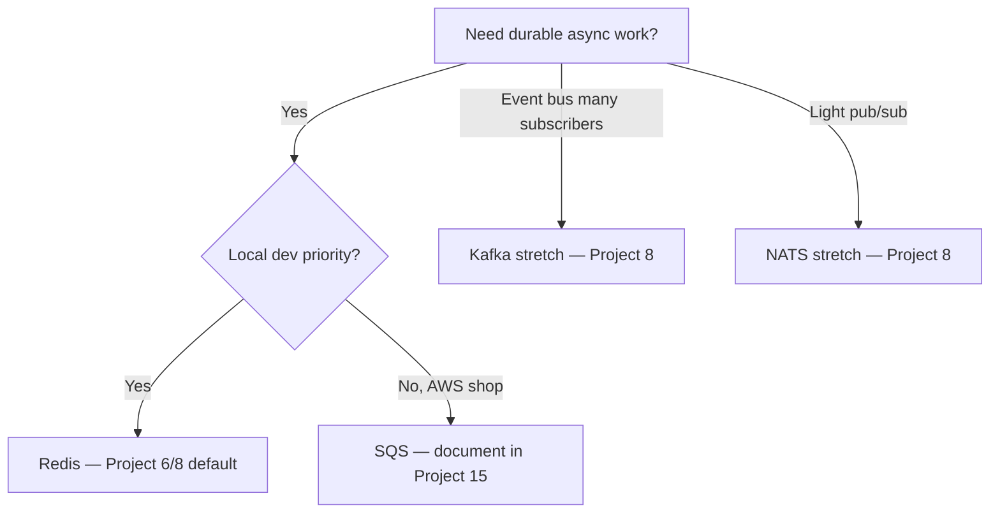

# Messaging and RPC

**Use this:** When job posts mention **Kafka, Redis, queues, REST, or gRPC** and you need plain language before [Project 6](../../archive/v1-22-step/career-project-specs/06-async-worker-stretch.md) or [Project 8](../../archive/v1-22-step/career-project-specs/08-go-retrieval-worker-lab.md).

**Reading order:**

1. **You are here** — what a queue is and how services talk
2. [Software engineering — Integration](software-engineering.md#integration-sync-async-and-messaging) — idempotency, delivery semantics, webhooks
3. [Project 6](../../archive/v1-22-step/career-project-specs/06-async-worker-stretch.md) → [Project 8](../../archive/v1-22-step/career-project-specs/08-go-retrieval-worker-lab.md) — hands-on queue + worker

**Companion:** [Glossary](software-engineering-glossary.md) · [Integration automation](integration-automation.md) · [Career targeting](../career/target-alignment.md)

---

## Why queues and APIs matter

A **message queue** is a to-do list between services: one part of your app **drops off work**, another part **picks it up later**. That lets you answer HTTP quickly while slow work runs in the background ([Project 1](../../archive/v1-22-step/career-project-specs/01-integration-webhook-receiver.md) → [Project 6](../../archive/v1-22-step/career-project-specs/06-async-worker-stretch.md)).

The hard part is not picking Redis vs Kafka—it is **duplicate delivery**. Messages can arrive more than once. Your handler must stay correct anyway ([idempotency](software-engineering-glossary.md#idempotency), [dead letter queue](software-engineering-glossary.md#dead-letter-queue-dlq)).

**API styles** are how services ask each other questions synchronously (while the caller waits):

| Style | Plain English | Playbook default |
|-------|---------------|------------------|
| **REST + OpenAPI** | HTTP + JSON with a documented contract | [Project 5](../../archive/v1-22-step/career-project-specs/05-contract-first-api.md), [Project 8](../../archive/v1-22-step/career-project-specs/08-go-retrieval-worker-lab.md) boundary |
| **gRPC** | Faster typed calls between internal services | Optional stretch on Project 8 |
| **Webhooks** | Partner pushes events to your URL | [Project 1](../../archive/v1-22-step/career-project-specs/01-integration-webhook-receiver.md) |

Playbook labs default to **Redis** for local simplicity—the reliability patterns transfer to Kafka and managed queues unchanged.

---

## Table of contents

- [Message brokers — when employers use each](#message-brokers--when-employers-use-each)
- [REST/OpenAPI vs gRPC — service boundaries](#restopenapi-vs-grpc--service-boundaries)
- [Choosing a broker for your lab](#choosing-a-broker-for-your-lab)
- [Related projects](#related-projects)
- [See also](#see-also)
- [Technical reference](#technical-reference)

---

## Message brokers — when employers use each

| Broker | Typical employer context | Playbook default | Same semantics you already practice |
|--------|-------------------------|------------------|-------------------------------------|
| **Redis** (lists/streams) | Startups, side projects, local dev, smaller services | **Projects 6, 8** — primary lab broker | At-least-once + idempotent consumer + DLQ |
| **Kafka** | Monzo, scale-ups, event platforms, log-oriented pipelines | **Stretch** on [Project 6](../../archive/v1-22-step/career-project-specs/06-async-worker-stretch.md) / [Project 8](../../archive/v1-22-step/career-project-specs/08-go-retrieval-worker-lab.md) | Duplicate delivery → idempotent handler; consumer groups ≈ N workers |
| **NATS** | Cloud-native microservices, edge, lightweight pub/sub | Optional in Project 8 stretch | At-least-once subscribers; duplicate tolerance |
| **SQS / managed queue** | AWS-heavy shops | Documented in Project 15 cloud deploy | Visibility timeout + DLQ = same mental model |
| **RabbitMQ** | Enterprise integrations, older stacks | Name-only in specs | Same ack/nack/DLQ vocabulary |

A **message broker** decouples producers from consumers: the producer publishes work; workers consume at their own pace. The critical engineering contract is **delivery semantics**—whether a message may be delivered more than once—and how your handler stays correct when duplicates arrive.

**Redis** (lists or streams) fits local development and smaller services because it is fast to set up and iterate on. The playbook uses it in Projects 6 and 8 to practice **at-least-once delivery**, **idempotent consumers**, and **Dead Letter Queues (DLQs)**—patterns that apply identically on Kafka or managed queues.

**Kafka** appears in job descriptions when employers need a durable event log, many consumers replaying history, high-throughput fan-out, or a company-wide event bus. Kafka is a partitioned log with **consumer groups**—roughly N workers sharing partition assignment—and **at-least-once delivery** by default. You do not need a dedicated Kafka lab to speak credibly; the optional consumer stretch on Project 8 is enough hands-on signal if you can explain the reliability contract.

**NATS** suits cloud-native microservices and edge deployments where lightweight pub/sub matters. Subscribers tolerate duplicates under at-least-once modes—the same idempotency discipline as Redis or Kafka.

**Amazon Simple Queue Service (SQS)** and similar managed queues appear in AWS-heavy shops. **Visibility timeout** plus DLQ maps directly to the ack/nack/DLQ vocabulary you practice locally.

**RabbitMQ** still appears in enterprise integrations and older stacks. The broker differs; the vocabulary—acknowledge, negative acknowledge, dead letter—does not.

### Per-broker pros / cons / when not

| Broker | Pros | Cons | When not |
|--------|------|------|----------|
| **Redis** | Fast setup; great for labs | Weaker durability vs Kafka | Need infinite event replay log |
| **Kafka** | Durable log; fan-out | Heavy local ops | Single small worker queue |
| **NATS** | Lightweight pub/sub | Different ops model | Need SQL transactional outbox |
| **SQS** | Managed; visibility timeout | AWS coupling | Multi-cloud local-only dev |
| **RabbitMQ** | Mature routing | Older ops patterns | Greenfield without team skill |

See [Illustrative snippets — queue consumer](illustrative-snippets.md#queue-consumer-redis-list) · [Project 6](../../archive/v1-22-step/career-project-specs/06-async-worker-stretch.md).

### How to explain Kafka vs Redis in an interview

You can describe building idempotent workers on Redis locally because it is fast to iterate, then explain that Kafka is the same reliability contract at scale—a partitioned log with consumer groups and at-least-once delivery—so ramping on an employer's broker means learning operational details, not relearning how to write safe consumers. Emphasize that duplicate delivery is expected and idempotency keys or deduplication tables are how handlers stay correct.

When Kafka appears in a job description, the employer usually wants durable event history, replay capability, or high fan-out—not merely "async work," which Redis handles fine at smaller scale. When Redis is enough in a portfolio, you are proving idempotency, DLQ handling, worker pools, and operational replay ([Project 14](../../archive/v1-22-step/career-project-specs/15-devops-cli-lab.md))—skills that transfer directly.

---

## REST/OpenAPI vs gRPC — service boundaries

| Style | Best for | Playbook |
|-------|----------|----------|
| **REST + OpenAPI** | Public/partner APIs, browser clients, human-readable contracts | **Project 5** spine; Python↔Go boundary in **Project 8** |
| **gRPC + protobuf** | Internal service-to-service, strong typing, low overhead | Handbook + **stretch** on Project 8 |
| **Webhooks** | Partner pushes events to you | **Project 1** |

**REST** with an **OpenAPI** specification suits public and partner-facing APIs, browser clients, and contracts that humans read and debug easily. JSON over HTTP is ubiquitous; tooling for testing, mocking, and documentation is mature.

**gRPC** with **Protocol Buffers (protobuf)** suits internal service-to-service calls where strong typing, code generation, and lower serialization overhead matter. Browsers cannot speak native gRPC without **gRPC-Web** or a gateway—public edges usually stay REST.

**Webhooks** invert the direction: a partner pushes events to your HTTP endpoint. Project 1 covers synchronous ingress that later forwards to queue consumers.

### Project 8 boundary (Python LLM ↔ Go retrieval)

The default lab contract uses **REST/JSON** or an **OpenAPI fragment**—stable, debuggable, and compatible with Project 2 evaluation tooling.

The **gRPC stretch** (optional) adds an internal `Retrieve` Remote Procedure Call with protobuf; a Python client calls the Go gateway over gRPC instead of HTTP JSON. Idempotency and timeout rules apply unchanged—the transport differs, not the reliability contract.

### How to explain REST vs gRPC in an interview

Public and partner-facing paths should stay OpenAPI/REST because debuggability, browser compatibility, and contract review matter at the boundary. Internal hot paths can be gRPC where typing and latency matter—but keep one contract schema whether you serialize to JSON or protobuf, so both sides agree on field names, optional fields, and error semantics. When gRPC appears in job descriptions—Monzo with Envoy RPC, microservice meshes, polyglot internal APIs—the pattern is internal efficiency at the cost of edge translation layers.

---

## Choosing a broker for your lab



Master **idempotency and DLQ** on one broker before switching. Broker choice is an Architecture Decision Record (ADR), not a skills gap—employers care that you understand delivery semantics, not which logo appeared in your side project.

If local development speed matters, start with Redis (Projects 6 and 8). If the target employer is AWS-heavy, document SQS with visibility timeout and DLQ in your cloud deploy (Project 15). Reach for Kafka or NATS stretches when you need event-bus or pub/sub vocabulary for specific job targets.

---

## Related projects

| Project | Messaging/RPC focus |
|---------|---------------------|
| [Project 1](../../archive/v1-22-step/career-project-specs/01-integration-webhook-receiver.md) | Sync ingress; forward-ref to queue consumers |
| [Project 6](../../archive/v1-22-step/career-project-specs/06-async-worker-stretch.md) | Queue + worker + DLQ fundamentals |
| [Project 8](../../archive/v1-22-step/career-project-specs/08-go-retrieval-worker-lab.md) | Go consumer; Prometheus; Kafka/gRPC stretches |
| [Project 15](../../archive/v1-22-step/career-project-specs/16-cloud-deploy-lab.md) | Managed queue in cloud deploy |

---

## See also

- [Career targeting — UK job matrix](../career/target-alignment.md#what-uk-employers-ask-vs-playbook)
- [Software engineering — integration](software-engineering.md#integration-sync-async-and-messaging)
- [Integration automation](integration-automation.md)

---

## Technical reference

### Jargon quick lookup

| Term | One line |
|------|----------|
| **At-least-once delivery** | Message may arrive more than once—handler must be idempotent |
| **DLQ** | Dead letter queue—poison messages after max retries |
| **Consumer group** | Kafka workers sharing partition load |
| **Visibility timeout** | SQS: message hidden while worker processes; redelivers if not acked |
| **Azure Service Bus** | Managed queue + dead-letter—same idempotency story as Redis/SQS ([Project 6 stretch](../../archive/v1-22-step/career-project-specs/06-async-worker-stretch.md#azure-certification-stretch)) |
| **OpenAPI** | Machine-readable HTTP contract |
| **protobuf** | Binary schema format used with gRPC |

### Redis queue commands

```bash
redis-cli LPUSH jobs:webhook '{"job_id":"abc","payload":{...}}'
redis-cli BRPOP jobs:webhook 30
```

### Glossary links

- [Kafka, Redis, and NATS](software-engineering-glossary.md#kafka-redis-and-nats-message-brokers)
- [Idempotency](software-engineering-glossary.md#idempotency) · [Message queue](software-engineering-glossary.md#message-queue)
- [Azure Service Bus](software-engineering-glossary.md#azure-service-bus) · [Azure certification track](../career/azure-certification-track.md)
- [REST](software-engineering-glossary.md#rest) · [gRPC](software-engineering-glossary.md#grpc) · [Webhook](software-engineering-glossary.md#webhook)

### Interview one-liners

- "Same idempotency and DLQ semantics whether Redis or Kafka—I can ramp on your broker."
- "REST at the edge for humans and browsers; gRPC inside when typing and latency matter."
