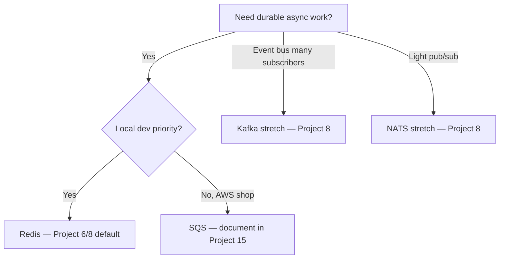

# Messaging and RPC — career context

**Use this:** Recognize **Kafka**, **Redis**, **NATS**, **REST/OpenAPI**, and **gRPC** in job posts and interviews. The playbook labs default to **Redis** for local simplicity — the **reliability patterns** (idempotency, at-least-once, DLQ) transfer unchanged.

**Companion:** [Integration sync/async/messaging](software-engineering.md#integration-sync-async-and-messaging) · [GraphQL, gRPC, webhooks](software-engineering.md#graphql-grpc-and-webhooks) · [Career targeting](../career/target-alignment.md)

---

## Message brokers — when employers use each

| Broker | Typical employer context | Playbook default | Same semantics you already practice |
|--------|-------------------------|------------------|-------------------------------------|
| **Redis** (lists/streams) | Startups, side projects, local dev, smaller services | **Projects 6, 8** — primary lab broker | At-least-once + idempotent consumer + DLQ |
| **Kafka** | Monzo, scale-ups, event platforms, log-oriented pipelines | **Stretch** on [Project 6](../../career-project-specs/06-async-worker-stretch.md) / [Project 8](../../career-project-specs/08-go-retrieval-worker-lab.md) | Duplicate delivery → idempotent handler; consumer groups ≈ N workers |
| **NATS** | Cloud-native microservices, edge, lightweight pub/sub | Optional in Project 8 stretch | At-least-once subscribers; duplicate tolerance |
| **SQS / managed queue** | AWS-heavy shops | Documented in Project 15 cloud deploy | Visibility timeout + DLQ = same mental model |
| **RabbitMQ** | Enterprise integrations, older stacks | Name-only in specs | Same ack/nack/DLQ vocabulary |

### Kafka vs Redis (interview line)

*"We built idempotent workers on Redis locally because it's fast to iterate. Kafka is the same contract at scale — partitioned log, consumer groups, at-least-once delivery — so I'd ramp on your broker without relearning reliability patterns."*

**When Kafka appears in JDs:** durable event log, many consumers replaying history, high throughput fan-out, company-wide event bus. You don't need a dedicated Kafka lab — optional consumer on Project 8 is enough hands-on signal.

**When Redis is enough in portfolio:** proving idempotency, DLQ, worker pools, and ops replay ([Project 14](../../career-project-specs/14-devops-cli-lab.md)).

---

## REST/OpenAPI vs gRPC — service boundaries

| Style | Best for | Playbook |
|-------|----------|----------|
| **REST + OpenAPI** | Public/partner APIs, browser clients, human-readable contracts | **Project 5** spine; Python↔Go boundary in **Project 8** |
| **gRPC + protobuf** | Internal service-to-service, strong typing, low overhead | Handbook + **stretch** on Project 8 |
| **Webhooks** | Partner pushes events to you | **Project 1** |

### Project 8 boundary (Python LLM ↔ Go retrieval)

Default lab contract: **REST/JSON** or **OpenAPI fragment** — stable, debuggable, matches Project 2 eval tooling.

**gRPC stretch (optional):** Add internal `Retrieve` RPC with protobuf; Python client calls Go gateway over gRPC instead of HTTP JSON. Same idempotency and timeout rules apply.

### Interview line

*"Public and partner-facing paths stay OpenAPI/REST. Internal hot paths can be gRPC where typing and latency matter — we kept one contract schema whether JSON or protobuf."*

**When gRPC appears in JDs:** Monzo (Envoy RPC), microservice meshes, polyglot internal APIs. Browsers still need REST or gRPC-Web at the edge.

---

## Choosing a broker for your lab

**Rule:** Master **idempotency + DLQ** on one broker before switching. Broker choice is an ADR, not a skills gap.

---

## Related projects

| Project | Messaging/RPC focus |
|---------|---------------------|
| [Project 1](../../career-project-specs/01-integration-webhook-receiver.md) | Sync ingress; forward-ref to queue consumers |
| [Project 6](../../career-project-specs/06-async-worker-stretch.md) | Queue + worker + DLQ fundamentals |
| [Project 8](../../career-project-specs/08-go-retrieval-worker-lab.md) | Go consumer; Prometheus; Kafka/gRPC stretches |
| [Project 15](../../career-project-specs/15-cloud-deploy-lab.md) | Managed queue in cloud deploy |

---

## See also

- [Career targeting — UK job matrix](../career/target-alignment.md#what-uk-employers-ask-vs-playbook)
- [Software engineering — integration](software-engineering.md#integration-sync-async-and-messaging)
- [Integration automation](integration-automation.md)
