# SDLC ↔ career playbook map

> **Not the learning path.** Follow projects in order: [README.md](../../README.md#progression-step-1--22) (Project 1 → 22).

This doc maps the **classic software development lifecycle** to playbook projects, concept docs, and checklists. The playbook teaches **technical delivery** (build, test, ship, operate)—not Agile/Scrum process, stakeholder workshops, or product discovery.

**Companion:** [Engineering pillars](engineering-pillars.md) (topic index) · [Software engineering handbook](software-engineering.md) · [Software engineering glossary](software-engineering-glossary.md) (jargon from specs)

---

## Lifecycle at a glance

```mermaid
flowchart LR
  subgraph planning [Planning_and_Requirements]
    P1[Project_specs]
    P5[Project_5_OpenAPI]
  end

  subgraph design [Design]
    ADR[Portfolio_ADRs]
    SE[software_engineering_md]
    DB[database_design_md]
  end

  subgraph build [Implementation]
    Labs[Projects_1_to_22]
  end

  subgraph test [Testing]
    PT[per_project_testing_md]
    PR[production_readiness_md]
  end

  subgraph deploy [Deployment]
    P14[P14_shell]
    P15[P15_CLI]
    P16[P16_cloud_deploy]
  end

  subgraph operate [Operations_and_Maintenance]
    P3[P3_observability]
    P15ops[P15_DLQ_replay]
    P22[P22_capstone]
  end

  planning --> design --> build --> test --> deploy --> operate
  operate -.->|"iterate_next_project"| planning
```

---

## Phase 1 — Planning & requirements

Define scope, constraints, and acceptance criteria before code.

| Playbook source | Role |
|-----------------|------|
| [career-project-specs/](../../career-project-specs/) | **Problem**, success criteria, **Before you start** |
| [README — How to work through a project](../../README.md) | Read spec before building |
| [Project 5 — Contract-first API](../../career-project-specs/05-contract-first-api.md) | OpenAPI as shared truth; CI drift gates |
| [Project 22 — Capstone](../../career-project-specs/22-integrated-platform-capstone.md) | Integration boundaries across labs |
| [PROGRESS.md](../../PROGRESS.md) | Personal planning log |

**Coverage:** Light–moderate · **Gap:** requirements elicitation, backlogs, Agile ceremonies

---

## Phase 2 — Design

Architecture, data model, API contracts, failure modes.

| Playbook source | Role |
|-----------------|------|
| [software-engineering.md](software-engineering.md) | Architectural and integration patterns |
| [database-design.md](database-design.md) | Schema, transactions, indexes |
| [messaging-and-rpc.md](messaging-and-rpc.md) | Broker and RPC choices |
| [portfolio-artifacts.md](../templates/portfolio-artifacts.md) | ADR + architecture diagram per lab |
| [system-design-interview-map.md](../career/system-design-interview-map.md) | Design problems ↔ labs |
| [Project 5](../../career-project-specs/05-contract-first-api.md), [12](../../career-project-specs/12-multi-tenant-auth-lab.md), [19](../../career-project-specs/19-rust-hot-path-lab.md) | Contracts, tenant isolation, Go vs Rust ADR |

**Coverage:** Moderate–strong (engineering design) · **Gap:** formal UML, enterprise governance at scale

---

## Phase 3 — Implementation

Write production-shaped code with shared patterns.

| Skill bucket | Primary projects |
|--------------|------------------|
| Reliability / integrations | 1, 2, 5, 6, 9, 10 |
| Concurrency / async | 6, 7, 8, 10, 13, 17, 21 |
| Data / performance | 4, 8, 18, 23*, 25* |
| Full-stack / platforms | 7, 11, 12, 13 |
| DevOps / automation | 14, 15, 16 |
| Security / systems | 9, 19*, 20* |
| Capstone | 22 |

\*Optional / deferred per [README](../../README.md).

**Coverage:** **Strong** — core of the playbook.

---

## Phase 4 — Testing

Verify at unit, integration, and E2E layers; gate releases.

| Playbook source | Role |
|-----------------|------|
| [software-engineering.md#testing](software-engineering.md#testing) | Pyramid, doubles, debugging loop |
| [per-project-testing.md](per-project-testing.md) | Lab-by-lab strategy (Projects 1–22) |
| Each spec — **Testing approach (lab)** | Stack-specific emphasis |
| [production-readiness.md](../../checklists/production-readiness.md) | Ship gate per milestone |
| [Project 2](../../career-project-specs/02-rag-llm-service.md), [9](../../career-project-specs/09-application-security-lab.md), [22](../../career-project-specs/22-integrated-platform-capstone.md) | Eval regression, OWASP scripts, E2E smoke |

**Coverage:** **Strong** · **Gap:** formal QA process, test management tooling

---

## Phase 5 — Deployment & release

Build artifacts, promote through environments, ship safely.

| Playbook source | Role |
|-----------------|------|
| [software-engineering.md#cicd-and-delivery](software-engineering.md#cicd-and-delivery) | Pipeline, blue/green, canary, 12-factor |
| [Project 14](../../career-project-specs/14-shell-automation-lab.md) | CI glue, shellcheck |
| [Project 15](../../career-project-specs/15-devops-cli-lab.md) | Ops CLI, DLQ replay |
| [Project 16](../../career-project-specs/16-cloud-deploy-lab.md) | Compose, secrets, health checks |
| [Project 17](../../career-project-specs/17-k8s-controller-lab.md) | K8s reconcile pattern |
| [production-readiness.md](../../checklists/production-readiness.md) | Versioning, pinned deps, smoke URLs |

**Coverage:** **Strong** · **Gap:** org-scale release management (CAB, staged rollouts)

---

## Phase 6 — Operations & maintenance

Monitor, respond, replay/repair, evolve under load.

| Playbook source | Role |
|-----------------|------|
| [Project 3 — Observability](../../career-project-specs/03-observability-lab.md) | Correlation IDs, structured logs, latency |
| [software-engineering.md#observability-logs-metrics-traces](software-engineering.md#observability-logs-metrics-traces) | Logs, metrics, traces; SLI/SLO |
| [production-readiness.md](../../checklists/production-readiness.md) | Per-step applicability matrix |
| [Project 1](../../career-project-specs/01-integration-webhook-receiver.md), [6](../../career-project-specs/06-async-worker-stretch.md) | DLQ, replay, poison messages |
| [Project 15](../../career-project-specs/15-devops-cli-lab.md), [18](../../career-project-specs/18-proxy-load-balancer-lab.md) | Ops CLI, graceful shutdown |
| [Project 22](../../career-project-specs/22-integrated-platform-capstone.md) | Cross-service `request_id`, E2E demo |

**Coverage:** Moderate–strong · **Gap:** retirement/decommission, migration runbooks

---

## Security (cross-cutting)

| When | Where |
|------|-------|
| Design / review | [software-engineering.md#security](software-engineering.md#security-for-applications), [application-security-web-owasp.md](../../checklists/application-security-web-owasp.md) |
| Build | [Project 1](../../career-project-specs/01-integration-webhook-receiver.md) (HMAC), [12](../../career-project-specs/12-multi-tenant-auth-lab.md) |
| Test | [Project 9](../../career-project-specs/09-application-security-lab.md) |
| Ship | [llm-feature-ship.md](../../checklists/llm-feature-ship.md), [integration-hardening.md](../../checklists/integration-hardening.md) |

---

## Mini-SDLC per project

Every project repeats this loop ([README](../../README.md)):

1. **Plan** — open spec; read learn / before / concepts  
2. **Design** — spec + portfolio ADR/diagram  
3. **Build** — [`career-projects/`](../../career-projects/)  
4. **Test** — [per-project-testing.md](per-project-testing.md)  
5. **Release gate** — [production-readiness.md](../../checklists/production-readiness.md) + [portfolio-artifacts.md](../templates/portfolio-artifacts.md)  
6. **Operate / learn** — [PROGRESS.md](../../PROGRESS.md) → next spec  

---

## Optional sequences (by SDLC emphasis)

| Goal | Sequence |
|------|----------|
| Requirements → contract → build | **5** → **1** or **7** |
| Build → test → observe | **1** → **3** |
| Build → test → deploy | **1** → **6** → **16** |
| Full lifecycle in one story | Spine through **16**, then **22** |

Default path: **P3** (observability) and **P5** (contracts) arrive early—you are not implementation-only for long.

---

## Summary

| SDLC phase | Coverage | Anchors |
|------------|----------|---------|
| Planning / requirements | Light | Specs, P5, PROGRESS |
| Design | Moderate | software-engineering, ADRs, P12 |
| Implementation | **Strong** | Projects 1–22 |
| Testing | **Strong** | per-project-testing, spec test sections |
| Deployment | **Strong** | P14–P16, CI/CD handbook |
| Operations | Moderate–strong | P3, production-readiness, DLQ labs |
| Retirement | None | — |
| Process (Agile, Scrum) | None | — |

**Unfamiliar terms in specs?** → [Software engineering glossary](software-engineering-glossary.md)
