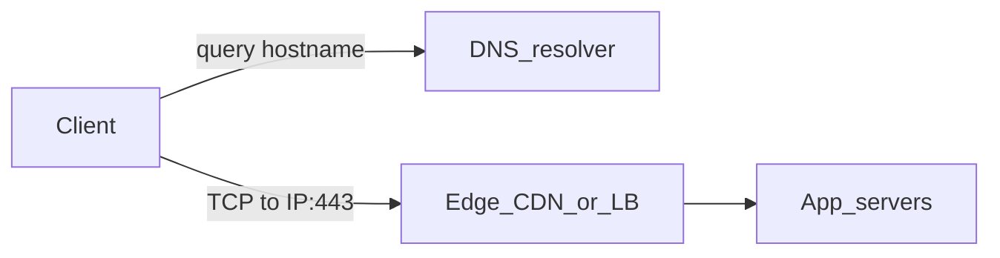
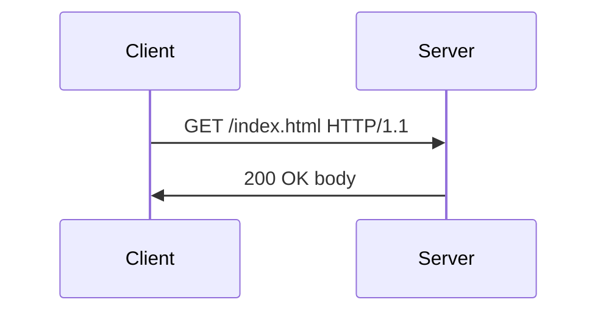
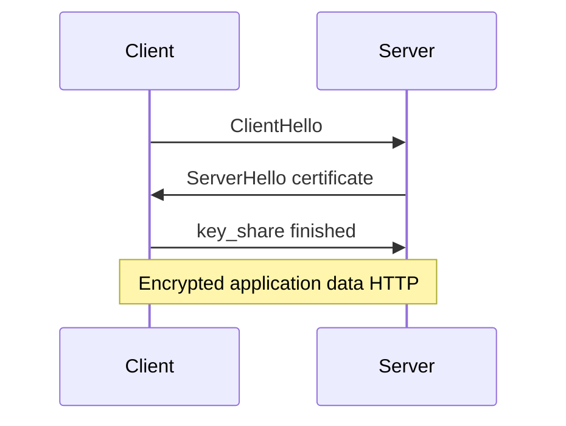
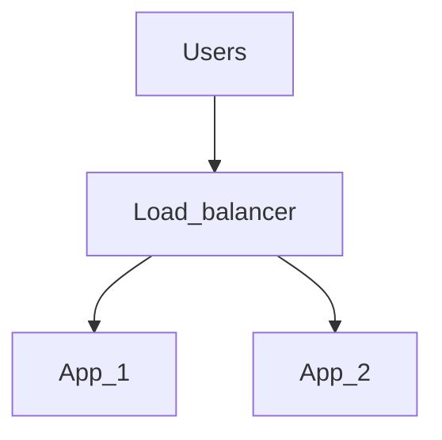

# Servers and networking

**Use this:** When you wonder **what happens when you open a URL** or why **TLS, DNS, and load balancers** appear in specs—before [Project 18](../../archive/v1-22-step/career-project-specs/18-proxy-load-balancer-lab.md).

**Reading order:**

1. **You are here** — request path from browser to app
2. [Command-line tooling — curl](command-line-tooling.md) — reproduce requests from terminal
3. [Project 18 — Proxy / load balancer](../../archive/v1-22-step/career-project-specs/18-proxy-load-balancer-lab.md) — timeouts and health checks

**Companion:** [Glossary](software-engineering-glossary.md) · [Database design](database-design.md) · [Software engineering — security](software-engineering.md#security-for-applications)

How traffic reaches your software—in plain English first, technical detail in the footer.

---

## What happens when you open a URL

1. Your device looks up the **hostname** (DNS)—“what IP address is `api.example.com`?”
2. Your app opens a **connection** to that address on a **port** (443 for HTTPS).
3. **TLS** encrypts the connection so nobody on the path can read passwords or tokens.
4. Your app sends an **HTTP request** (GET, POST, …); the server sends a **response** with a status code.
5. Middle boxes—**load balancers**, **reverse proxies**, **CDNs**—may sit in front of your server.

That is the story every webhook, API, and browser call follows.

---

## Table of contents

- [How a request crosses the network](#how-a-request-crosses-the-network)
- [TCP/IP, IP addresses, and ports](#tcpip-ip-addresses-and-ports)
- [DNS](#dns)
- [HTTP](#http)
- [TLS and HTTPS](#tls-and-https)
- [SSH](#ssh)
- [Firewalls and security groups](#firewalls-and-security-groups)
- [Reverse proxies and load balancers](#reverse-proxies-and-load-balancers)
- [Caching, CDNs, and browsers](#caching-cdns-and-browsers)
- [WebSockets and long polling](#websockets-and-long-polling)
- [Cloud models](#cloud-models)
- [Edge protection: WAF, rate limits, DDoS](#edge-protection-waf-rate-limits-ddos)
- [Email and DNS (SPF/DKIM) — brief](#email-and-dns-spfdkim--brief)
- [Security cross-reference](#security-cross-reference)
- [Interview checklist](#interview-checklist)

---

## How a request crosses the network

When your browser or API client fetches a page, it resolves a **hostname** to an address, opens a **Transmission Control Protocol (TCP)** connection to an **IP address and port**, then speaks **Hypertext Transfer Protocol (HTTP)** or **HTTPS** (HTTP secured with TLS). Middle infrastructure may include DNS resolvers, load balancers, reverse proxies, and Content Delivery Networks (CDNs).



DNS tells you *where* to connect. TCP delivers a reliable byte stream between endpoints. HTTP defines *what* you ask for and how the server responds. Each layer has separate failure modes—DNS misconfiguration, connection refused, TLS certificate mismatch, HTTP 502 from an upstream—all of which show up differently in logs and client errors.

---

## TCP/IP, IP addresses, and ports

An **IP address** locates a host on a network—IPv4 looks like `203.0.113.10`; IPv6 uses longer hexadecimal addresses. A **port** is a 16-bit number selecting a service on that host: port 443 for HTTPS, port 22 for Secure Shell (SSH). A **socket** is the pair `(client_ip:port, server_ip:port)` identifying one connection.

**Connection refused** means the host was reached but nothing is listening on that port—wrong port, service down, or a firewall that sends a reset. **Timeout** means no response arrived—host offline, wrong IP, firewall silently dropping packets, routing problems, or severe packet loss. The distinction matters for debugging: refused is local to the target service; timeout often implicates network path or firewall rules.

**What:** connectivity checks to a host and port. **Why:** confirm DNS resolution, routing, and that a service is listening before debugging application logic. **When:** after deploys, firewall changes, or "cannot connect" reports.

```bash
curl -v https://example.com:443/
nc -vz example.com 443
```

On Windows PowerShell: `Test-NetConnection example.com -Port 443`.

---

## DNS

The **Domain Name System (DNS)** maps human-readable hostnames to addresses and other records.

| Record (concept) | Role |
|------------------|------|
| A | Hostname → IPv4 |
| AAAA | Hostname → IPv6 |
| CNAME | Alias to another name |

An **A record** points a hostname to an **IPv4** address—what most clients use to connect. An **AAAA record** does the same for **IPv6**; many stacks try AAAA first when IPv6 is available. A **CNAME record** declares that this hostname is an **alias** of another name; the resolver continues lookup on the target. You cannot attach arbitrary data at a CNAME the way you can at an A record; **apex** domains (the bare domain without `www`) often need **ALIAS/ANAME** records at DNS providers instead of a plain CNAME.

Resolution flows from a stub resolver on the client through a recursive resolver to the authority chain: root → top-level domain (TLD) → your zone.

**What:** look up the IPv4 address for a hostname. **Why:** verify DNS propagation after a change or debug "wrong server" issues. **When:** after updating A records or migrating hosts.

```bash
dig +short A example.com
```

**Time To Live (TTL)** controls how long resolvers cache a record—lower TTL speeds propagation of changes but increases query load. Plan TTL reductions before migrations so stale caches expire quickly.

---

## HTTP

**Hypertext Transfer Protocol (HTTP)** is a text-based request/response protocol, commonly HTTP/1.1 or HTTP/2 over TLS. A request carries a **method**, **path**, **headers**, and optional **body**. A response carries a **status code**, headers, and body.

| Method | Typical use |
|--------|-------------|
| GET | Read resource (should not mutate server state) |
| POST | Create action / submit data |
| PUT / PATCH | Replace / partial update |
| DELETE | Delete |

**GET** fetches a representation. It should be **safe**—no server-side side effects—and is often **cacheable**. Browsers prefetch links; APIs use GET for reads.

**POST** submits data or triggers an action. It is **not assumed idempotent**—retries may duplicate work unless the API uses idempotency keys.

**PUT** replaces a resource at a known Uniform Resource Identifier (URI); repeating the same body is often treated as idempotent.

**PATCH** applies a partial update; semantics vary by API (JSON Merge Patch versus JSON Patch, for example).

**DELETE** removes a resource; idempotency expectations differ—a second delete may return 404 or 204 depending on the API contract.

| Code range | Meaning |
|------------|---------|
| 2xx | Success |
| 3xx | Redirection |
| 4xx | Client error |
| 5xx | Server error |

**2xx** means success: **200** generic OK, **201** created, **204** no body. **3xx** means redirection—the client should retry elsewhere; **301** is permanent, **302/307/308** are temporary or method-preserving variants, and details matter for POST redirects. **4xx** means client fault: **400** bad request, **401** unauthenticated, **403** forbidden, **404** not found, **429** rate limited. **5xx** means server fault: **500** unexpected error, **502/503/504** often from gateways or overload—retries with backoff may help, but the fix is usually server-side.



**Idempotency** means repeating a request has the same effect as doing it once. GET should be safe to repeat; POST often is not. Payment and order APIs commonly accept idempotency keys so retries do not double-charge.

---

## TLS and HTTPS

**Transport Layer Security (TLS)** encrypts traffic and authenticates the server. The server presents a **certificate** chaining to a trusted **Certificate Authority (CA)**; the client verifies the certificate matches the hostname via **Server Name Indication (SNI)** on the wire. **HTTPS** is HTTP over TLS.

The handshake negotiates symmetric encryption keys after an asymmetric bootstrap. The certificate proves identity if validation succeeds—expired, wrong hostname, or untrusted CA breaks browser trust immediately.



**TLS termination** at a load balancer simplifies certificate management on application nodes but concentrates trust on the proxy path. If policy requires encryption inside the data center, terminate TLS at the edge and re-encrypt to backends, or use mutual TLS between services.

---

## SSH

**Secure Shell (SSH)** provides encrypted remote login and file copy. **Public-key authentication** is common: a private key on your machine (`~/.ssh/id_ed25519`) and the matching public key (`.pub`) on the server.

**What:** test GitHub SSH auth and copy a file to a remote host. **Why:** verify key setup before debugging deploy or git failures. **When:** initial machine setup or after key rotation.

```bash
ssh -T git@github.com
scp local.txt user@host:/remote/path/
```

Use `~/.ssh/config` to alias hosts and set keys per destination. **Agent forwarding** lets a remote server use your local key to reach further hosts—enable it only when necessary, because an untrusted server can abuse a forwarded agent.

See also the SSH section in [Command-line tooling](command-line-tooling.md).

---

## Firewalls and security groups

Firewalls allow or deny traffic by **IP address, port, and direction** (inbound or outbound). **Least privilege** means opening only what you need—default deny, explicit allow.

Cloud **security groups** are stateful filters attached to virtual machines or Elastic Network Interfaces (ENIs). Misconfiguration is a top cause of "works in dev, unreachable in prod": the application listens on the right port, but the security group never allows inbound traffic on it.

---

## Reverse proxies and load balancers

A **reverse proxy** (for example, nginx) sits in front of application servers. It terminates TLS, routes by Host header or path, serves static files, and buffers slow clients so backends are not tied up waiting for uploads.

A **load balancer (LB)** distributes connections across **backends** using algorithms like round-robin or least connections. **Health checks** remove unhealthy nodes from rotation.



**Sticky sessions** (session affinity) route the same client to the same backend. That can hide stateful bugs in the application until a node fails—prefer stateless apps with shared session storage when possible.

---

## Caching, CDNs, and browsers

Browsers and **Content Delivery Networks (CDNs)** cache responses using headers like `Cache-Control`, `ETag`, and `Last-Modified`. A CDN serves static assets from edge locations closer to users, reducing origin load and latency.

**Stale-while-revalidate** lets clients serve slightly stale content while fetching a fresh copy in the background. **Cache busting** with hashed asset filenames (for example, `app.a1b2c3.js`) ensures browsers fetch new bundles after deploys without disabling caching entirely.

---

## WebSockets and long polling

**WebSockets** upgrade an HTTP connection into a bidirectional channel over a single long-lived TCP connection—useful for chat, live dashboards, and collaborative editing.

**Long polling** holds an HTTP request open until the server has data to send, then the client immediately opens a new request. It is a fallback when WebSockets are blocked by proxies or corporate networks.

WebSockets reduce overhead for frequent updates; long polling is simpler but creates more HTTP churn. Choose based on update frequency, infrastructure constraints, and client capabilities.

---

## Cloud models

| Model | You manage | Provider manages |
|-------|------------|------------------|
| **IaaS** | OS upward | Hardware, network fabric |
| **PaaS** | App and config | Runtime, patching often abstracted |
| **SaaS** | Users and data | Almost everything |

**Infrastructure as a Service (IaaS)** gives you virtual machines and networks—you patch the OS and run your stack. **Platform as a Service (PaaS)** abstracts the runtime—you deploy code and configuration. **Software as a Service (SaaS)** is the full product—you manage users and data.

**Regions** and **Availability Zones (AZs)** provide fault isolation within a cloud provider. Cross-region deployment adds latency and replication complexity—tie this to consistency tradeoffs in [database CAP discussion](database-design.md#cap-theorem-careful-reading).

---

## Edge protection: WAF, rate limits, DDoS

A **Web Application Firewall (WAF)** applies HTTP-aware rules—SQL injection patterns, suspicious paths, geographic blocks. It is not a substitute for secure application code; it adds a filter layer at the edge.

**Rate limiting** protects against brute-force login attempts and abusive clients. Tune thresholds carefully—legitimate bursty traffic (mobile apps reconnecting, batch imports) can look like abuse if limits are too aggressive.

**Distributed Denial of Service (DDoS)** attacks flood targets with volume or exploit protocol weaknesses. Mitigation usually happens at Internet Service Provider (ISP) or cloud scrubbing centers through architecture choices and provider features, not application logic alone.

---

## Email and DNS (SPF/DKIM) — brief

Email deliverability often requires **Sender Policy Framework (SPF)**—which IP addresses may send mail for a domain—and **DomainKeys Identified Mail (DKIM)**—cryptographic signatures on messages. Misconfigured DNS records break outbound mail. This matters when you own domains and send transactional email from your application.

---

## Security cross-reference

| Topic | Where to read more |
|--------|-------------------|
| TLS, SSH, firewalls | This doc |
| OWASP, app auth | [Software engineering](software-engineering.md) |
| SQL injection, backups | [Database design](database-design.md) |
| Secrets in shell | [Command-line tooling](command-line-tooling.md) |

---

## Interview checklist

- Explain **DNS** A vs CNAME and **TTL**.
- **TCP connection refused** vs **timeout** with examples of causes.
- **HTTP** verbs and common status codes; **idempotency**.
- **TLS** purpose; **certificate** vs **key**; what misconfiguration breaks browser trust.
- **Load balancer** vs **reverse proxy**; **health checks**.
- **IaaS vs PaaS vs SaaS** with an example each.
- **WAF vs network firewall** at a high level.

---

## Technical reference

### Jargon quick lookup

| Term | One line |
|------|----------|
| **DNS** | Name → IP address lookup |
| **TLS / HTTPS** | Encrypted HTTP |
| **TCP** | Reliable byte stream between client and server |
| **Reverse proxy** | Server in front of your app (nginx, Envoy) |
| **CDN** | Cached copies of static content close to users |
| **WAF** | Filters malicious HTTP patterns at the edge |
| **IaaS / PaaS / SaaS** | Infrastructure / platform / software as a service |

### Glossary links

- [CDN](software-engineering-glossary.md#cdn-content-delivery-network) · [WAF](software-engineering-glossary.md#waf-web-application-firewall)
- [IaaS / PaaS / SaaS](software-engineering-glossary.md#iaas--paas--saas) · [Load balancer](software-engineering-glossary.md#load-balancer)
- [SSE and WebSocket](software-engineering-glossary.md#sse-and-websocket)

### Interview one-liners

- "Connection refused = nothing listening; timeout = filtered or overloaded path."
- "TLS terminates at the proxy or app—I know where certificates live in my stack."
