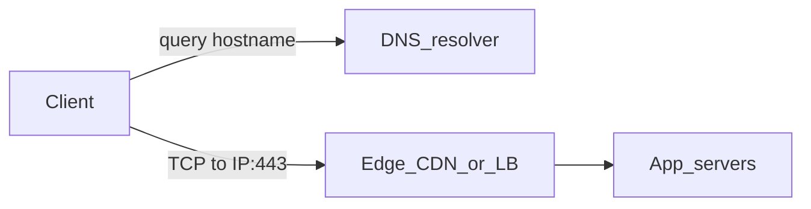
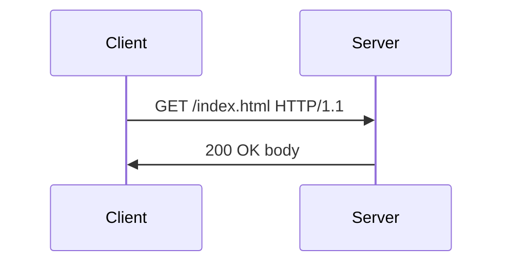
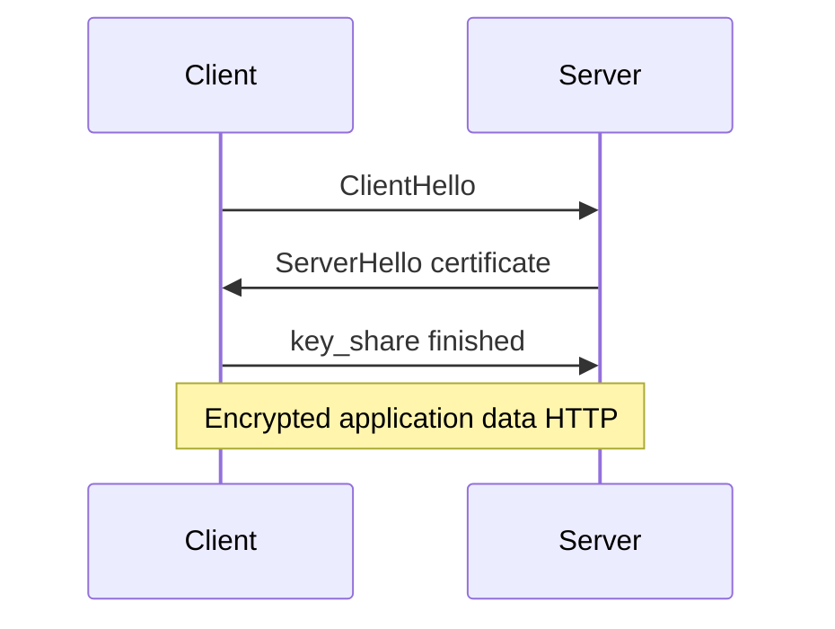
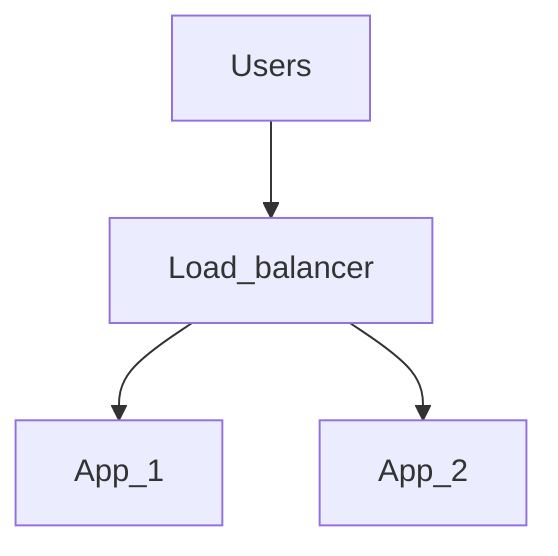

# Servers and networking

Study notes for how traffic reaches software, how TLS and DNS fit together, and how cloud and edge pieces connect. **Basic** = vocabulary; **Intermediate** = tradeoffs and debugging; **Advanced** = distributed and failure nuances.

**Companion docs:** [Command-line tooling](command-line-tooling.md) · [Database design](database-design.md) · [Software engineering](software-engineering.md)

---

## Table of contents

- [How this doc is organized](#how-this-doc-is-organized)
- [How a request crosses the network](#how-a-request-crosses-the-network)
- [TCP/IP, IP addresses, and ports](#tcpip-ip-addresses-and-ports)
- [DNS](#dns)
- [HTTP](#http)
- [TLS and HTTPS](#tls-and-https)
- [SSH](#ssh)
- [Firewalls and security groups](#firewalls-and-security-groups)
- [Reverse proxies and load balancers](#reverse-proxies-and-load-balancers)
- [Caching, CDNs, and browsers](#caching-cdns-and-browsers)
- [WebSockets and long polling](#websockets-and-long-polling)
- [Cloud models](#cloud-models)
- [Edge protection: WAF, rate limits, DDoS](#edge-protection-waf-rate-limits-ddos)
- [Email and DNS (SPF/DKIM) — brief](#email-and-dns-spfdkim--brief)
- [Security cross-reference](#security-cross-reference)
- [Interview checklist](#interview-checklist)

---

## How this doc is organized

| Level | You should be able to… |
|--------|-------------------------|
| **Basic** | Define IP, port, DNS name, HTTP method, status code, TLS role; sketch client → server. |
| **Intermediate** | Explain connection refused vs timeout; TLS handshake at a high level; when to use a reverse proxy; read a simple firewall rule impact. |
| **Advanced** | Discuss TLS termination tradeoffs, replication lag across regions, graceful degradation under partitions (tie to [database CAP](database-design.md)). |

---

## How a request crosses the network

**Idea:** Your browser or API client resolves a **hostname**, opens a **TCP connection** to an **IP:port**, then speaks **HTTP** or **HTTPS** (HTTP over TLS). Middle boxes may include **DNS**, **load balancers**, **reverse proxies**, and **CDNs**.



**Takeaway:** DNS tells you *where* to connect; TCP delivers a reliable byte stream; HTTP defines *what* you ask for.

---

## TCP/IP, IP addresses, and ports

- **IP address:** locates a host on a network (IPv4 like `203.0.113.10` or IPv6).
- **Port:** a 16-bit number selecting a *service* on that host (e.g. 443 for HTTPS, 22 for SSH).
- **Socket:** the pair `(client_ip:port, server_ip:port)` identifying one connection.

**Connection refused vs timeout (Intermediate):**

- **Refused:** host reached, but nothing listening on that port (wrong port, service down, firewall drop that presents as RST on some stacks).
- **Timeout:** no response—host offline, wrong IP, firewall *silently* dropping, routing loop, or severe packet loss.

**Examples:**

```bash
curl -v https://example.com:443/
nc -vz example.com 443
```

PowerShell: `Test-NetConnection example.com -Port 443`.

---

## DNS

**Basic:** Maps human-readable names to addresses.

| Record (concept) | Role |
|------------------|------|
| A | Hostname → IPv4 |
| AAAA | Hostname → IPv6 |
| CNAME | Alias to another name |

#### DNS record types (going deeper)

- **A** — Points a hostname to an **IPv4** address. What clients use most often for “connect to this name.”
- **AAAA** — Same as **A** but for **IPv6**. Many stacks try AAAA first when IPv6 is available; missing AAAA is fine if you only serve IPv4.
- **CNAME** — **Canonical name**: this hostname is an **alias** of another name; the resolver continues with the target. You cannot set arbitrary data “at” a CNAME in the same way as an A record; **apex** domains often need **ALIAS/ANAME** at DNS providers instead of a plain CNAME.

**Resolution order (simplified):** stub resolver → recursive resolver → authority chain from root → TLD → zone.

**Example:**

```bash
dig +short A example.com
```

**Intermediate:** **TTL** affects how fast DNS changes propagate. **CNAME at zone apex** has constraints (often use ALIAS/ANAME at DNS providers).

---

## HTTP

**Basic:** Text-based **request/response** (often HTTP/1.1 or HTTP/2 over TLS). Request: **method**, **path**, **headers**, optional **body**. Response: **status code**, headers, body.

| Method | Typical use |
|--------|-------------|
| GET | Read resource (should not mutate server state) |
| POST | Create action / submit data |
| PUT / PATCH | Replace / partial update |
| DELETE | Delete |

#### HTTP methods (going deeper)

- **GET** — Fetch a representation; should be **safe** (no server-side side effects) and is often **cacheable**. Browsers prefetch links; APIs use GET for reads.
- **POST** — Submit data or trigger an action; **not assumed idempotent**—retries may duplicate work unless the API uses idempotency keys.
- **PUT** — Replace a resource at a known URI; repeating the same body is often treated as idempotent “make it look like this.”
- **PATCH** — Partial update; semantics vary by API (JSON Merge Patch vs JSON Patch, etc.).
- **DELETE** — Remove a resource; idempotency expectations differ by API (second delete may be 404 or 204).

| Code range | Meaning |
|------------|---------|
| 2xx | Success |
| 3xx | Redirection |
| 4xx | Client error |
| 5xx | Server error |

#### HTTP status families (going deeper)

- **2xx** — Success: **200** generic OK, **201** created, **204** no body. Cache and client libraries treat these as “request understood and accepted.”
- **3xx** — Redirection: client should retry elsewhere (**301** permanent, **302/307/308** temporary or method-preserving variants—details matter for POST).
- **4xx** — Client fault: **400** bad request, **401** unauthenticated, **403** forbidden, **404** not found, **429** rate limited—fix request, credentials, or backoff.
- **5xx** — Server fault: **500** unexpected error, **502/503/504** often from gateways or overload—retry with backoff may help; fix is usually server-side.



**Intermediate:** **Idempotency:** repeating GET "should" be safe; POST may not be. APIs often document idempotency keys for payments.

---

## TLS and HTTPS

**Basic:** **TLS** encrypts and authenticates the connection. The server presents a **certificate** chaining to a **trusted CA**; the client verifies the name matches the hostname (**SNI** on the wire).

**Intermediate — handshake (conceptual):**



**Takeaway:** Symmetric keys negotiated after asymmetric bootstrap; certificate proves identity if validation succeeds.

**Advanced:** **TLS termination** at a load balancer simplifies certificates on app nodes but concentrates trust on the proxy path (encrypt **inside** the data center if required by policy).

---

## SSH

**Basic:** Encrypted remote shell and file copy; **public-key auth** common (`~/.ssh/id_ed25519` private, `.pub` public).

```bash
ssh -T git@github.com
scp local.txt user@host:/remote/path/
```

**Intermediate:** `~/.ssh/config` for hosts; **agent forwarding** only when necessary (untrusted server can abuse it).

See also the SSH section in [Command-line tooling](command-line-tooling.md).

---

## Firewalls and security groups

**Basic:** Rules allowing or denying **IP + port + direction** (inbound/outbound). **Least privilege:** only open what you need.

**Cloud security groups** are stateful filters attached to VMs or ENIs—misconfiguration is a top cause of “works in dev, unreachable in prod.”

---

## Reverse proxies and load balancers

**Reverse proxy (e.g. nginx):** Terminates TLS, routes by Host/path, serves static files, buffers slow clients. **LB:** Distributes connections across **backends** using algorithms (round-robin, least connections); **health checks** remove bad nodes.



**Intermediate:** **Sticky sessions** vs **stateless** apps; **Session affinity** can hide backend bugs until nodes fail.

---

## Caching, CDNs, and browsers

**Browser/CDN:** `Cache-Control`, `ETag`, `Last-Modified` reduce origin load. **Intermediate:** stale-while-revalidate patterns; **cache busting** with hashed asset names.

---

## WebSockets and long polling

**WebSockets:** Bi-directional channel over a single long-lived HTTP upgrade—chat, live dashboards.

**Long polling:** Client holds request open until server has data—fallback when WebSockets unavailable.

---

## Cloud models

| Model | You manage | Provider manages |
|-------|------------|------------------|
| **IaaS** | OS upward | Hardware, network fabric |
| **PaaS** | App and config | Runtime, patching often abstracted |
| **SaaS** | Users and data | Almost everything |

**Regions and AZs:** Fault isolation; cross-region = latency + replication complexity.

---

## Edge protection: WAF, rate limits, DDoS

**WAF (Web Application Firewall):** HTTP-aware rules (e.g. SQLi patterns)—**not** a substitute for secure code.

**Rate limiting:** Protects brute-force and abusive clients; tune carefully to avoid blocking legitimate bursty traffic.

**DDoS:** Volume or protocol attacks; often mitigated at ISP/cloud scrubbing centers—**architecture** + provider features, not app logic alone.

---

## Email and DNS (SPF/DKIM) — brief

Deliverability often requires **SPF** (which IPs may send for a domain) and **DKIM** (signed messages). Mis-DNS breaks mail—relevant when you own domains.

---

## Security cross-reference

| Topic | Where to read more |
|--------|-------------------|
| TLS, SSH, firewalls | This doc |
| OWASP, app auth | [Software engineering](software-engineering.md) |
| SQL injection, backups | [Database design](database-design.md) |
| Secrets in shell | [Command-line tooling](command-line-tooling.md) |

---

## Interview checklist

- Explain **DNS** A vs CNAME and **TTL**.
- **TCP connection refused** vs **timeout** with examples of causes.
- **HTTP** verbs and **common status codes**; **idempotency**.
- **TLS** purpose; **certificate** vs **key**; what **misconfiguration** breaks browser trust.
- **Load balancer** vs **reverse proxy**; **health checks**.
- **IaaS vs PaaS vs SaaS** with an example each.
- **WAF vs network firewall** at a high level.
