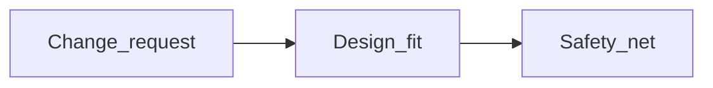
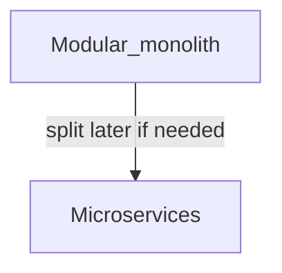
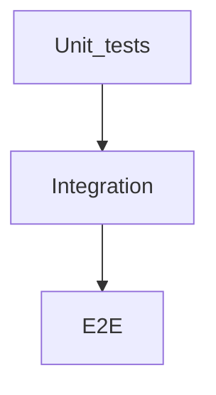

# Software engineering

This handbook explains how to build maintainable systems, ship safely, and talk clearly about your work in interviews. It covers programming paradigms, design patterns, APIs (Application Programming Interfaces), testing, debugging, data structures and algorithms (DSA), and observability. Side-by-side language syntax lives in [Language fundamentals comparison](../languages/language-fundamentals-comparison.md).

**Companion docs:** [Command-line tooling](command-line-tooling.md) · [Servers and networking](servers-and-networking.md) · [Database design](database-design.md) · [Algorithms and data structures](algorithms-and-data-structures.md) · [Language fundamentals comparison](../languages/language-fundamentals-comparison.md) · [Software engineering glossary (A–Z)](software-engineering-glossary.md) · [SDLC ↔ playbook map](sdlc-playbook-map.md)

**If stack maps feel like jargon at first:** skim the [docs README — stack maps](../README.md#languages-new-to-a-stack) and the [language glossary](../languages/glossary.md), then return here for longer explanations and worked patterns (delivery semantics, idempotent handlers, the N+1 query problem). For ORM (Object-Relational Mapping) query shapes, see [Database design — N+1 pattern](database-design.md#orms-and-the-n1-query-pattern).

---

## Table of contents

- [How to use this doc](#how-to-use-this-doc)
- [Complexity, change, and technical debt](#complexity-change-and-technical-debt)
- [SOLID](#solid)
- [DRY and when duplication wins](#dry-and-when-duplication-wins)
- [Programming paradigms](#programming-paradigms)
- [Scripting versus programming](#scripting-versus-programming)
- [Design patterns (GoF-style survey)](#design-patterns-gof-style-survey)
- [Patterns across languages (Go vs PHP vs TS vs Python)](#patterns-across-languages-go-vs-php-vs-ts-vs-python)
- [Architectural patterns](#architectural-patterns)
- [Domain-Driven Design (DDD)](#domain-driven-design-ddd)
- [CQRS and Event Sourcing](#cqrs-and-event-sourcing)
- [Anti-patterns (what NOT to do)](#anti-patterns-what-not-to-do)
- [Integration: sync, async, and messaging](#integration-sync-async-and-messaging)
- [Example: idempotent webhook or job (Integration)](#example-idempotent-webhook-or-job-consumer)
- [REST](#rest)
- [SOAP and WS-style services](#soap-and-ws-style-services)
- [OData](#odata)
- [GraphQL, gRPC, and webhooks](#graphql-grpc-and-webhooks)
- [Testing](#testing)
- [Debugging (workflow)](#debugging-workflow)
- [CI/CD and delivery](#cicd-and-delivery)
- [Versioning and compatibility](#versioning-and-compatibility)
- [Code review and documentation](#code-review-and-documentation)
- [Observability: logs, metrics, traces](#observability-logs-metrics-traces)
- [Security for applications](#security-for-applications)
- [Cross-language concepts and gotchas](#cross-language-concepts-and-gotchas)
- [Data structures and algorithms](#data-structures-and-algorithms)
- [Concurrency basics](#concurrency-basics)
- [Internationalization and encoding](#internationalization-and-encoding)
- [Licenses (developer awareness)](#licenses-developer-awareness)
- [Interview checklist](#interview-checklist)

---

## How to use this doc

Each section starts with a plain-English explanation, then goes deeper into tradeoffs, failure modes, and how teams actually apply the idea. When code appears, the text before and after tells you what it demonstrates, why you would write it that way, and when it applies.

If you are new to the stack, read [Integration: sync, async, and messaging](#integration-sync-async-and-messaging) and [Concurrency basics](#concurrency-basics) before an interview—they connect directly to Projects 1, 6, and 8. ORM access patterns that cause slow queries are covered under [Database design — N+1](database-design.md#orms-and-the-n1-query-pattern).

---

## Complexity, change, and technical debt

Software gets harder to change when the structure hides what the code is supposed to do and tests are missing. Teams call that **technical debt**—work you deliberately postpone (or accidentally accumulate) that keeps costing time, like interest on a loan.

The practical habit is to take **small, reversible steps**: ship a narrow fix, measure, then refactor when product risk allows—not a six-month rewrite that blocks features.



When a change request arrives, first ask whether the current design can absorb it cleanly. A safety net of tests lets you refactor without fear. All three matter: skipping design leads to hacks; skipping tests leads to regressions.

---

## SOLID

**SOLID** is a set of five design principles (coined by Robert Martin) that help you structure code so it stays easy to change. They are a lens for reading and reviewing code—not a checklist to maximize on every line.

**Single responsibility** means a class or module should have one reason to change. If your `UserService` sends email, calculates tax, and writes to the database, a change to email templates forces you to touch the same file as a tax rule change. Split those concerns.

**Open/closed** means you extend behavior without editing stable core code—often through interfaces or the Strategy pattern. Adding a new payment provider should not require rewriting the entire checkout flow.

**Liskov substitution** means subtypes must honor the contract of their supertypes. If `Square` breaks the expectations of `Rectangle`, any code that worked with rectangles will surprise callers when given a square—that breaks polymorphism.

**Interface segregation** means many small interfaces beat one fat interface that clients must stub out. A read-only report generator should not be forced to implement write methods it never uses.

**Dependency inversion** means high-level modules depend on abstractions, not concrete low-level details. That makes testing easier because you can inject fakes.

**What this shows:** dependency inversion—the order service depends on a `Clock` interface, not the system clock directly.

**Why you'd write it this way:** production code needs real time; tests need predictable time. An interface lets both share the same `OrderService` without branching on "am I in a test."

**When to use it:** any time external I/O (time, randomness, HTTP, database) would make unit tests flaky or slow.

```text
interface Clock { now(): Timestamp }           // abstraction the domain owns
class SystemClock implements Clock { ... }     // real time — used in production
class OrderService(Clock clock) { ... }        // constructor receives any Clock
```

In tests you inject a `FixedClock` so "now" is always the same instant. In production you inject `SystemClock`. The domain never imports OS time APIs.

SOLID is guidance, not dogma. **YAGNI** ("You Aren't Gonna Need It") still applies—do not add interfaces for things that will never vary.

---

## DRY and when duplication wins

**DRY** (Don't Repeat Yourself) says each piece of knowledge should have one authoritative home in the codebase. If billing logic is copied into three controllers, they will drift apart and bugs will hide in the copies.

Duplication can still beat a wrong abstraction. If two similar code paths are evolving in different directions, extracting them into one shared function too early locks you into a shape that fits neither. A common rule of thumb is the **Rule of Three**: wait until you see the pattern three times before abstracting.

---

## Programming paradigms

Most production systems mix paradigms. The table below compares the core ideas; the paragraphs after it explain how each feels to write and maintain.

| Paradigm | Idea | Typical strengths |
|----------|------|-------------------|
| **Imperative** | Statements mutate state step by step | Straightforward control flow |
| **Object-oriented** | Encapsulation, messages, polymorphism | Modeling domains with nouns |
| **Functional** | Immutability, pure functions, higher-order functions | Easier reasoning about data flow |
| **Declarative** | Describe *what*, not *how* | SQL, many domain-specific languages |

**Imperative** code tells the machine each step (`for`, assignments, mutations). It is easy to follow for straight-line scripts, but shared mutable state across modules makes testing and parallel execution harder.

**Object-oriented** code groups data and behavior into objects. **Encapsulation** hides invariants inside the object; **polymorphism** lets you substitute implementations behind a shared interface. It fits domain nouns well, but watch for **god objects** (classes that know too much) and deep inheritance trees where behavior is scattered across many superclasses.

**Functional** code prefers **immutable** data and **pure** functions (same inputs always produce same outputs). Higher-order functions like `map` and `filter` compose into pipelines that are easier to reason about in parallel. Real applications still need side effects at the edges—writing to a database, sending HTTP—but keeping those edges thin helps.

**Declarative** code states the desired outcome and lets an engine figure out the steps. SQL is the classic example: you say `SELECT ... WHERE ...` without specifying how to scan tables. Debugging declarative code often means asking "why didn't the engine pick the plan I expected?"

---

## Scripting versus programming

A **script** usually means a file run by an interpreter without a separate compile step. **Scripting language** often implies fast iteration and dynamic typing, but the boundary is fuzzy. A five-thousand-line "script" with tests, CI (Continuous Integration), and deployment is still software engineering—the label does not determine quality.

Judge code by **maintainability**, **observability**, and **risk**, not by whether someone called it a script.

---

## Design patterns (GoF-style survey)

The **Gang of Four (GoF)** catalog names recurring solutions to common design problems. Patterns are **shared vocabulary** between engineers—knowing the name helps in code review—but misapplied patterns add complexity without benefit.

**Creational patterns** control how objects are built. A **Factory** centralizes construction so callers do not depend on concrete classes. A **Builder** assembles complex objects step by step. **Singleton** ensures one instance exists—it is often overused; the real gotcha is **global mutable state** shared across the whole program.

**Structural patterns** connect pieces. An **Adapter** translates one interface into another so two libraries can work together. A **Decorator** wraps an object to add behavior without subclassing. A **Facade** presents a simple surface over a messy subsystem.

**Behavioral patterns** organize collaboration. **Strategy** swaps algorithms at runtime. **Observer** implements publish/subscribe. **Command** encapsulates an action so you can queue, log, or undo it.

---

## Patterns across languages (Go vs PHP vs TS vs Python)

The GoF patterns were written for class-heavy object-oriented languages. In Go, Python, and modern TypeScript, the same intent is often expressed with a **function**, a **closure**, or **duck typing** (if it walks and quacks like the expected type, it works). Forcing a textbook class hierarchy when a function would do is itself an anti-pattern.

| Pattern intent | Go | PHP (Laravel) | TypeScript / Node | Python |
|----------------|----|---------------|-------------------|--------|
| **Dependency injection** | Accept an **interface**, inject a struct; no container needed | **Service container** + constructor injection | Constructor injection, often a DI container (NestJS) | Pass callables/objects; **duck typing**, optional `Protocol` |
| **Strategy** | Func type or small interface | Class implementing an interface | First-class function passed in | Plain callable / `lambda` |
| **Singleton** | Package-level `var` + `sync.Once` | Container-bound singleton; **per-request reset** under FPM | **Module cache** makes a module a de-facto singleton | Module-level object; import caches it |
| **Iterator** | `for range` / channels | `Iterator` interface / generators | Iterables + generators (`function*`) | Generators (`yield`), iterator protocol |
| **Decorator** | Wrap a func/interface | Class wrapping + interface | Higher-order function or TS decorator syntax | Function decorators (`@wraps`) |

**Go** has no class inheritance—favor **composition** and **small interfaces** satisfied implicitly. Asking "where is the abstract base class?" is the wrong question in Go.

**PHP-FPM** (FastCGI Process Manager) resets memory **per HTTP request**, so a "singleton" lives only for that request. A cross-request cache needs Redis or APCu, not a PHP static variable.

**Node/TypeScript** modules are **cached on first import**, so top-level state is effectively a singleton for the process lifetime. That is convenient for connection pools and dangerous for mutable shared state across requests.

**Python** leans on **duck typing**; you rarely need an explicit interface. `Protocol` from the typing module adds static checking when you want it without runtime overhead.

For side-by-side syntax, see [Language fundamentals comparison](../languages/language-fundamentals-comparison.md). For concurrency idioms per runtime, see [Concurrency basics](#concurrency-basics).

---

## Architectural patterns

Architecture is how you split a system into parts and connect them. The playbook default is a **modular monolith** first—one deployable unit with clear internal boundaries—then extract microservices when seams are proven.



| Style | Notes |
|-------|--------|
| **Layered / N-tier** | UI → app → data; simple but can hide domain model |
| **Hexagonal / ports-adapters** | Domain core; adapters for DB and HTTP |
| **Clean / Onion** | Concentric layers; **Dependency Rule**—source dependencies point **inward** |
| **Event-driven** | Loose coupling; **eventual consistency** and idempotency matter |
| **CQRS** | Different read/write models; pairs with event sourcing in some systems |
| **Microservices** | Independent deploy; **distributed complexity** (network, observability) |

**Layered / N-tier** separates presentation, business logic, and data access. It is easy to understand, but business rules can leak into stored procedures or the UI, producing an **anemic domain model** where objects are just data bags.

**Hexagonal / ports-adapters** keeps the **domain** free of HTTP and ORM (Object-Relational Mapping) details. Adapters on the outside translate between the domain and the real world. This makes tests fast because you can swap a fake database adapter.

**Clean / Onion architecture** (Uncle Bob) draws the same idea as concentric rings: **entities** (enterprise rules) → **use cases** (application rules) → **interface adapters** (controllers, presenters, gateways) → **frameworks/drivers** (web framework, database). The **Dependency Rule** says source-code dependencies point **only inward**—inner layers never import outer ones. I/O is injected through interfaces the inner layers define. The payoff is a domain you can test without a web server; the cost is ceremony on small CRUD apps.

**Event-driven** systems communicate through messages instead of direct calls. You gain loose coupling but must handle **ordering**, **duplicate delivery**, and **eventual consistency** (readers may see stale data briefly). Design **idempotent** consumers from the start.

**CQRS** (Command Query Responsibility Segregation) splits **commands** (writes) from **queries** (reads). Read models can be denormalized for speed while writes stay validated. Often paired with events; avoid for simple CRUD. See [CQRS and Event Sourcing](#cqrs-and-event-sourcing) for depth.

**Microservices** let teams deploy and scale services independently. The cost is **network latency**, **distributed transactions**, and operational load—you need observability and clear boundaries before splitting.

---

## Domain-Driven Design (DDD)

**Domain-Driven Design (DDD)** is a way to keep complex business rules at the center of your design instead of scattering them across controllers, SQL, and UI templates. It is about **language** and **boundaries** as much as about code structure.

**Ubiquitous language** means engineers and domain experts share one vocabulary—the same words appear in conversations, code, and tests. An `Invoice` is called `Invoice`, not `BillingRow` or `TblInvoice`.

A **bounded context** is an explicit boundary where a model and its language are consistent. `Customer` in *Billing* and `Customer` in *Support* can legitimately be different models with different fields. Do not force one global schema when the business uses different concepts in different areas.

An **entity** has identity that persists through change (`Order #123` is still order 123 even if the shipping address changes). A **value object** is defined only by its attributes and is typically immutable—`Money{amount: 10, currency: "GBP"}` or an `Address` where replacing the whole value is simpler than mutating fields in place.

An **aggregate** is a cluster of entities and value objects treated as **one consistency unit**. Outside code touches it only through the **aggregate root**, which enforces invariants. You load and save the whole aggregate, not random inner pieces.

A **repository** is a collection-like abstraction for loading and saving aggregates. It hides persistence details so the domain does not depend on your ORM.

A **domain event** is a fact the domain emits (`OrderPlaced`, `InvoicePaid`). It bridges DDD to [event-driven integration](#event-driven-integration).

**What this shows:** an aggregate root that enforces a business rule— you cannot add lines to an order that is no longer in draft.

**Why you'd write it this way:** if the rule lived in the controller, every entry point (HTTP, CLI, queue worker) would duplicate the check and eventually one path would forget it.

**When to use it:** domains with real invariants (cannot modify submitted orders, cannot overdraw accounts) where the rule must hold no matter who calls the code.

```text
class Order {            // aggregate root
  private lines: OrderLine[]
  addLine(item, qty):
    if this.status != DRAFT: throw "cannot modify a submitted order"
    this.lines.push(OrderLine(item, qty))   // invariant lives here, not in the caller
}
```

DDD shines when the **domain is genuinely complex**—rich rules, many edge cases, domain experts to talk to. It is **overkill for simple CRUD**. **Bounded contexts** also guide service boundaries: a context is a strong candidate seam if you later split a monolith. Watch for the **anemic domain model** anti-pattern (data-only classes with all logic in service procedures)—see [Anti-patterns](#anti-patterns-what-not-to-do).

---

## CQRS and Event Sourcing

**CQRS (Command Query Responsibility Segregation)** splits the **write** model from the **read** model. Commands change state and enforce invariants; queries fetch data shaped for display. They can use different schemas or even different databases—reads might be denormalized for speed while writes stay normalized and validated.

**Event sourcing** stores an **append-only log of events** that produced state instead of only the current row. Events might be `AccountOpened`, `MoneyDeposited`, `MoneyWithdrawn`. Current state is derived by **replaying** events from the log. **Snapshots** cache state periodically so replay does not scan the entire history on every read.

**What this shows:** the difference between updating a balance in place versus recording a withdrawal as an immutable event.

**Why event sourcing:** you get a perfect audit trail and can answer "what did this account look like last Tuesday?" by replaying to that point.

**When to skip it:** simple CRUD where audit history and temporal queries are not worth the complexity. This playbook treats event sourcing as **interview vocabulary**, not a spine skill—see [target-alignment.md](../career/target-alignment.md).

```text
Traditional:  UPDATE account SET balance = 90 WHERE id = 1
Event-sourced: append MoneyWithdrawn{account:1, amount:10}   -- balance = fold(all events)
```

**CQRS tradeoffs:** independent scaling and tuned read models, at the cost of **two models to keep in sync**. The read side is usually updated asynchronously, so it is **eventually consistent**. Reach for CQRS when read and write shapes genuinely diverge—not for a basic admin panel.

**Event sourcing tradeoffs:** perfect audit and temporal queries, but real complexity around **event schema versioning**, replay performance, and the fact that you cannot simply "edit a row"—you append correcting events. It often pairs with CQRS because events naturally feed read projections.

---

## Anti-patterns (what NOT to do)

An **anti-pattern** is a common "solution" that looks reasonable but reliably causes pain. Recognizing them by name is half the fix; the other half is knowing when the tradeoff is acceptable.

| Anti-pattern | Smell | Fix |
|--------------|-------|-----|
| **God object / god class** | One class knows and does everything; every change touches it | Split by responsibility ([SOLID](#solid)); extract cohesive units |
| **Deep inheritance tree** | Behavior scattered across many superclasses; fragile base class | Prefer **composition** and small interfaces |
| **Anemic domain model** | Data-only classes; all rules live in "service" procedures | Put invariants on the [aggregate/entity](#domain-driven-design-ddd) |
| **Singleton / global mutable state** | Hidden shared state, hard to test, race-prone | Inject dependencies ([dependency inversion](#solid)); pass collaborators |
| **Premature / wrong abstraction** | One interface forced over two things that diverge | Tolerate duplication until the pattern stabilizes ([DRY](#dry-and-when-duplication-wins)) |
| **N+1 queries** | One query per row in a loop; latency balloons | Batch/join or eager-load—see [Database design — N+1](database-design.md#orms-and-the-n1-query-pattern) |
| **Unbounded concurrency** | `go handler()` per message; memory/connection spike | Bound with worker pool/semaphore—see [Concurrency basics](#concurrency-basics) |
| **Premature microservices** | Distributed monolith before boundaries are clear | [Modular monolith](#architectural-patterns) first; split on proven seams |
| **Blocking the main path** | Sync CPU/IO on event loop or UI thread → freezes/starvation | Move heavy work off the hot path—see [Concurrency basics](#ui-threads-and-dont-block-the-main-path) |

Most anti-patterns are **context-dependent**. A singleton config loader loaded once at startup is fine; a singleton mutable cache shared across HTTP requests is a trap. Name the tradeoff rather than cargo-culting the rule.

---

## Integration: sync, async, and messaging

**Companion in this playbook:** [Integration hardening](../../checklists/integration-hardening.md); [Project 1 — webhook receiver](../../career-project-specs/01-integration-webhook-receiver.md); [integration-automation stack map](integration-automation.md); [docs README](../README.md) (PHP, Node, Go, Python, SQL).

### Sync HTTP callers

**Synchronous HTTP (Hypertext Transfer Protocol)** means your code **waits** for the other service's response before continuing. That is simple to reason about, but if the peer is slow or down and you have **no timeouts**, your threads, connection pools, or event loop fill up and failures **cascade** through the system.

Combine **timeouts**, **bounded retries with jittered backoff** (randomized delay between retries so many clients do not retry at once), and **idempotency keys** for mutating calls so a retry does not double-apply an effect. Add **circuit breakers** when a dependency is clearly unhealthy so you **fail fast** instead of queuing work that will never succeed.

### Message queues and delivery semantics

**Queues** decouple **when** work is produced from **when** it is processed. The producer can finish and return while messages wait for an available worker.

| Name | Plain English | What your code must guarantee |
|------|---------------|-------------------------------|
| **At-most-once** | A message may be processed **zero or one** time; **loss** is possible on crash | Fine only when missing an event is acceptable (telemetry, best-effort cache warm) |
| **At-least-once** | **Common default** after retries: the **same logical message** may arrive **twice** | Consumer must be **idempotent** or **dedupe** with a **stable id** |
| **Exactly-once** (end-to-end) | Marketed promise; in distributed systems you usually build **effectively-once** from **at-least-once** + **idempotent writes** + careful **outbox/transaction** patterns | Design for **duplicate delivery** first; then narrow the window where it hurts |

In practice, assume **at-least-once** delivery and make consumers **idempotent**. See [GraphQL, gRPC, and webhooks](#graphql-grpc-and-webhooks) for webhook-specific notes (signatures, fast acknowledgment vs slow work). For broker choices, see [Messaging and RPC](messaging-and-rpc.md).

### Example: idempotent webhook or job consumer

A partner sends `POST /webhooks/orders` with JSON including `"event_id": "evt_123"`. Their side **retries** if your server is slow or returns HTTP 5xx—so your handler may see **`evt_123` twice**. You must ensure the second delivery does not create a second order.

**What the fragile pattern shows:** a handler that inserts on every request.

**Why it fails:** HTTP retries are normal; the partner is not buggy—they are protecting their own reliability.

**When you'd fix it:** any inbound webhook, queue consumer, or partner callback where the sender retries on failure.

Fragile pattern (duplicate side effects):

```text
on POST /webhooks/orders:
  parse JSON body
  INSERT INTO orders (...) VALUES (...)      -- retry → duplicate orders
  RETURN 200
```

Safer pattern (record idempotency before side effects):

```text
on POST /webhooks/orders:
  parse JSON → ev = body.event_id
  BEGIN TRANSACTION
    INSERT INTO processed_webhook_events (event_id)
      VALUES (ev)
      ON CONFLICT (event_id) DO NOTHING           -- dialect varies: upsert / unique constraint
    IF inserted_or_conflict_means_already_done:
       COMMIT ; RETURN 200                       -- replay: harmless
    APPLY business change (same tx if possible): -- e.g. upsert order by partner_order_id
      INSERT INTO orders (...) ON CONFLICT (partner_order_id) DO UPDATE ...
  COMMIT
  RETURN 200
```

Line by line: first parse the stable **`event_id`**. Inside a transaction, try to insert into a **processed events** table with a unique constraint—if the row already exists, this delivery is a replay and you return 200 without re-running business logic. If it is new, apply the business change in the same transaction (ideally an upsert on a **business natural key** like `partner_order_id`) so even a partial failure retries safely.

**Takeaways:**

- **Verify signatures** where the integration provides them—before you trust payloads or enqueue work ([integration hardening checklist](../../checklists/integration-hardening.md)).
- Return **success only after** you have durably recorded that this **`event_id`** is handled, or applied an equivalent **business-key upsert**.
- Slow work (PDF generation, ML inference, third-party chaining) belongs in **async jobs** keyed by the same **`event_id`** or business id. The HTTP handler acknowledges **intent recorded**, not "everything in the world is finished."

### Event-driven integration

An **event** announces that something already happened (`OrderPlaced`, `InvoicePaid`). A **command** asks something to happen (`ChargeCustomer`). Integration platforms (Boomi, n8n, custom buses) chain steps that react to events or commands. Your code mirrors this with **webhooks → queue → worker**.

**Events** are often **immutable facts**. Consumers must tolerate **duplicate delivery** and **out-of-order** arrival when multiple partitions or retries exist. Design **idempotent** handlers keyed by `event_id` or a business natural key.

**Commands** imply **intent**. Duplicates can **double-charge** if you only check HTTP success. Use **idempotency keys**, unique constraints, or "insert processed_commands first" patterns like the webhook example above.

**Outbox pattern:** when you must **write database state and publish a message atomically**, write both intents to an **outbox table** in the same transaction. A separate **relay process** publishes to the queue. Without an outbox, you can commit the database but fail to send the message—or send the message then roll back the database—leaving partners in inconsistent worlds.

**Saga:** a **long-running business process** split into **local transactions** with **compensating steps** (cancel shipment if payment fails). If compensation runs late or is skipped, money and inventory diverge. Prefer an explicit saga state machine or workflow engine when steps cross teams; do not hide saga logic in ad-hoc nested callbacks.

**Playbook mapping:** [Project 1](../../career-project-specs/01-integration-webhook-receiver.md) (ingress) → [Project 6](../../career-project-specs/06-async-worker-stretch.md) (durable steps) → [Project 8](../../career-project-specs/08-go-retrieval-worker-lab.md) (concurrent workers). Vocabulary: [integration-automation stack map](integration-automation.md).

---

## REST

**REST (Representational State Transfer)** identifies resources by URIs (Uniform Resource Identifiers). The server is **stateless** between requests—session state lives in cookies, tokens, or external stores, not in server memory tied to a connection. REST uses standard HTTP semantics: GET to read, POST to create, PUT/PATCH to update, DELETE to remove.

**OpenAPI** (formerly Swagger) documents REST contracts so clients and servers agree on shapes and error formats. Production APIs usually add **pagination** (cursor-based is safer than offset for large tables), **filtering**, and stable error bodies (RFC 7807 "Problem Details" is a common pattern).

---

## SOAP and WS-style services

**SOAP (Simple Object Access Protocol)** sends **XML** payloads, often with a **WSDL (Web Services Description Language)** contract file. Enterprise integrations sometimes rely on SOAP's **WS-*** standards for security and transactions. It is verbose on the wire compared to JSON REST, but tooling in large organizations is mature.

| | REST (typical JSON API) | SOAP |
|---|-------------------------|------|
| Format | JSON common | XML |
| Contract | OpenAPI common | WSDL |
| Transport | HTTP | HTTP + SOAP envelope |

REST is often easier for browsers and mobile clients consuming JSON. SOAP persists where standardized enterprise stacks require it.

---

## OData

**OData (Open Data Protocol)** exposes entity sets over HTTP with uniform query options: `$filter`, `$orderby`, `$expand`. It suits readable data APIs behind tools like Power BI or Excel-like clients that expect a consistent query surface. Contrast with hand-crafted REST query parameters or **GraphQL**, where the client shapes fields explicitly rather than following a server-driven OData model.

---

## GraphQL, gRPC, and webhooks

| Style | Notes |
|-------|--------|
| **GraphQL** | Client selects fields; watch **N+1** query issues and resolver performance |
| **gRPC** | HTTP/2, Protocol Buffers, strong typing; common **service-to-service** |
| **Webhooks** | Server pushes to your URL—verify **signatures**, handle **retries** idempotently |

**GraphQL** lets clients request exactly the fields they need in one round trip. The cost is **resolver** performance and **N+1** database access unless you batch loads (DataLoader pattern). Schema evolution and authorization live in the graph layer.

**gRPC (Google Remote Procedure Call)** uses **Protocol Buffers** contracts over **HTTP/2** with strong typing—excellent for **service-to-service** calls on internal networks. Browsers need a gateway (**gRPC-Web**) for typical web apps. Hands-on stretch: [Project 8](../../career-project-specs/08-go-retrieval-worker-lab.md). Career context: [Messaging and RPC](messaging-and-rpc.md).

**Webhooks** are outbound HTTP callbacks from a partner to your URL. Treat every delivery as **at-least-once**: verify **HMAC (Hash-based Message Authentication Code)** signatures, respond quickly (queue heavy work), and make handlers **idempotent** on event IDs.

**SSE (Server-Sent Events)** suits one-way server streams; **WebSockets** suit bidirectional communication—see [Servers and networking](servers-and-networking.md).

---

## Testing



The **testing pyramid** recommends many **unit** tests (fast, narrow scope), fewer **integration** tests (real database, HTTP, or queue), and few **end-to-end (E2E)** tests (full stack through UI or public API). E2E tests give high confidence but are slow and **flaky** if overused—reserve them for critical paths and smoke suites.

**Test doubles** stand in for real dependencies:

- A **fake** is a working simplified implementation (in-memory database).
- A **stub** returns canned answers without logic.
- A **mock** asserts that specific calls were made—over-mocking couples tests to implementation details.

**Unit tests** exercise one module with no real database or network. Failures pinpoint logic bugs quickly.

**Integration tests** use real pieces working together—a test container database, a local queue. They catch SQL mistakes, migration issues, and wiring bugs.

**E2E tests** run the full stack. They are the slowest and most brittle—use sparingly.

**Flaky tests** erode trust. Quarantine them, fix the root cause, or delete them.

For lab-by-lab guidance, see [Per-project testing (labs + AI)](per-project-testing.md).

When production behavior disagrees with what you thought you shipped, use the [Debugging workflow](#debugging-workflow) before adding more tests blindly. After you find root cause, **lock the fix** with a regression test.

---

## Debugging (workflow)

**Debugging** means shrinking the gap between **expected** and **actual** behavior—not guessing, and not changing three things at once.

A workable loop:

1. **Reproduce** with the same inputs and environment class.
2. **Shrink** the case to the smallest command or dataset that still fails.
3. Form a **hypothesis**.
4. Run **one** cheap **experiment** (breakpoint, log line, assertion in a test, trace filter, SQL `EXPLAIN`).
5. Confirm or falsify; repeat.

**Local vs production:** a **debugger** (step through code, inspect stack and locals) shines when control flow or invariants are wrong in code you can run locally. **Structured logs** and **traces** shine when the bug involves timing, concurrency, or multiple services—you often cannot attach a debugger in production. Use [Observability](#observability-logs-metrics-traces) there, reproduce locally once you know which request failed.

**Binary search:** `git bisect` between a known-good commit and a known-bad commit when a regression appears and the diff space is large.

**Safety net:** after root cause is found, add or extend [tests](#testing) so the same class of bug fails fast next time.

Tests assert intent up front; debugging explains a mismatch after failure. They meet at the **regression test**.

---

## CI/CD and delivery

**CI/CD (Continuous Integration / Continuous Delivery or Deployment)** automates the path from commit to production. A typical pipeline runs: lint → test → build → artifact → deploy to environments.

**Blue/green deployment** runs two identical environments and switches traffic atomically—fast rollback by switching back. **Canary deployment** sends a small fraction of traffic to the new version first. **Feature flags** decouple **deploy** (code is live) from **release** (users see the feature).

The **12-factor app** principles (popularized by Heroku) include: one codebase per app; **config in environment variables**; **stateless processes**; **logs as streams**; **admin tasks as one-off processes** rather than special long-running modes.

---

## Versioning and compatibility

**SemVer (Semantic Versioning)** uses MAJOR.MINOR.PATCH. Breaking API changes bump **major** when consumers rely on version numbers to know compatibility.

**API versioning** via URL path (`/v1/`) vs HTTP header is a team convention—pick one and document it. Breaking changes need migration paths for existing clients.

---

## Code review and documentation

Good code review is precise, kind, and teaches **why**—not just "change this." Small pull requests review faster with higher quality than thousand-line dumps.

**ADRs (Architecture Decision Records)** capture significant decisions in a short document: **context** (what problem we faced), **decision** (what we chose), **consequences** (tradeoffs accepted). Future you—and interviewers—can read why the queue is Redis instead of Kafka.

---

## Observability: logs, metrics, traces

Observability answers "what is happening inside my running system?" through three complementary signals:

| Signal | Use when… |
|--------|------------|
| **Logs** | Discrete events, debugging narratives |
| **Metrics** | Rates, histograms, SLIs (request latency percentiles) |
| **Traces** | Latency across services—**distributed tracing** IDs |

**Logs** are human-readable **events** with timestamps. Structured **JSON** logs with consistent field names make it easy to answer "what happened to request ID X?" in a log aggregator.

**Metrics** are cheap **aggregates**—rates, percentiles, counters—ideal for dashboards and alerting. **Cardinality explosion** (a unique label per user ID on a counter) breaks many metrics systems; keep label sets bounded.

**Traces** link **spans** across services to show where latency hides. They require **instrumentation** (OpenTelemetry is the common standard) and **sampling** at high volume.

**SLI (Service Level Indicator)** is what you measure (e.g. p95 latency). **SLO (Service Level Objective)** is your internal target (e.g. p95 < 200ms). **SLA (Service Level Agreement)** is a customer-facing promise with consequences if breached.

Signals tell you **where** time went or **which** request failed. They rarely replace reasoning about **why** application logic is wrong—narrow with correlation IDs and traces, reproduce locally, then use [Debugging](#debugging-workflow).

For the **measure → profile → fix → verify** workflow, see [Memory and performance](memory-and-performance.md).

---

## Security for applications

**OWASP (Open Web Application Security Project)** publishes common vulnerability categories worth recognizing:

**Injection**, **broken authentication**, **sensitive data exposure**, **XXE (XML External Entity)**, **broken access control**, **security misconfiguration**, **XSS (Cross-Site Scripting)**, **insecure deserialization**, **known vulnerable components**, **insufficient logging**, **SSRF (Server-Side Request Forgery)**.

**Authn (authentication)** is **who you are**. **Authz (authorization)** is **what you may do**. Confusing them leads to "logged in" users accessing other tenants' data.

**Supply chain:** use lockfiles, tools like **Dependabot** for dependency alerts, review upgrades, and pin CI actions to commit SHAs if policy requires.

**SAST (Static Application Security Testing)** analyzes source code; **DAST (Dynamic Application Security Testing)** probes a running app. **Shift-left** means finding defects earlier when they are cheaper to fix.

**CSRF (Cross-Site Request Forgery)** matters for cookie-based sessions—use tokens or SameSite cookies. **CORS (Cross-Origin Resource Sharing)** controls browser cross-origin requests; it is **not** authorization by itself.

---

## Cross-language concepts and gotchas

Syntax fundamentals—variables, functions, classes, collections, errors, nulls, async—live in [Language fundamentals comparison](../languages/language-fundamentals-comparison.md) with side-by-side snippets across JavaScript, TypeScript, PHP, Go, Rust, and others.

This handbook file focuses on **delivery-shaped** topics: integration, observability, concurrency under load. For equality (`===` vs PHP `==`), truthiness, and async spelling per language, see [Null, optionals, equality, and truthiness](../languages/language-fundamentals-comparison.md#null-optionals-equality-and-truthiness) and [Async and concurrency (fundamentals)](../languages/language-fundamentals-comparison.md#async-and-concurrency-fundamentals). For mentor-depth explanations of the 20 core-stack tripwires, see [Language gotchas deep dive](../languages/language-gotchas-deep-dive.md).

---

## Data structures and algorithms

Complexity notation, core structures, pattern recognition, and interview flow live in [Algorithms and data structures](algorithms-and-data-structures.md). This file stays a breadth index. You still want **Big-O** vocabulary for code reviews and interviews even when libraries implement the details.

---

## Concurrency basics

A **process** runs in **separate memory**. **Threads** inside one process share memory—without synchronization rules, **data races** (two writers or a writer and reader without coordination) corrupt state. Prefer **immutable data**, **message passing**, or **documented locking** over ad-hoc shared mutable heaps.

### UI threads and "don't block the main path"

Interactive apps (desktop, mobile, browser) expose a **main** or **UI thread** that users feel as "the app responding." Long **CPU work**, blocking **disk** I/O, or naive **network** calls on that thread cause **freezes**. Move heavy work to **background threads**, **worker pools**, or **async** calls that do not stall the UI (exact API depends on framework—Swift **MainActor**, Android **Dispatchers**, browser **Web Workers**, etc.).

Backend services rarely have a literal UI thread, but they have **scarce resources**: bounded thread pools, event loops, database connection pools. **Blocking** inside an async-only stack (FastAPI/asyncio, Node.js) causes **starvation under load**—the same class of mistake as freezing a mobile UI.

### Concurrency on your core stack

| Runtime | Model | Typical mistake |
|---------|--------|-----------------|
| **PHP (FPM)** | One request ≈ one worker process; memory resets | Long CPU work in webhook handler → partner retries flood you |
| **Node / TS** | Single-threaded event loop + thread pool for some I/O | Blocking sync file/DB call stalls all requests |
| **Python (asyncio)** | Event loop + `async def` | Calling blocking libraries without `to_thread` / executor |
| **Go** | Goroutines + channels + `context` | Unbounded `go handler()` per message → memory spike |

For Go workers, bound concurrency with a **worker pool** or **semaphore**; propagate **context** cancellation from HTTP timeout or job deadline. See [Go stack map](../languages/go.md) and [Project 8](../../career-project-specs/08-go-retrieval-worker-lab.md). For heap growth, profiling, and backpressure, see [Memory and performance](memory-and-performance.md).

Async syntax per language: [Language fundamentals comparison — Async](../languages/language-fundamentals-comparison.md#async-and-concurrency-fundamentals).

---

## Internationalization and encoding

Store user-facing text as **UTF-8** (Unicode Transformation Format, 8-bit)—it covers virtually all written languages. Separate **locale** (formatting dates, numbers, currency) from **language** (which strings to show). Never assume single-byte encodings for user-generated text.

---

## Licenses (developer awareness)

**Permissive** licenses (MIT, Apache) impose few obligations on use and distribution. **Copyleft** licenses (GPL) require share-alike obligations when you distribute combined works—this is not legal advice; involve counsel for commercial products.

---

## Interview checklist

Use this as a self-test after reading the sections above:

- Name and motivate **SOLID** (one sentence each).
- **DDD** vocabulary: bounded context, aggregate, value object vs entity; **Clean/Onion** Dependency Rule.
- **CQRS** vs **event sourcing**; when each is overkill.
- One **anti-pattern** you have removed and how ([Anti-patterns](#anti-patterns-what-not-to-do)).
- **REST vs SOAP** at a high level.
- **Idempotency** and HTTP methods.
- **Testing pyramid**; difference **mock** vs **fake**.
- **Microservices** vs **monolith** tradeoffs.
- **Observability** three pillars; **SLI vs SLO**.
- **OWASP** top-level categories you have mitigated in code.
- **Big-O** of a nested loop; when a **hash map** helps ([Algorithms and data structures](algorithms-and-data-structures.md)).
- One **cross-language** bug (e.g. `==` in PHP vs `===` — [comparison doc](../languages/language-fundamentals-comparison.md#null-optionals-equality-and-truthiness)).
