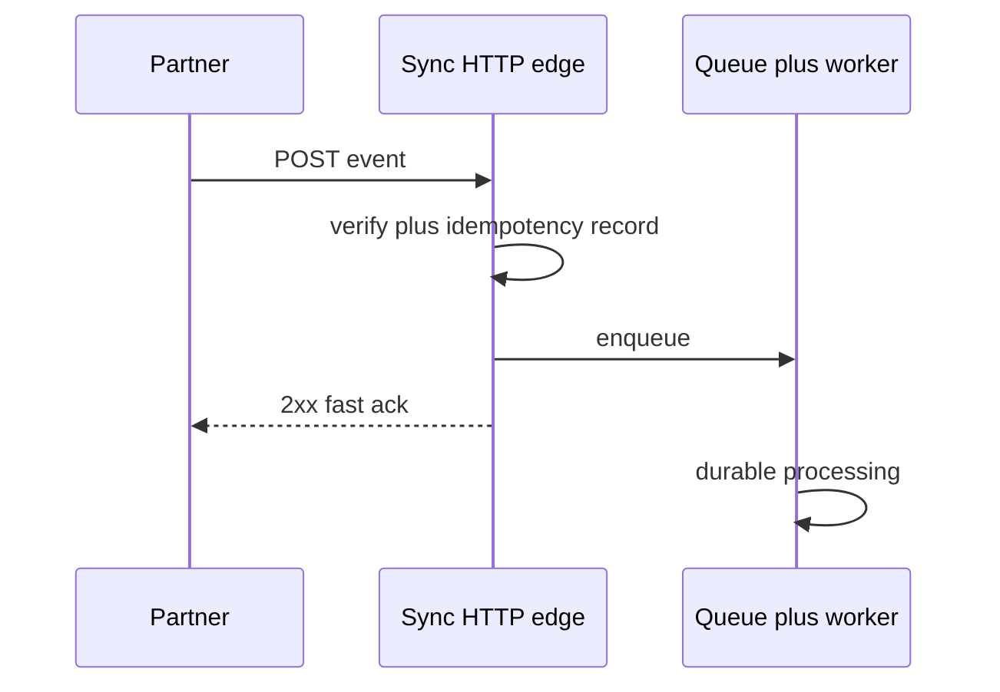
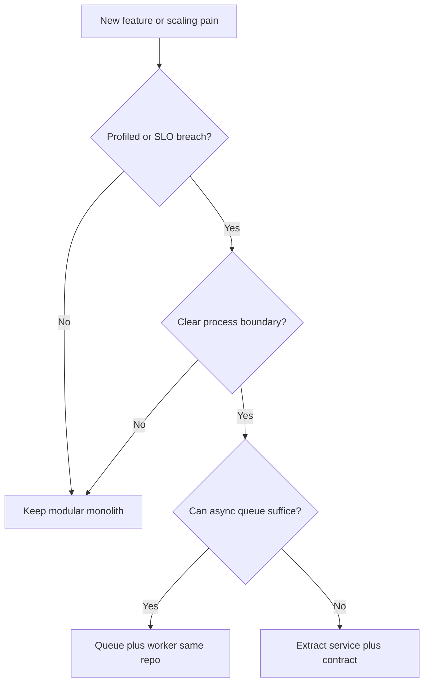

# Pillar 1 deep dive — System shape

**Use this:** Before drawing boundaries for [Project 1](../../career-project-specs/01-integration-webhook-receiver.md) or the capstone—when you are unsure **where HTTP stops and background work begins**.

**Reading order:**

1. [Architecture framework](architecture-framework.md) — five pillars spine (**read first**)
2. **You are here** — sync vs async, monolith vs split
3. [Messaging and RPC](messaging-and-rpc.md) — queues and API styles
4. [Integration automation](integration-automation.md) — Boomi/n8n vocabulary

**Part of:** [Architecture framework](architecture-framework.md)

**Goal:** Reason about **integration and event-driven system shape** — boundaries, sync versus durable work, data ownership — on **your core stack** (PHP, Node/TypeScript, Go, Python, SQL).

---

## Why sync vs async matters

Partners and users hate **hanging HTTP requests**. If processing takes seconds (PDF generation, LLM call, fan-out to ten services), you should:

1. **Verify and record** the request quickly (signature, idempotency key).
2. **Return success** once the work is safely queued—not when all side effects finish.
3. **Process in the background** with retries and a dead-letter path.

That is the **sync vs async boundary**: the webhook handler is **sync** (short); the worker is **async** (durable).



**Rule of thumb:** return HTTP success when intent is **safely recorded** (idempotency row or enqueue)—not when all downstream side effects finish.

## What this means here

System shape is the first architectural decision you make. Before writing code, you should be able to answer: where does HTTP end and durable work begin? What is a synchronous acknowledgment versus async completion? How do Boomi/n8n-style workflows map to webhooks, queues, and workers?

You also need explicit tradeoffs in plain language: latency versus consistency, at-least-once delivery versus exactly-once attempts, thin PHP ingress versus Go worker throughput versus Python LLM boundary. Explain the request path, delivery guarantees, and failure modes before opening an IDE.

**Not the goal:** Expert syntax in six ecosystems, or breadth sandboxes for languages outside your stack.

## Reference architecture (this playbook)

```text
Partner / Boomi / n8n trigger
    → PHP or Node webhook (sign, idempotency, fast 2xx)     [Pillar 1 + 2 + 5]
    → queue / outbox                                         [Pillar 2 — Integration]
    → Go worker (retries, DLQ, concurrent fan-out)           [Pillar 1 + 2 + 4]
    → Python RAG service (evals, citations, guardrails)        [Pillar 1 + 3 — Data]
    → Go retrieval gateway (chunk fetch, timeouts)           [Pillar 4 — Performance]
    → Postgres (SQL correctness, indexes, vectors)           [Pillar 3 — Data]
```

This is the canonical shape for the playbook. An external partner or integration platform sends a trigger. Your webhook layer validates and deduplicates, then returns HTTP 2xx quickly. Work continues asynchronously through a queue, a Go worker handles retries and fan-out, Python serves LLM needs, Go serves the retrieval hot path, and Postgres holds durable state. Each bracket tag shows which pillars that layer primarily exercises.

Practice mapping this shape through the project sequence: [Project 1 webhook](../../career-project-specs/01-integration-webhook-receiver.md) → [Project 6 worker](../../career-project-specs/06-async-worker-stretch.md) → [Project 8 Go lab](../../career-project-specs/08-go-retrieval-worker-lab.md) → [Project 2 RAG](../../career-project-specs/02-rag-llm-service.md) → [Project 4 SQL](../../career-project-specs/04-sql-performance-lab.md) → … → [Project 22 capstone](../../career-project-specs/22-integrated-platform-capstone.md).

### Reference box → project map

| Box in diagram | Primary project | What you prove |
|----------------|-----------------|----------------|
| Webhook ingress | [Project 1](../../career-project-specs/01-integration-webhook-receiver.md), [Project 7](../../career-project-specs/07-node-typescript-lab.md) | HMAC, idempotency, fast 2xx |
| Queue / outbox | [Project 6](../../career-project-specs/06-async-worker-stretch.md) | At-least-once, DLQ |
| Go worker | [Project 8](../../career-project-specs/08-go-retrieval-worker-lab.md) | Concurrency, retrieval gateway |
| Python RAG | [Project 2](../../career-project-specs/02-rag-llm-service.md) | Evals, citations |
| Postgres | [Project 4](../../career-project-specs/04-sql-performance-lab.md) | Indexes, vectors |
| BFF / UI | [Project 11](../../career-project-specs/11-llm-web-app-lab.md), [Project 13](../../career-project-specs/13-realtime-dashboard-lab.md) | Product boundary, SSE |

## Monolith vs split (when to defer microservices)

| Shape | Pros | Cons | Use when |
|-------|------|------|----------|
| **Modular monolith** | Simple deploy; easy refactors | Single scaling unit | Default until evidence says split |
| **Split by language boundary** | Python LLM + Go retrieval ([Project 8](../../career-project-specs/08-go-retrieval-worker-lab.md)) | Two deployables | Measured latency/team boundary |
| **Many microservices** | Independent scale | Ops + contract overhead | Proven load or org boundaries |

### When to split (decision checklist)

Ask these before extracting a service—write an ADR if any answer is "yes" with evidence:

| Signal | Example in playbook | Split candidate |
|--------|---------------------|-----------------|
| **Measured hot path** | Python retrieval p95 blocks webhook SLA | Go retrieval gateway (P8) |
| **Different scaling shape** | Workers need 10× web tier | Queue + worker (P6/P8) |
| **Team ownership boundary** | Platform team owns auth; product owns features | Optional later—not default in labs |
| **Failure isolation** | LLM outage must not wedge ingress | Fast ack + async (P1/P6) |
| **No signal yet** | "Microservices are modern" | **Stay monolith** |



See [Architecture framework — Pillar 1](architecture-framework.md#pillar-1--system-shape-highest-leverage).

## Depth order (what to deepen first)

This order maps to the [five pillars](architecture-framework.md#the-five-pillars):

1. **Pillar 1 — System shape** — Service boundaries, sync versus durable work, API evolution, data ownership, messaging, backpressure.
2. **Pillar 2 — Integration** — Connectors, idempotent steps, error branches, replay; see [integration-automation](integration-automation.md).
3. **Pillar 3 — Data** — SQL transactions, indexing, migrations, vector retrieval — [SQL lab](../../career-project-specs/04-sql-performance-lab.md).
4. **Pillar 4 — Performance** — Big-O and structure choice under load — [Algorithms study path](algorithms-study-path.md); Python versus Go splits.
5. **Pillar 5 — Operations** — Observability, deploy/rollback, incident thinking, security at edges.

## Practices

**Diagrams:** Draw context, container, or component views — even one diagram per shipped lab beats none. Tag boundaries to [Pillar 1](architecture-framework.md#pillar-1--system-shape-highest-leverage).

**ADRs:** Write one page covering context, decision, and consequences for real forks (for example Python-only retrieval versus Go gateway). Set `**Pillar:** 1` (or 1 + 4 when the split is performance-driven).

**Study, don't skim:** Read load-bearing handbook sections and the algorithms study path when a spec points you there.

## Where this repo practices it

Phased specs: [career projects catalog](../../README.md#progression-step-1--22) · [architecture framework](architecture-framework.md) (learning order). Pair with [AI-assisted unfamiliar stack](ai-assisted-unfamiliar-stack.md) when AI accelerates a new corner of **your** stack.

Handbook depth: [Software engineering](software-engineering.md) · [Database design](database-design.md) · [Messaging and RPC](messaging-and-rpc.md).

---

## Technical reference

### Jargon quick lookup

| Term | One line |
|------|----------|
| **Fast ack** | Return HTTP 2xx before slow work completes |
| **Outbox** | Write business data + outbound message in one DB transaction |
| **BFF** | Backend for frontend—API tailored to one UI |
| **Modular monolith** | One deploy with clean internal modules |
| **ADR** | Short write-up of an architecture decision |

### Glossary links

- [Fast ack](software-engineering-glossary.md#fast-ack) · [Outbox pattern](software-engineering-glossary.md#outbox-pattern)
- [BFF](software-engineering-glossary.md#bff-backend-for-frontend) · [Modular monolith](software-engineering-glossary.md#modular-monolith)
- [ADR](software-engineering-glossary.md#adr-architecture-decision-record) · [Strangler-fig](software-engineering-glossary.md#strangler-fig-pattern)

### Interview one-liners

- "HTTP ends where durable work begins—I ack when the job is recorded, not when the LLM finishes."
- "Monolith first; split when profiling or team boundaries give evidence, not because microservices are fashionable."
