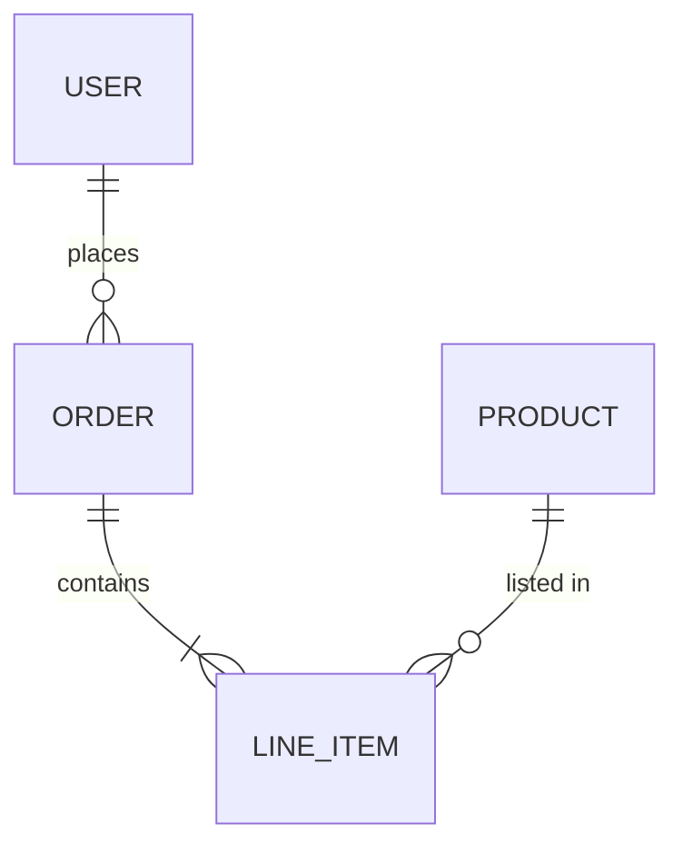
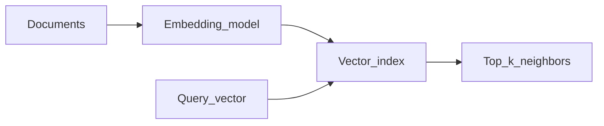

# Database design

Relational modeling, storage tradeoffs, **vector search**, and operational topics—structured for **job** and **interview** prep with **Basic / Intermediate / Advanced** depth.

**Companion docs:** [Command-line tooling](command-line-tooling.md) · [Servers and networking](servers-and-networking.md) · [Software engineering](software-engineering.md)

---

## Table of contents

- [How this doc is organized](#how-this-doc-is-organized)
- [Why databases exist](#why-databases-exist)
- [Relational model and ER thinking](#relational-model-and-er-thinking)
- [Keys and integrity](#keys-and-integrity)
- [Normalization](#normalization)
- [Indexes](#indexes)
- [Transactions and ACID](#transactions-and-acid)
- [Migrations](#migrations)
- [Connection pooling](#connection-pooling)
- [Replication and read scaling](#replication-and-read-scaling)
- [CAP theorem (careful reading)](#cap-theorem-careful-reading)
- [SQL versus NoSQL families](#sql-versus-nosql-families)
- [OLTP versus OLAP](#oltp-versus-olap)
- [Vector databases and embeddings](#vector-databases-and-embeddings)
- [Time-series and graph stores](#time-series-and-graph-stores)
- [Full-text search](#full-text-search)
- [Change data capture](#change-data-capture)
- [Sharding and partitioning](#sharding-and-partitioning)
- [Data and access security](#data-and-access-security)
- [Interview checklist](#interview-checklist)

---

## How this doc is organized

| Level | Focus |
|--------|--------|
| **Basic** | Tables, keys, SQL vs NoSQL vocabulary, what ACID abbreviates. |
| **Intermediate** | Normal forms tradeoffs, index plans, isolation phenomena, replication lag. |
| **Advanced** | **CAP** nuance, ANN index families at overview level, **zero-downtime** migration strategies. |

---

## Why databases exist

**Basic:** Persistent, concurrent, structured storage with **query languages** (SQL most common). Compare to files: **concurrency**, **durability**, **declarative queries**.

---

## Relational model and ER thinking

**Basic:** **Relations** (tables), **tuples** (rows), **attributes** (columns), **constraints**.

**Takeaway:** Entities and relationships become tables and **foreign keys** (see next section).

---

## Keys and integrity

- **Primary key:** Uniquely identifies a row (often surrogate integer/UUID).
- **Foreign key:** References another table—enforces **referential integrity**.
- **Natural key:** Business-meaningful (email)—can change; often prefer surrogate + unique constraint.

**Intermediate:** `ON DELETE CASCADE` vs `RESTRICT`—**orphan rows** vs **accidental mass deletes**.

---

## Normalization

**Basic:**

| Form | Idea |
|------|------|
| **1NF** | Atomic columns; repeating groups eliminated |
| **2NF** | No partial dependency on part of a composite key |
| **3NF** | No transitive dependency on non-key attributes |

#### Normal forms (plain language)

- **1NF** — Each column holds a **single atomic** value; no “list inside a cell” or repeating column groups. You can still have redundancy—1NF is about shape, not eliminating duplication.
- **2NF** — When the primary key is **composite**, no non-key column should depend on **only part** of that key—only relevant for multi-column keys (e.g. order line: `qty` depends on the full `(order_id, product_id)` key, not `order_id` alone).
- **3NF** — No non-key column should depend on **another** non-key column (no **transitive** dependency through a “middle” attribute). Classic fix: move `customer_city` off **Order** into **Customer** so city updates happen once.

**Intermediate:** **Denormalize** for read hot paths (materialized views, counters)—**document the tradeoff**.

**Advanced:** **BCNF** handles certain anomalies 3NF still allows—know the name in interviews.

**Mini-example (Basic):** Store `customer_city` on every order row → update anomalies; move city to **Customer** table (3NF direction).

---

## Indexes

**Basic:** **B-tree** (common default) speeds **equality and range** on keys—**O(log n)** probe vs **O(n)** scan.

**Intermediate:** **Covering index** includes columns so queries avoid **table lookups**. **Write amplification:** every index updates on write.

**When indexes hurt:** Low-selectivity columns, tiny tables, or **hot write** paths with too many indexes.

---

## Transactions and ACID

| Letter | Meaning |
|--------|---------|
| **A**tomicity | All or nothing |
| **C**onsistency | Invariants preserved |
| **I**solation | Concurrent txs see well-defined visibility |
| **D**urability | Committed data survives crashes |

#### ACID in practice

- **Atomicity** — Either **all** statements in the transaction commit, or **none** do—no half-applied transfers. Implemented via logs and rollback.
- **Consistency** — **Rules you care about** (constraints, triggers, foreign keys) hold when the transaction ends; the DB rejects or rolls back illegal states.
- **Isolation** — Concurrent transactions each see a coherent story—**without** isolation you get dirty reads, lost updates, etc. Real engines offer **levels** with different cost and anomaly tradeoffs.
- **Durability** — After **commit**, committed data survives **crash/power loss** (WAL/fsync policies matter for exact guarantees).

**Isolation phenomena (names interviews expect):** **dirty read**, **non-repeatable read**, **phantom read**. **Levels:** Read uncommitted → read committed → repeatable read → serializable (names vary by engine).

**Intermediate:** **MVCC** (snapshot isolation) avoids reader/writer blocking—**replication** still lags.

---

## Migrations

**Basic:** **Forward-only** scripts in CI/CD; **never** hand-edit production without automation.

**Intermediate:** **Expand/contract** for zero-downtime: add new column nullable → backfill → add constraints → remove old.

---

## Connection pooling

**Basic:** Reuse TCP connections to DB—**avoid** opening per request (exhausts server).

**Intermediate:** Pool size vs **latency** under load; **connection storms** after deploys.

---

## Replication and read scaling

**Basic:** **Primary** takes writes; **replicas** serve reads—**asynchronous** replication implies **lag**.

**Intermediate:** **Read-your-writes** may fail if you read a replica before it catches up—route critical reads to primary or use **session stickiness** carefully.

---

## CAP theorem (careful reading)

**Basic (often stated):** Partition tolerance **P** is not optional in distributed systems—under **network partition**, you trade **C**onsistency vs **A**vailability for certain operations.

**Advanced:** Real systems offer **tunable** consistency (linearizable vs eventual); **CAP** is a **coarse** teaching model—avoid slogans without nuance in senior interviews.

---

## SQL versus NoSQL families

| Family | Example use |
|--------|--------------|
| **Document** | Flexible schema, nested JSON—MongoDB, DynamoDB document mode |
| **Key-value** | Cache, sessions—Redis |
| **Wide-column** | Time-ordered big data—Cassandra |
| **Graph** | Traversals, relationships as first-class |

#### NoSQL families (going deeper)

- **Document** — One **JSON-like** document per key; good when reads/writes are **document-shaped** and joins are rare. Watch **unbounded document growth** and **cross-document** consistency.
- **Key-value** — O(1) get/put by key—**Redis** for cache, sessions, rate limits; not a substitute for complex queries without building secondary structures yourself.
- **Wide-column** — Rows with **dynamic columns**, partition keys that define locality—**Cassandra**-style; strong for **high write** and time-series-ish patterns with clear partition design.
- **Graph** — **Nodes and edges** as first-class; shines for **traversals** (friends-of-friends, fraud rings); operational and query complexity differs from relational joins.

**Rule of thumb:** Start with **relational** when joins and constraints are core; choose **document** when schema varies per record and access patterns are document-shaped.

---

## OLTP versus OLAP

| | OLTP | OLAP |
|---|------|------|
| Pattern | Many small transactions | Heavy scans, aggregations |
| Schema | Normalized | Often **star/snowflake** dimensional |
| Engines | Postgres, SQL Server rowstore | Column stores, warehouses |

#### OLTP vs OLAP (going deeper)

- **OLTP** — **Many short** transactions: point lookups, inserts, updates—optimized for **row** storage, indexes, and low latency per operation (apps, order entry).
- **OLAP** — **Heavy scans** and aggregations over large history—often **columnar** storage, partitioning, and pre-aggregates; not tuned for single-row interactive updates.
- **Why it matters:** Running analytical **warehouse** queries on the **production OLTP** DB can starve transactional traffic—**ETL/ELT** into a separate store is the usual pattern.

**ETL / ELT:** Extract → transform → load into warehouse (**ELT**: load raw then transform in-warehouse).

---

## Vector databases and embeddings

**Basic:** **Embedding model** maps text/images into **high-dimensional vectors**. **Similarity search** finds nearest neighbors in that space—used for **semantic search**, **recommendations**, **RAG** (retrieval-augmented generation).

**Intermediate:** **ANN** (approximate nearest neighbor) trades **recall** for **latency**—indexes like **HNSW**, **IVF** are common names; **hybrid** search combines **keyword (BM25)** + **vector** for better relevance.

**Advanced:** Re-embedding cost on model changes; **chunking** strategy affects RAG quality.

---

## Time-series and graph stores

**Time-series:** Metrics, events with timestamps—** cardinality** and retention policies matter.

**Graph:** **Traversal** queries (degrees of separation)—alternatively **recursive CTEs** in SQL for moderate depth.

---

## Full-text search

**Basic:** SQL `LIKE` scans poorly at scale—**inverted indexes** in Elasticsearch/OpenSearch/SQL Server FTS for **tokens** and ranking.

---

## Change data capture

**Intermediate:** **CDC** streams row changes to warehouse/search—**eventual consistency** consumers.

---

## Sharding and partitioning

**Advanced:** **Horizontal sharding** splits rows by **shard key**—**hot shards** (imbalanced keys) hurt fairness and failover.

---

## Data and access security

**Basic — SQL injection:** Never concatenate user input into SQL strings—use **parameterized queries** / **prepared statements**. ORMs help default path but **raw SQL** and dynamic fragments can still be vulnerable.

**Least privilege:** App role **only** needed DML; separate **migration** role; **read-only** for reporting.

**Encryption at rest:** Data volumes encrypted; **KMS** manages keys—know who can decrypt (IAM).

**PII:** Mask in non-prod; classify columns.

**Backups:** **Encrypted** backups; **RPO/RTO** vocabulary; restrict who can **restore** (power = data breach).

**Intermediate:** **Row-level security** (policy per tenant) in Postgres/SQL Server when multi-tenant tables shared.

---

## Interview checklist

- **Primary vs foreign key**; what breaks without FK constraints.
- **1NF–3NF** with a **small normalization** example.
- **ACID** and **isolation phenomena** names.
- **Index** why/when; **covering index** intuition.
- **Replication lag** and user-visible bugs.
- **SQL vs NoSQL** when to pick document/KV.
- **OLTP vs OLAP** and **star schema** one-liner.
- **Vector DB** purpose; **embedding**; **RAG** pipeline sketch.
- **SQL injection** mitigation.
- **CAP** without false certainty.
