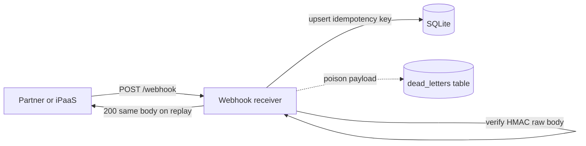

# Architecture — webhook receiver (reference)

**Spec:** [Project 1](../../../archive/v1-22-step/career-project-specs/01-integration-webhook-receiver.md)  
**Framework:** [Architecture framework](../../concepts/architecture-framework.md)

## System context

Partner systems POST signed webhooks. The receiver verifies trust, dedupes retries, and returns fast — durable side effects happen after the idempotency record.

## Pillar annotations

| Component / path | Pillar | Decision |
|------------------|--------|----------|
| Fast 2xx after idempotency write | **1 — System shape** | HTTP ends before heavy downstream work |
| HMAC on raw body before JSON parse | **5 — Reliability and security** | Forged POST rejected at edge |
| Idempotency key store | **2 — Integration** | At-least-once transport; effectively-once business effect |
| `idemp` schema | **3 — Data** | Unique constraint on idempotency key |
| `dead_letters` branch | **2 + 5** | Poison messages parked without blocking partner retries |
