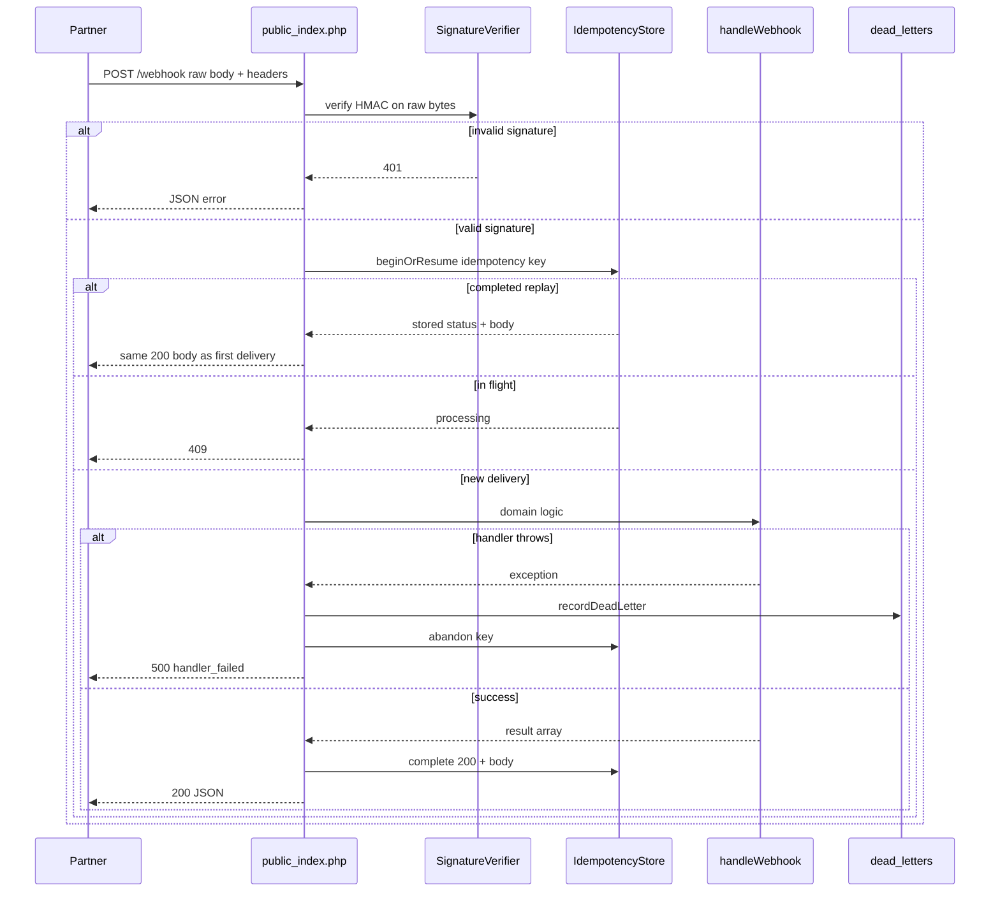

# Request flow — webhook receiver

**Spec:** [Project 1](../../../career-project-specs/01-integration-webhook-receiver.md)

## Happy path (scenario 1)

1. Partner sends signed POST with new `Idempotency-Key`.
2. HMAC passes; store inserts `processing` row.
3. Handler returns result; store updates to `completed` with response body.
4. Structured log `webhook_ok` on stderr.

## Replay (scenario 2)

Same key and body: store returns `completed`; handler **not** invoked again; response body matches first delivery (including stored `request_id`).

## Poison path (scenario 5)

`event: test.boom` triggers handler throw → `dead_letters` insert → `abandon()` deletes `processing` row → `500` to partner. Partner may retry same key after fix (scenario 9).
