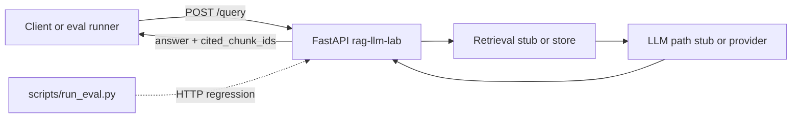

# Architecture — RAG / LLM service (reference)

**Spec:** [Project 2](../../../career-project-specs/02-rag-llm-service.md)  
**Framework:** [Architecture framework](../../concepts/architecture-framework.md)

## System context

Clients and the eval runner call a stable `POST /query` contract. The FastAPI service validates input, runs retrieval + generation (stub today), and returns grounded answers with `cited_chunk_ids`.

## Pillar annotations

| Component | Pillar | Decision |
|-----------|--------|----------|
| Stable `POST /query` JSON contract | **1 — System shape** | Python owns LLM/RAG boundary |
| `cited_chunk_ids` in response | **3 — Data** | Grounding accountability |
| Eval JSONL + `run_eval.py` | **5 — Reliability** | Regression before prompt/model changes |
| `request_id` + `latency_ms` logs | **5 — Operations** | Observability (Project 3 on same repo) |
| Go `/retrieve` (later) | **4 — Performance** | Optional split per Project 8 |

## Stub vs production

Captures in this folder reflect **`_stub_answer`** in `app/main.py` — keyword routing for France, echo for other questions. Replace the stub with real retrieval + LLM while keeping the response shape and eval harness stable.
