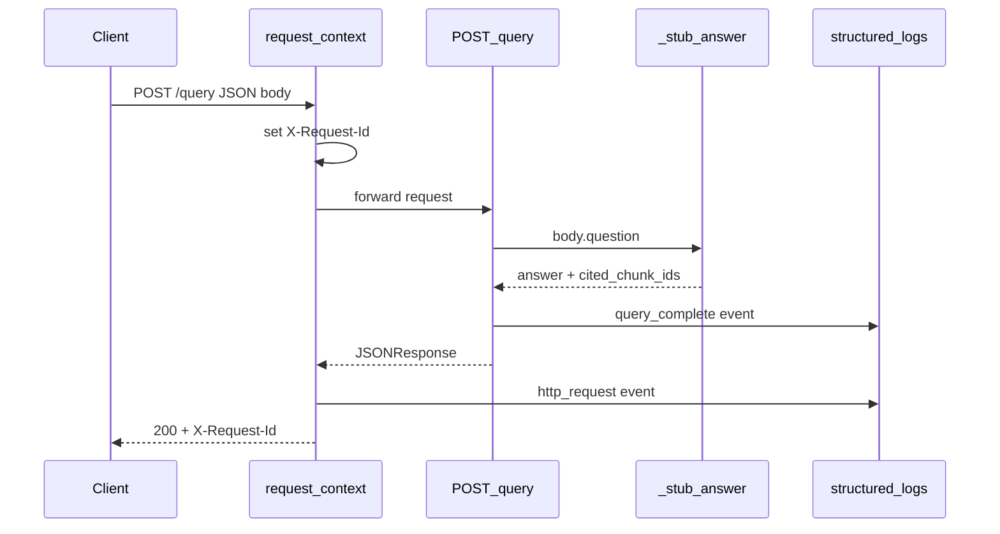
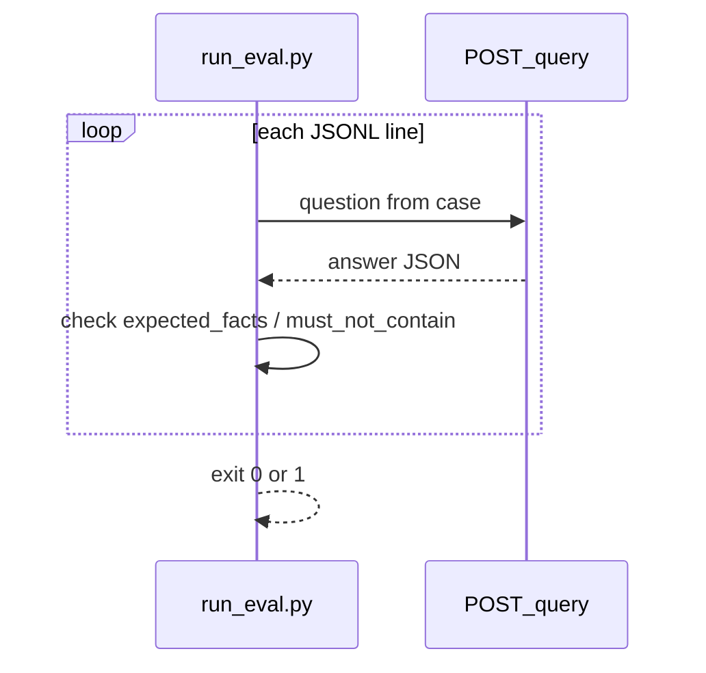

# Request flow — RAG / LLM service

**Spec:** [Project 2](../../../career-project-specs/02-rag-llm-service.md)

## Eval runner path (scenario 1)

## France question (scenario 3)

Stub matches `capital` + `france` in the question → fixed answer + one citation id.

## Echo path (non-France)

Returns `(stub) Echo: …` with **empty** `cited_chunk_ids` — documents the contract when retrieval finds nothing.
