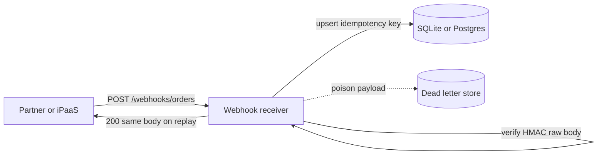

# Sample architecture diagram — webhook ingress (Project 1)

**Purpose:** Reference quality bar for `docs/portfolio/architecture.md` in lab repos.  
**Framework:** [Architecture framework](../../concepts/architecture-framework.md)

## System context

Partner systems POST signed webhooks. The receiver verifies trust, dedupes retries, and returns fast — durable side effects happen after the idempotency record.

## Pillar annotations

| Component / path | Pillar | Decision |
|------------------|--------|----------|
| Fast 2xx after idempotency write | **1 — System shape** | HTTP ends before heavy downstream work |
| Hash-based message authentication code (HMAC) on raw body before JSON parse | **5 — Reliability and security** | Forged POST rejected at edge |
| Idempotency key store | **2 — Integration** | At-least-once transport; effectively-once business effect |
| Idempotency schema | **3 — Data** | Unique constraint on `event_id` or header key |
| Dead-letter queue (DLQ) branch | **2 + 5** | Poison messages parked without blocking partner retries |

## How to explain this in an interview

Partners retry until they see HTTP 2xx — you record idempotency before side effects and return the stored response on replay, so transport duplicates never double-apply billing.
