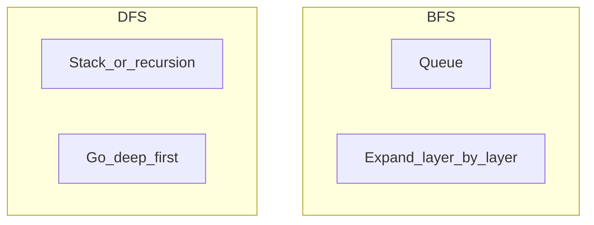

# Algorithms and data structures

Interview- and design-review-grade literacy: **how work and memory scale**, **which structure fits which access pattern**, and **how to talk about it** when libraries or AI supply the code. Companion to [Software engineering](software-engineering.md).

**See also:** [Database design — Indexes](database-design.md#indexes) for B-trees and index tradeoffs in storage engines.

---

## How to use this doc

| Level | Focus |
|--------|--------|
| **Basic** | Name the structure, know typical op costs, one real-world use. |
| **Intermediate** | Tradeoffs (memory vs speed, average vs worst), when *not* to optimize asymptotically. |

---

## Why this still matters (including with AI)

Asymptotic complexity is a **language for bounds**: whether a path is safe at 10³ vs 10⁹ items, whether you are doing extra passes, whether you are trading memory for time. Generated code can be **asymptotically fine** or **accidentally quadratic**; you still choose structures, spot hot loops, and explain choices to teammates and interviewers.

**When Big-O is load-bearing in production:** request handlers, batch jobs, data pipelines, anything that runs **per item** at scale, or holds large in-memory graphs. **When libraries are enough:** most app code—use your language’s `dict`, `list`, `PriorityQueue`, and standard sorts; optimize after measurement.

---

## Time and space complexity

### Big-O is scaling, not seconds

**Big-O** describes how cost grows as input size `n` grows—**up to constant factors**. A fast O(n²) may beat a slow O(n log n) for tiny `n`; the notation tells you what happens when `n` gets large.

**Worst vs average:** Interview answers are usually **worst case** unless the problem says otherwise. **Hash tables** are O(1) average for lookup but **O(n)** worst if everything collides—still the right tool when keys are well distributed.

**Amortized:** Some operations are occasionally expensive but rare **when spread over many steps**. **Appending** to a dynamic array is usually O(1) **amortized** (doubling capacity pays for rare O(n) copies).

### Space

**Auxiliary space** is extra memory beyond storing the input/output **as given** (often what interviews mean by “space”). **Total space** includes the output itself. **Recursion** uses **O(depth)** stack frames—deep trees can blow the stack even if heap memory is fine.

### Common growth classes (recognition)

| Class | Meaning | Example situation |
|--------|---------|-------------------|
| **O(1)** | Constant | Hash lookup (average), index into array, peek heap top |
| **O(log n)** | Halve or narrow | Balanced BST search, binary search, B-tree probe |
| **O(n)** | One pass | Scan array, build hash map of counts, BFS/DFS visiting each edge once (sparse graph) |
| **O(n log n)** | Divide-and-conquer or good sorts | Mergesort/heapsort, many “sort then scan” pipelines |
| **O(n²)** | Pairs or nested loops on `n` | Naive “all pairs,” some DP tables |
| **O(2ⁿ)** | Exhaustive subsets | Trying every subset of `n` items—explodes fast |

### Reading loops (practical)

- **Sequential loop over `n`:** O(n) per iteration → O(n) if body is O(1).
- **Nested loops both to `n`:** often O(n²)—verify inner work isn’t itself O(n).
- **`i = n; while i > 1: i //= 2`:** O(log n) iterations.
- **Sort then one pass:** O(n log n) + O(n) → O(n log n).

---

## Data structures

Each subsection: **what**, **typical operations**, **when to prefer**, **sketch**, **real world**.

### Array, dynamic array, list (contiguous)

**What:** Elements stored in order at contiguous indices (dynamic arrays grow by reallocation).

**Typical ops:** Index read/write **O(1)**; append **O(1) amortized**; insert/delete **in the middle O(n)** (shift elements).

**When:** Default for sequences; cache-friendly scans; stacks/queues often built on arrays (ring buffer).

**Sketch (dynamic capacity):**

```python
def append(arr, x, size, cap):
    if size == cap:
        cap = max(1, cap * 2)
        arr = arr + [None] * (cap - len(arr))  # conceptual grow
    arr[size] = x
    size += 1
    return arr, size, cap
```

**Real world:** Buffers, JSON arrays, column chunks, most “just a list” in application code.

---

### Linked list

**What:** Nodes with pointers; order without contiguous memory.

**Typical ops:** Insert/delete **given a node pointer** O(1); find k-th element **O(n)**; worse **locality** than arrays.

**When:** Frequent insert/delete in the middle **if** you already hold node references; LRU with sentinel + hash map combines list + map.

**Sketch:**

```python
class Node:
    def __init__(self, val, next=None):
        self.val = val
        self.next = next

# prepend: O(1)
head = Node(42, head)
```

**Real world:** LRU eviction lists, kernel schedulers, functional-style persistent lists; many language runtimes use lists internally (not always exposed to app devs).

---

### Stack (LIFO)

**What:** Push/pop from one end.

**Ops:** Push/pop **O(1)**.

**When:** Parsing (brackets, expressions), DFS explicitly, undo stacks, recursive call semantics.

**Real world:** Expression evaluation, bytecode VMs, browser history “back,” depth-first traversals.

---

### Queue (FIFO) and deque

**What:** **Queue:** enqueue rear, dequeue front. **Deque:** efficient both ends.

**Ops:** **O(1)** each end when implemented with a ring buffer or doubly linked structure.

**When:** BFS, fair work distribution, rate smoothing, ordered event processing.

**Real world:** Job queues (conceptually—often backed by Redis, SQS, RabbitMQ), streaming windows, level-order tree walks.

---

### Hash map and hash set

**What:** Key → value (map) or key present? (set) via hash function + bucket array.

**Typical ops:** Insert/lookup/delete **O(1) average**; **O(n)** worst case.

**When:** Counting, deduplication, caching by id, “have I seen this?”—**no requirement for sorted order**.

**Sketch (simplified chaining):**

```python
def naive_hash(key: str, buckets: int) -> int:
    return sum(ord(c) for c in key) % buckets

# bucket[slot] holds a short list of (key, value) on collision
```

**Real world:** Language `dict`/`Map`/`HashMap`, caches, indexes in memory, API route tables keyed by path (often with trie for prefixes—see below).

---

### Trees and balanced BST (conceptual)

**What:** Hierarchical ordering; **BST:** left smaller, right larger.

**Typical ops:** Search/insert **O(h)** height; **O(log n)** if **balanced** (AVL, red-black)—unbalanced skew can degrade to **O(n)**.

**When:** Ordered iteration, range queries **in memory**; file systems and DBs use **B-trees** on disk (wider nodes, fewer seeks)—see [Indexes](database-design.md#indexes).

**Real world:** `TreeSet`/`sorted map` types, interval trees in specialized libs, DOM/XML trees, syntax trees.

**B-tree intuition (disk):** Shallow, **wide** nodes keep more keys per read; minimizing seeks beats raw CPU on storage. Details stay in the database doc.

---

### Heap / priority queue

**What:** Binary heap is a complete tree with **heap property** (parent ≥ or ≤ children).

**Typical ops:** Insert **O(log n)**; peek min/max **O(1)**; pop **O(log n)**.

**When:** “Top k,” schedulers (next due task), merging sorted streams, Dijkstra with a priority queue.

**Sketch:** Array storage: node `i` has children `2i+1`, `2i+2`; sift up/down after push/pop.

**Real world:** Timeout wheels’ cousins at coarse level, OS schedulers, event loops with earliest deadline, bandwith limiters.

---

### Trie (prefix tree)

**What:** Edges labeled characters; paths from root spell strings; shared prefixes share nodes.

**Typical ops:** Insert/lookup prefix **O(L)** for string length `L` (alphabet size affects child map structure).

**When:** Autocomplete, IP longest-prefix routing (conceptually), censored-word filters, many short strings with shared prefixes.

**Sketch (nested dict):**

```python
root = {}

def trie_insert(trie, word):
    node = trie
    for ch in word:
        node = node.setdefault(ch, {})
    node["$"] = True  # end marker
```

**Real world:** Routers, search suggestions, some config/key namespaces.

---

### Graph representations

**Adjacency list:** Each vertex → list of neighbors. **Space** O(V + E) for sparse graphs; iterate neighbors fast.

**Adjacency matrix:** `V × V` table. **Space** O(V²); **edge lookup** between two vertices O(1).

**When:** List **almost always** for sparse graphs (web links, social “who follows whom,” dependencies). Matrix when **very dense** or you need **all-pairs** bit tricks at small V.

**Real world:** Dependency resolution, network topology, recommendation subgraphs, CI task graphs.

---

### Bloom filter and bitmap (vocabulary)

**Bloom filter:** Probabilistic set membership—**may say “maybe yes,” never false “no”** (with tuned false positive rate). **Bits** + multiple hash functions.

**Bitmap / bitset:** Dense set of integers in a range; fast **union/intersection** for analytics.

**When:** “Probably seen before” at huge scale (CDN, DB internals), dedup with acceptable false positives; bitmaps for feature flags or slot allocation.

**Real world:** Cassandra/Scylla hints, Akamai-style caches, Chrome safe-browsing style filters (simplified).

---

## Algorithm families (recognition + when to suggest)

### Sorting

**Comparison sorts** (mergesort, heapsort, typical `sort()`): **O(n log n)** worst case. **Stable** sort keeps equal keys’ order—matters for multi-key sorts.

**Linear-time sorts** when keys are **bounded integers or small alphabet** (counting sort, radix sort): **O(nk)**—know they exist for interview variety.

**When:** “Need sorted order,” dedup after sort, binary search precondition, joining sorted streams.

### Binary search

**What:** Halve a **sorted** range each step → **O(log n)**.

**When:** Lookup in sorted array; **“search on answer”** (minimum feasible capacity, earliest time, etc.) with a predicate **monotonic** in the domain.

### Two pointers and sliding window

**Two pointers:** Often **sorted array** pair sums, merge sorted lists, palindrome scan—avoid O(n²) recomputation.

**Sliding window:** Contiguous subarray/substring with a **constraint** (max sum ≤ K, unique chars)—often **O(n)** when you only advance ends.

### BFS and DFS

**BFS (queue):** Explores **layer by layer**; **shortest path in unweighted** graph; closest first.

**DFS (stack or recursion):** Goes **deep** first; cycle detection (with colors), topological sort (on DAG), exhaustive layouts.



**When:** Grid puzzles, dependency graphs, connected components, path existence (with caveats for weighted shortest path—Dijkstra/A* then).

### Greedy vs dynamic programming

**Greedy:** Locally best choice; works only when **problem has greedy-choice property** (e.g. some interval scheduling). Fast, simple **when valid**.

**DP:** **Overlapping subproblems** + optimal substructure; table or memoization; often **O(n²)** or similar—know the **shape** (“knapsack-like,” edit distance) more than every variant.

**Interview tip:** Brute force → spot repeated subproblems → memo/table; or prove greedy on a small example.

---

## Interview and design discussion flow

1. **Clarify:** constraints, size of `n`, sorted?, memory limits, need stability?
2. **Tiny example:** walk on the board.
3. **Brute force** with stated complexity—establishes a ceiling.
4. **Optimize:** pick structure (hash map, heap, two pointers) and **justify** why complexity improves.
5. **Edge cases:** empty, one element, duplicates, overflow, recursion depth.
6. **Tests:** at least one normal, one edge, one larger random/sanity.

In **system design**, use the same vocabulary: “That’s linear scan per request; if the fan-out grows…” or “We can bound membership with a Bloom filter if false positives are OK.”

---

## Quick reference

**Structures → access pattern:** random by index → array; by key → hash map; min/max repeatedly → heap; ordering/ranges → tree or sort+search; prefixes → trie; relationships → graph (usually list).

**Patterns → shapes:** sorted + target → binary search; contiguous constraint → sliding window; unweighted shortest → BFS; exhaustive structures → DFS + pruning.
