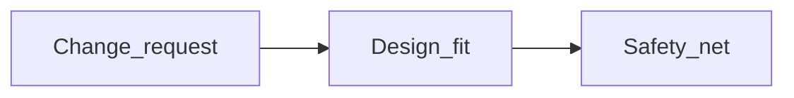
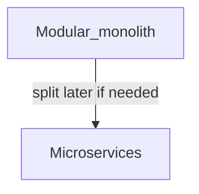
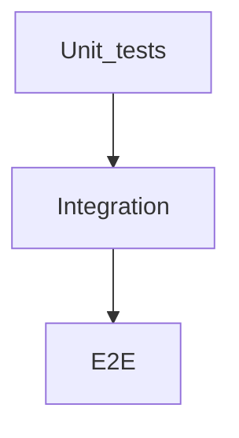

# Software engineering

Concepts for building maintainable systems, shipping safely, and communicating in interviews—from **paradigms** and **patterns** to **APIs**, **testing**, **debugging**, **DSA**, **observability**, and **cross-language gotchas** (Python, JavaScript, PHP, C#).

**Companion docs:** [Command-line tooling](command-line-tooling.md) · [Servers and networking](servers-and-networking.md) · [Database design](database-design.md) · [Algorithms and data structures](algorithms-and-data-structures.md)

**If jargon-dense stack notes feel overwhelming first:** skim **[Stacks — New here?](../stacks/README.md#new-here-read-this-once)** and **[Stacks glossary](../stacks/glossary.md)**; come back here for **longer narratives and worked patterns** (delivery semantics, idempotent handlers, N+1). For ORM query shapes, see **[Database design — N+1 pattern](database-design.md#orms-and-the-n1-query-pattern)**.

---

## Table of contents

- [How to use this doc and skill bands](#how-to-use-this-doc-and-skill-bands)
- [Complexity, change, and technical debt](#complexity-change-and-technical-debt)
- [SOLID](#solid)
- [DRY and when duplication wins](#dry-and-when-duplication-wins)
- [Programming paradigms](#programming-paradigms)
- [Scripting versus programming](#scripting-versus-programming)
- [Design patterns (GoF-style survey)](#design-patterns-gof-style-survey)
- [Architectural patterns](#architectural-patterns)
- [Integration: sync, async, and messaging](#integration-sync-async-and-messaging)
- [Example: idempotent webhook or job (Integration)](#example-idempotent-webhook-or-job-consumer)
- [REST](#rest)
- [SOAP and WS-style services](#soap-and-ws-style-services)
- [OData](#odata)
- [GraphQL, gRPC, and webhooks](#graphql-grpc-and-webhooks)
- [Testing](#testing)
- [Debugging (workflow)](#debugging-workflow)
- [CI/CD and delivery](#cicd-and-delivery)
- [Versioning and compatibility](#versioning-and-compatibility)
- [Code review and documentation](#code-review-and-documentation)
- [Observability: logs, metrics, traces](#observability-logs-metrics-traces)
- [Security for applications](#security-for-applications)
- [Cross-language concepts and gotchas](#cross-language-concepts-and-gotchas)
- [Data structures and algorithms](#data-structures-and-algorithms)
- [Concurrency basics](#concurrency-basics)
- [Internationalization and encoding](#internationalization-and-encoding)
- [Licenses (developer awareness)](#licenses-developer-awareness)
- [Interview checklist](#interview-checklist)

---

## How to use this doc and skill bands

| Level | Focus |
|--------|--------|
| **Basic** | Definitions, “when would I use this,” one example. |
| **Intermediate** | Tradeoffs, failure modes, how teams apply this in practice. |
| **Advanced** | Distributed pitfalls, formal edges (named, not fully proved here). |

**Newcomer bridge:** If stack maps felt like alphabet soup, read **[Integration + idempotent example](#integration-sync-async-and-messaging)** and **[Concurrency basics](#concurrency-basics)** before interviews; ORM access patterns live under **[Database design — N+1](database-design.md#orms-and-the-n1-query-pattern)**.

---

## Complexity, change, and technical debt

**Basic:** Software **cost to change** rises when structure obscures intent and tests are missing. **Technical debt** is postponed work (often deliberate short-term) with carrying cost—like financial debt, interest compounds.

**Intermediate:** Prefer **small, reversible steps**; align refactors with **product risk**.



---

## SOLID

**Single responsibility:** One reason to change per unit (class/module).

**Open/closed:** Extend behavior without editing stable core—often interfaces/strategy.

**Liskov substitution:** Subtypes must honor contracts of supertypes (surprises break polymorphism).

**Interface segregation:** Many small interfaces beat one fat interface clients must stub.

**Dependency inversion:** Depend on **abstractions**, not concrete low-level modules—eases testing (inject fakes).

**Tiny pseudocode (dependency inversion):**

```text
interface Clock { now(): Timestamp }
class SystemClock implements Clock { ... }
class OrderService(Clock clock) { ... }  // test injects FixedClock
```

**Intermediate:** SOLID is a **lens**, not a checklist to maximize—**YAGNI** applies.

---

## DRY and when duplication wins

**Basic:** Don’t Repeat Yourself—one authoritative place for each piece of knowledge.

**Intermediate:** **Duplication beats wrong abstraction.** If two similar pieces evolve differently, extract **after** the pattern stabilizes (Rule of Three often cited).

---

## Programming paradigms

| Paradigm | Idea | Typical strengths |
|----------|------|-------------------|
| **Imperative** | Statements mutate state | Straightforward control flow |
| **Object-oriented** | Encapsulation, messages, polymorphism | Modeling domains with nouns |
| **Functional** | Immutability, pure functions, higher-order fns | Easier reasoning about data flow |
| **Declarative** | Describe *what*, not *how* | SQL, many DSLs |

#### Paradigms (going deeper)

- **Imperative** — You write **steps** that change program state (`loop`, assignments). Easy to follow for straight-line scripts; shared mutable state can get hard to test.
- **Object-oriented** — **Encapsulation** hides invariants; **polymorphism** lets you substitute implementations. Fits domain nouns; watch for **god objects** and deep inheritance trees.
- **Functional** — Prefer **immutable** data and **pure** functions; higher-order functions (`map`, `filter`) compose pipelines. Easier reasoning in parallel; real apps still need side effects at the edges.
- **Declarative** — You state **desired outcome**; the engine decides steps (**SQL**, Terraform-style config, many UI frameworks’ templates). Debugging is “why didn’t the engine pick the plan I expected?”

**Intermediate:** Most production systems are **multi-paradigm** (e.g. FP + OOP in modern languages).

---

## Scripting versus programming

**Basic:** **“Script”** usually means a file run by an interpreter without a separate compile step; **“scripting language”** often implies fast iteration and dynamic typing—but **boundary is fuzzy**. A 5k-line “script” is still **software engineering** if it has tests and deployment.

**Intermediate:** Judge by **maintainability**, **observability**, and **risk**—not labels.

---

## Design patterns (GoF-style survey)

**Creational:** **Factory** centralizes construction; **Builder** for stepwise complex objects; **Singleton**—often overused; **global mutable state** is the gotcha.

**Structural:** **Adapter** translates interfaces; **Decorator** adds behavior wrappers; **Facade** simplifies subsystems.

**Behavioral:** **Strategy** swaps algorithms; **Observer** pub/sub; **Command** encapsulates invocations (undo queues).

**Intermediate:** Patterns are **shared vocabulary**—misapplied patterns add complexity.

---

## Architectural patterns



| Style | Notes |
|-------|--------|
| **Layered / N-tier** | UI → app → data; simple but can hide domain model |
| **Hexagonal / ports-adapters** | Domain core; adapters for DB and HTTP |
| **Event-driven** | Loose coupling; **eventual consistency** and idempotency matter |
| **CQRS** | Different read/write models; pairs with event sourcing in some systems |
| **Microservices** | Independent deploy; **distributed complexity** (network, observability) |

#### Architectural styles (going deeper)

- **Layered / N-tier** — Clear separation (presentation / business / data) but can become **anemic domain** if “real” rules leak into stored procedures or the UI.
- **Hexagonal / ports-adapters** — **Domain** stays free of HTTP/ORM details; adapters translate. Strong fit for testability and swapping infrastructure.
- **Event-driven** — **Loose coupling** via messages; you trade simplicity for **ordering**, **duplicates**, and **eventual consistency**—design idempotent consumers.
- **CQRS** — Splits **commands** (writes) from **queries** (reads); read models can be optimized separately. Often paired with events; avoid overkill for simple CRUD.
- **Microservices** — **Independent deploy** and scaling; cost is **network latency**, **distributed transactions**, and **operational** load—need observability and clear boundaries.

**Intermediate:** **Modular monolith** first is a valid default—extract services when boundaries are clear.

---

## Integration: sync, async, and messaging

**Companion in this playbook:** [Integration hardening](../../checklists/integration-hardening.md); [Project 1 — webhook receiver](../../project-specs/01-integration-webhook-receiver.md); [Stacks — ecosystem maps](../stacks/README.md) (how PHP, Python, Node, … express these ideas).

### Sync HTTP callers

**Basic:** **Synchronous HTTP** means your code **waits** for the other service’s response. That is simple to reason about, but if the peer is slow or down and you have **no timeouts**, your **threads, connection pools, or event loop** fill up and failures **cascade** through the system.

**Intermediate:** Combine **timeouts**, **bounded retries with jittered backoff**, and **idempotency keys** for mutating calls so a **retry** does not double-apply an effect. Add **circuit breakers** when a dependency is clearly unhealthy so you **fail fast** instead of queuing work that will never succeed.

### Message queues and delivery semantics

**Basic:** **Queues** decouple **when** work is produced from **when** it is processed—the producer can finish while messages wait for an available worker.

**Delivery names (what product people really mean):**

| Name | Plain English | What your code must guarantee |
|------|---------------|-------------------------------|
| **At-most-once** | A message may be processed **zero or one** time; **loss** is possible on crash | Fine only when missing an event is acceptable (telemetry, best-effort cache warm) |
| **At-least-once** | **Common default** after retries: the **same logical message** may arrive **twice** | Consumer must be **idempotent** or **dedupe** with a **stable id** |
| **Exactly-once** (end-to-end) | Marketed promise; in distributed systems you usually build **effectively-once** from **at-least-once** + **idempotent writes** + careful **outbox/transaction** patterns | Design for **duplicate delivery** first; then narrow the window where it hurts |

**Message queues (reminder):** **At-least-once** delivery is the usual mental model—**consumers must be idempotent**. See also [GraphQL, gRPC, and webhooks](#graphql-grpc-and-webhooks) for **webhook**-specific notes (signatures, fast ack vs slow work).

### Example: idempotent webhook or job consumer

**Scenario:** A partner sends `POST /webhooks/orders` with JSON including `"event_id": "evt_123"`. Their side **retries** if your server is slow or returns 5xx—so your handler may see **`evt_123` twice**.

**Fragile pattern (duplicate side effects):**

```text
on POST /webhooks/orders:
  parse JSON body
  INSERT INTO orders (...) VALUES (...)      -- retry → duplicate orders
  RETURN 200
```

**Safer pattern (record idempotency before side effects):**

```text
on POST /webhooks/orders:
  parse JSON → ev = body.event_id
  BEGIN TRANSACTION
    INSERT INTO processed_webhook_events (event_id)
      VALUES (ev)
      ON CONFLICT (event_id) DO NOTHING           -- dialect varies: upsert / unique constraint
    IF inserted_or_conflict_means_already_done:
       COMMIT ; RETURN 200                       -- replay: harmless
    APPLY business change (same tx if possible): -- e.g. upsert order by partner_order_id
      INSERT INTO orders (...) ON CONFLICT (partner_order_id) DO UPDATE ...
  COMMIT
  RETURN 200
```

**Takeaways:**

- **Verify signatures** where the integration provides them—before you trust payloads or enqueue work (**[integration hardening](../../checklists/integration-hardening.md)**).
- Return **success only after** you have durably expressed “this **`event_id`** is handled” or applied an equivalent **business-key upsert**.
- Slow work (**PDFs, ML, third-party chaining**) belongs in **async jobs** keyed by the same **`event_id`** or business id—the HTTP handler acknowledges **intent recorded**, not “world finished.”

---

## REST

**Basic:** Resources identified by URIs; **stateless** server between requests (session state externalized). Uses HTTP semantics.

**Intermediate:** **OpenAPI** documents contracts. **Pagination** (`cursor`), **filtering**, **errors** with stable problem formats (e.g. RFC 7807 style).

---

## SOAP and WS-style services

**Basic:** **XML** payloads, often **WSDL** for contract; strong tooling in some enterprises; **verbose** on the wire.

**Intermediate:** **REST vs SOAP** tradeoffs: SOAP has **WS-* standards** (security, transactions) in heavy integrations; REST often easier for browsers and mobile JSON.

| | REST (typical JSON API) | SOAP |
|---|-------------------------|------|
| Format | JSON common | XML |
| Contract | OpenAPI common | WSDL |
| Transport | HTTP | HTTP + SOAP envelope |

---

## OData

**Basic:** **OData** exposes entity sets with uniform query options (`$filter`, `$orderby`, `$expand`) over HTTP—good for **readable** data APIs behind Power BI / Excel-like clients.

**Intermediate:** Contrast with **hand-crafted REST query params** and **GraphQL** (client-shaped fields vs server-driven OData model).

---

## GraphQL, gRPC, and webhooks

| Style | Notes |
|-------|--------|
| **GraphQL** | Client selects fields; watch **N+1** query issues and resolvers performance |
| **gRPC** | HTTP/2, protobuf, strong typing; common **service-to-service** |
| **Webhooks** | Server pushes to your URL—verify **signatures**, handle **retries** idempotently |

#### GraphQL, gRPC, webhooks (going deeper)

- **GraphQL** — Clients request exactly the fields they need; the cost is **resolver** performance and **N+1** database access unless you batch/dataloader. Schema evolution and auth live in the graph layer.
- **gRPC** — **Protobuf** contracts, HTTP/2, strong typing—excellent **service-to-service** on internal networks; browsers need a gateway (gRPC-Web) for typical web apps.
- **Webhooks** — Outbound HTTP callbacks; treat every delivery as **at-least-once**—verify **HMAC signatures**, respond quickly (queue work), and make handlers **idempotent** on event IDs.

**Optional:** **SSE** for one-way server streams; **WebSockets** for bidirectional—see [Servers and networking](servers-and-networking.md).

---

## Testing



**Pyramid:** Many **unit** tests (fast, narrow), fewer **integration** (DB, HTTP), few **E2E** (slow, brittle if overused).

**Test doubles:** **Fake** working implementation; **stub** canned answers; **mock** asserts calls.

#### Testing layers (going deeper)

- **Unit** — One module or function, **no** real DB/network; failures pinpoint logic bugs quickly—mock only when necessary (over-mocking couples tests to implementation).
- **Integration** — Real **DB**, queue, or HTTP to a test container; catches SQL, migrations, and wiring issues—slower but closer to production.
- **E2E** — Full stack through UI or public API; highest confidence, slowest and **flakiest**—reserve for critical paths and smoke suites.

**Intermediate:** **Flaky tests** erode trust—quarantine, fix or delete.

For **lab-by-lab** emphasis (which layers to use per initiative, optional AI prompt patterns), see [Per-project testing (labs + AI)](../playbook/per-project-testing.md).

When behavior in prod or CI disagrees with what you thought you shipped, use a tight **debugging loop** before you only add more tests—see **[Debugging (workflow)](#debugging-workflow)**. After you understand the failure, **lock the fix** with a regression test so the failure mode stays visible.

---

## Debugging (workflow)

**Basic:** **Debugging** means shrinking the gap between **expected** and **actual** behavior—not guessing, and not changing three things at once. A workable loop: **reproduce** (same inputs, same environment class) → **shrink** the case (smallest command, smallest data) → **hypothesis** → **one** cheap **experiment** (breakpoint, log line, assertion in a test, trace filter, SQL plan) → confirm or falsify → repeat.

**Intermediate:**

- **Local vs production:** A **debugger** (step, inspect stack and locals) shines when control flow or invariants are wrong in code you can run. **Structured logs** and **traces** shine when the bug is timing, concurrency, or multi-service—often you cannot attach a debugger to production; treat **[Observability: logs, metrics, traces](#observability-logs-metrics-traces)** as the default production tool and narrow locally once you can reproduce.

- **Binary search:** **`git bisect`** (or equivalent) between known-good and known-bad commits when a regression appears and the diff space is large.

- **Safety net:** After you find root cause, add or extend **[Testing](#testing)** so the same class of bug fails fast next time (unit or integration, whichever catches the boundary you fixed).

**Not the same as testing:** **Tests** assert intent up front; **debugging** explains a mismatch after failure. They meet at the regression test.

---

## CI/CD and delivery

**Pipeline:** lint → test → build → artifact → deploy to envs.

**Patterns:** **Blue/green** and **canary** reduce blast radius. **Feature flags** decouple deploy from release.

**12-factor app (basics):** One codebase; **config in environment**; **stateless processes**; **logs as streams**; **admin tasks as one-off processes**.

---

## Versioning and compatibility

**SemVer:** MAJOR.MINOR.PATCH—**breaking** API changes bump major when consumers rely on semver.

**API versioning:** URL (`/v1/`) vs header—team convention matters.

---

## Code review and documentation

**Good review:** Precise, kind, teaches **why**. Small PRs review faster with higher quality.

**ADRs:** Record significant architecture decisions—**context, decision, consequences**.

---

## Observability: logs, metrics, traces

| Signal | Use when… |
|--------|------------|
| **Logs** | Discrete events, debugging narratives |
| **Metrics** | Rates, histograms, SLIs (request latency percentiles) |
| **Traces** | Latency across services—**distributed tracing** IDs |

#### Observability signals (going deeper)

- **Logs** — Human-readable **events** with timestamps; best for “what happened to this request ID?” when fields are structured (**JSON**) and levels are used consistently.
- **Metrics** — Cheap **aggregates** (rates, percentiles, counters); ideal for dashboards and alerting—**cardinality** explosion (unique label per user) breaks many systems.
- **Traces** — **Spans** linked across services show where latency hides; requires **instrumentation** (OpenTelemetry) and sampling at scale.

**SLI / SLO / SLA:** SLI = measurement; **SLO** = internal target; **SLA** = customer-facing promise with consequences.

Signals tell you **where** time went or **which** request failed; they rarely replace thinking through **why** application logic is wrong—narrow with correlation IDs and traces, then reproduce locally and use **[Debugging (workflow)](#debugging-workflow)** when you need stepping or smaller reproducers.

---

## Security for applications

**OWASP-style categories to recognize:** **Injection**, **broken authentication**, **sensitive data exposure**, **XXE**, **broken access control**, **security misconfiguration**, **XSS**, **insecure deserialization**, **known vulnerable components**, **insufficient logging**, **SSRF**.

**Authn vs authz:** **who you are** vs **what you may do**.

**Supply chain:** lockfiles, **Dependabot**, review upgrades; **pin CI actions** to SHAs if policy requires.

**SAST/DAST:** static vs dynamic testing—**shift-left** reduces cost of defects.

**Intermediate:** **CSRF** for cookie sessions; **CORS** is not authorization.

---

## Cross-language concepts and gotchas

**Purpose:** Same **concept**, four **small snippets**. **TypeScript** note: optional strictness layer over JS—`strictNullChecks` catches many null bugs.

### Equality

| Language | Gotcha |
|----------|--------|
| **JavaScript** | `===` vs `==` (coercion)—prefer `===` |
| **PHP** | **Type juggling** with `==`; use `===` for strict |
| **Python** | `is` vs `==` (`is` for identity, e.g. `None`) |
| **C#** | Value vs reference equality; override `Equals`/`GetHashCode` carefully |

```python
# Python
if x is None: ...
if a == b: ...
```

```javascript
// JavaScript
if (x === null) { }
if (a === b) { }
```

```php
<?php
var_dump("1" == 1); // true
var_dump("1" === 1); // false
```

```csharp
// C#
object a = "x";
object b = "x";
Console.WriteLine(a == b); // may be reference compare unless string
```

### Truthiness

Know each language’s **falsy** set (e.g. JS: `0`, `""`, `NaN`, `null`, `undefined`, `false`; Python: empty containers are falsy; PHP: `"0"` is falsy).

### Null / optional

- **JS:** `null` vs `undefined`
- **Python:** `None`
- **PHP:** `null`; nullable types in 7.4+ `?string`
- **C#:** `null`; **nullable reference types** (`string?`) warn on dereference

### Exceptions

- **Python / JS / C#:** try/catch/finally familiar
- **PHP:** historical **Error** vs **Exception** split—modern code uses **Throwable**

### Async sketch

| Lang | Model |
|------|--------|
| **JS** | Promises, `async`/`await` |
| **Python** | `asyncio`, `async def` |
| **PHP** | Often request-per-process sync; async runtimes exist |
| **C#** | `async Task` + `await` |

---

## Data structures and algorithms

For complexity, core structures, pattern recognition, and interview flow, use the dedicated handbook note—**[Algorithms and data structures](algorithms-and-data-structures.md)**—so this file stays a breadth index. You still want Big-O vocabulary for reviews and screens even when libraries (or generated code) implement the details.

---

## Concurrency basics

**Processes** run in **separate memory**; **threads** inside one process share memory—without rules, **data races** (two writers, one reader without synchronization) corrupt state. Prefer **immutable data**, **message passing**, or **documented locking** over ad-hoc shared mutable heaps.

### UI threads and “don't block the main path”

**Basic:** Interactive apps (desktop, mobile, browser) expose a **main** or **UI thread** users feel as “the app responding.” Long **CPU work**, blocking **disk**, or naive **network** calls on that path cause **freezes**. Move heavy work to **background threads**, **worker pools**, or **async awaits** **that do not stall** the UI (exact API depends on framework—Swift **MainActor**, Android **Dispatchers**, browser **workers**, …).

**Intermediate:** Backend services less often have a literal “main thread,” but they still have **scarce resources**: **bounded thread pools**, **event loops**, **DB pool connections**. **Blocking** inside an async-only stack (FastAPI/asyncio; Node)—or **blocking the UI thread on mobile**—are the same **class** of mistake: starvation under load.

**Where each language expresses async:** see [Async sketch (cross-language)](#async-sketch).

---

## Internationalization and encoding

Store text as **UTF-8**. Separate **locale** from **language**; never assume single-byte encodings for user text.

---

## Licenses (developer awareness)

**Permissive** (MIT, Apache): few obligations. **Copyleft** (GPL): share-alike obligations on distribution—**not legal advice**; involve counsel for products.

---

## Interview checklist

- Name and motivate **SOLID** (one sentence each).
- **REST vs SOAP** at a high level.
- **Idempotency** and HTTP methods.
- **Testing pyramid**; difference **mock** vs **fake**.
- **Microservices** vs **monolith** tradeoffs.
- **Observability** three pillars; **SLI vs SLO**.
- **OWASP** top-level categories you have mitigated in code.
- **Big-O** of a nested loop; when **hash map** helps ([Algorithms and data structures](algorithms-and-data-structures.md)).
- One **cross-language** bug (e.g. `==` in PHP vs `===`).
