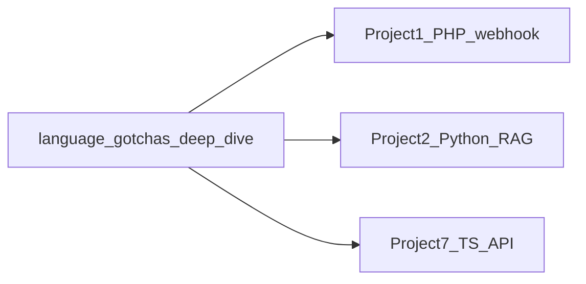

# Language gotchas — deep dive (Python · TypeScript/JS · PHP)

**Purpose:** Mentor-depth explanations of the **20 language tripwires** that bite backend engineers on this playbook's core stack. Each section covers **what happens**, **why**, **the production bug it causes**, and **the habit senior engineers use**.

**How to use:** Read one gotcha before your active lab when you are translating between stacks—not as a substitute for building. Skim [Interview prep](#interview-prep) when prepping for backend screens.

**Companion docs:** [Language fundamentals comparison](language-fundamentals-comparison.md) (syntax tables + Go/Rust) · [Python stack](python.md) · [PHP + Laravel](php-laravel.md) · [Node + TypeScript](node-typescript-backend.md) · [Software engineering](../concepts/software-engineering.md)

---

## Table of contents

1. [Truthiness and loose typing](#1-truthiness-and-loose-typing)
2. [Python mutable default arguments](#2-python-mutable-default-arguments)
3. [Loop variable capture (JS/TS)](#3-loop-variable-capture-jsts)
4. [PHP arrays are ordered hash maps](#4-php-arrays-are-ordered-hash-maps)
5. [JavaScript floating-point precision](#5-javascript-floating-point-precision)
6. [Python late binding in closures](#6-python-late-binding-in-closures)
7. [PHP type juggling (`==`)](#7-php-type-juggling-)
8. [JavaScript hoisting and TDZ](#8-javascript-hoisting-and-tdz)
9. [Python `is` vs `==`](#9-python-is-vs-)
10. [PHP numeric string key conversion](#10-php-numeric-string-key-conversion)
11. [JavaScript `this` binding](#11-javascript-this-binding)
12. [Python integer caching (CPython)](#12-python-integer-caching-cpython)
13. [PHP `empty()` semantics](#13-php-empty-semantics)
14. [JavaScript automatic semicolon insertion](#14-javascript-automatic-semicolon-insertion)
15. [Python tuple comma gotcha](#15-python-tuple-comma-gotcha)
16. [PHP boolean string conversion](#16-php-boolean-string-conversion)
17. [JS/TS object key coercion](#17-jsts-object-key-coercion)
18. [Python list multiplication aliasing](#18-python-list-multiplication-aliasing)
19. [PHP `foreach` copies values](#19-php-foreach-copies-values)
20. [JavaScript `NaN` behavior](#20-javascript-nan-behavior)
- [Interview prep](#interview-prep)

---

## 1. Truthiness and loose typing

### Example

**What these show:** How `Boolean()` / `bool()` / `==` treat empty strings, zero, `"0"`, and empty containers. **Why it matters:** Truthiness rules differ—guessing causes validation bugs. **When to care:** Any `if (value)` guard on user or partner input.

```javascript
// JavaScript / TypeScript
Boolean("")      // false
Boolean("0")     // true
Boolean(0)       // false
Boolean([])      // true
Boolean({})      // true
```

```python
# Python
bool([])     # False
bool({})     # False
bool("")     # False
bool("0")    # True
```

```php
<?php
var_dump("0" == 0);   // true
var_dump("" == 0);    // true
var_dump(" " == 0);   // true
var_dump("abc" == 0); // true
```

### Why this happens

JavaScript truthiness is based on **type categories**, not content: empty string and zero are falsy, but any non-empty string (including `"0"`) is truthy. Empty arrays and objects are objects, so they are truthy.

Python is more consistent: empty containers are falsy, but `"0"` is a non-empty string and therefore truthy.

PHP's `==` coerces both sides before comparing. Strings that look like numbers become numbers; strings that do not parse as numbers become `0`, so many surprising pairs compare equal.

### Real-world bug

```javascript
if (userInput) {
  // "" is false, but "0" is true — wrong for numeric form fields
}
```

A user enters `"0"` for a quantity or flag; your guard passes when you meant "no value provided."

### Safer habit

Use **explicit checks**, not truthiness, when the domain cares about `"0"`, empty string, or zero:

```javascript
if (userInput !== "" && userInput != null) { /* ... */ }
```

In PHP, use `===` always. In Python, compare to `None` with `is` and use explicit empty checks for strings and collections.

**See also:** [Null, optionals, equality, and truthiness](language-fundamentals-comparison.md#null-optionals-equality-and-truthiness) · [Equality gotchas](language-fundamentals-comparison.md#equality-gotchas)

---

## 2. Python mutable default arguments

### Example

**What:** A function default list shared across calls. **Why:** Defaults are evaluated once at definition time. **When:** Any helper with `=[]`—especially FastAPI dependencies.

```python
def add_item(item, lst=[]):
    lst.append(item)
    return lst

add_item(1)  # [1]
add_item(2)  # [1, 2]  ← bug
```

### Why this happens

Default argument values are evaluated **once**, at **function definition time**. The list object is created once and shared across all calls that omit `lst`.

### Real-world bug

A FastAPI dependency or helper that accumulates into a default list leaks state **between HTTP requests** in the same worker process—one tenant's data can appear in another's response.

### Safer habit

Never use mutable defaults. Use `None` and create a fresh container inside the function:

```python
def add_item(item, lst=None):
    if lst is None:
        lst = []
    lst.append(item)
    return lst
```

**See also:** [Immutability and value vs reference](language-fundamentals-comparison.md#immutability-and-value-vs-reference) · [Cross-language gotchas](language-fundamentals-comparison.md#cross-language-gotchas-interview-favorites)

---

## 3. Loop variable capture (JS/TS)

### Example

**What:** `var` vs `let` in a loop scheduling timeouts. **Why:** Function-scoped `var` shares one binding. **When:** Scheduling N async callbacks from a loop (Project 7).

```javascript
for (var i = 0; i < 3; i++) {
  setTimeout(() => console.log(i), 0);
}
// prints: 3, 3, 3

for (let i = 0; i < 3; i++) {
  setTimeout(() => console.log(i), 0);
}
// prints: 0, 1, 2
```

### Why this happens

`var` is **function-scoped**, not block-scoped. All callbacks close over the **same** `i`. When they run, the loop has finished and `i` is `3`.

`let` creates a **new binding per iteration**, so each callback captures its own value.

### Real-world bug

Scheduling N queue jobs or timers in a loop with `var` fires N handlers that all see the final index—duplicate work, skipped items, or out-of-bounds access.

### Safer habit

Use `let` in loops. Avoid `var` unless you can explain exactly why you need function scope. In TypeScript, `for...of` with `const` is usually clearest.

**See also:** [Closures and capture gotchas](language-fundamentals-comparison.md#closures-and-capture-gotchas)

---

## 4. PHP arrays are ordered hash maps

### Example

**What:** `unset` leaves sparse numeric keys. **Why:** PHP arrays are hash tables, not vectors. **When:** Any numeric `for` loop over arrays after deletion.

```php
<?php
$a = [10, 20, 30];
unset($a[1]);
print_r($a);
// [0 => 10, 2 => 30] — key 1 is gone; keys do NOT shift
```

### Why this happens

PHP `array` is an **ordered hash table**, not a dense vector. Deleting a key leaves a hole in the key space.

### Real-world bug

```php
for ($i = 0; $i < count($a); $i++) {
    echo $a[$i]; // undefined index when keys are sparse
}
```

After `unset`, numeric loops skip or hit missing indices.

### Safer habit

Iterate with `foreach ($a as $v)` or reindex with `array_values($a)` when you need dense 0..n-1 access.

**See also:** [Built-in data structures — Arrays and ordered lists](language-fundamentals-comparison.md#arrays-and-ordered-lists)

---

## 5. JavaScript floating-point precision

### Example

**What:** Decimal arithmetic in IEEE-754 doubles. **Why:** 0.1 and 0.2 are not exact in binary. **When:** Money, tax, or rate comparisons with `===`.

```javascript
0.1 + 0.2 === 0.3   // false
0.1 + 0.2           // 0.30000000000000004
```

### Why this happens

JavaScript numbers are IEEE-754 **double-precision floats**. Decimal fractions like `0.1` and `0.2` cannot be represented exactly in binary floating point.

### Real-world bug

Comparing invoice totals, tax lines, or rate-limiter thresholds with `===` after arithmetic rejects valid payments or triggers false alerts.

### Safer habit

Never compare floats for exact equality in business logic. Use integer cents, a decimal library, or an epsilon with a documented tolerance. Round at display boundaries, not silently in core logic.

**See also:** [Operators and expressions](language-fundamentals-comparison.md#operators-and-expressions)

---

## 6. Python late binding in closures

### Example

**What:** Lambdas in a loop all see the final `i`. **Why:** Closures capture variables, not values. **When:** Building deferred callback lists.

```python
funcs = []
for i in range(3):
    funcs.append(lambda: i)

[f() for f in funcs]   # [2, 2, 2]
```

Fix:

```python
funcs.append(lambda i=i: i)  # [0, 1, 2]
```

### Why this happens

Python closures capture **variables**, not **values**. All lambdas reference the same `i`, which ends at `2` when the loop finishes.

### Real-world bug

Building a list of deferred callbacks (batch jobs, retry handlers) without binding loop variables runs every callback with the final loop state.

### Safer habit

Bind early with a default argument (`lambda i=i: ...`) or use a factory function that takes `i` as a parameter.

**See also:** [Closures and capture gotchas](language-fundamentals-comparison.md#closures-and-capture-gotchas)

---

## 7. PHP type juggling (`==`)

### Example

**What:** Loose equality coercing strings and booleans. **Why:** Non-numeric strings become 0 in numeric comparisons. **When:** Webhook signature or API key checks—use `===`.

```php
<?php
var_dump("123abc" == 123);  // true
var_dump("true" == true);   // true
var_dump("false" == true);  // true — both sides become 0
```

### Why this happens

PHP converts operands to a common type for `==`. Numeric strings truncate at the first non-digit. Non-numeric strings become `0` when compared to numbers or booleans.

### Real-world bug

Webhook signature checks, API key validation, or status flags compared with `==` accept malformed strings that should fail.

### Safer habit

Use `===` and `!==` for every comparison where types matter—and they almost always matter in integration code.

**See also:** [Equality gotchas](language-fundamentals-comparison.md#equality-gotchas)

---

## 8. JavaScript hoisting and TDZ

### Example

**What:** `var` hoists as undefined; `let` throws in the temporal dead zone (TDZ). **Why:** Different declaration semantics. **When:** Refactoring legacy JS to TypeScript strict mode.

```javascript
console.log(x); // undefined — not ReferenceError
var x = 10;

console.log(y); // ReferenceError: Cannot access 'y' before initialization
let y = 10;
```

### Why this happens

`var` declarations are **hoisted** to the top of their function scope but initialized as `undefined` until the assignment line runs.

`let` and `const` are hoisted too, but sit in the **temporal dead zone (TDZ)** until their declaration line executes—reading them earlier throws.

### Real-world bug

Refactoring `let` to `var` (or copy-pasting legacy snippets) hides use-before-assign bugs that TypeScript strict mode would have caught.

### Safer habit

Use `let`/`const` only. Enable `"strict": true` in TypeScript. Treat `var` as legacy code to delete, not write.

**See also:** [Scope, blocks, and casting](language-fundamentals-comparison.md#scope-blocks-and-casting)

---

## 9. Python `is` vs `==`

### Example

**What:** Value equality vs object identity for lists. **Why:** Two equal lists can be different objects. **When:** Never use `is` for data comparison—only for `None`.

```python
a = [1, 2, 3]
b = [1, 2, 3]

a == b   # True  — same values
a is b   # False — different objects
```

### Why this happens

`==` compares **value equality** (via `__eq__`). `is` compares **object identity** (same memory address).

### Real-world bug

Using `if x is []` or `if x is "done"` never matches user data—only accidentally cached singletons. Using `== None` instead of `is None` can break when objects override equality.

### Safer habit

Use `is` / `is not` only for **`None`**, and occasionally for small cached singletons when you know the semantics. Use `==` for value comparison.

**See also:** [Null, optionals, equality, and truthiness](language-fundamentals-comparison.md#null-optionals-equality-and-truthiness)

---

## 10. PHP numeric string key conversion

### Example

**What:** `"10"` and `10` map to the same array slot. **Why:** PHP normalizes numeric string keys to integers. **When:** Partner IDs that look numeric.

```php
<?php
$a = [];
$a["10"] = "x";
$a[10] = "y";

print_r($a);
// [10 => "y"] — one slot, not two
```

### Why this happens

PHP converts string keys that look like integers to **integer keys**. `"10"` and `10` refer to the same bucket.

### Real-world bug

External IDs stored as string keys (`"001"`, `"10"`) collide with numeric keys after coercion, overwriting webhook payload fields or config entries.

### Safer habit

Treat array keys as opaque when IDs come from partners. Prefix string keys (`"id:10"`) or use objects/`ArrayObject` when string identity must be preserved.

**See also:** [Maps and dictionaries](language-fundamentals-comparison.md#maps-and-dictionaries)

---

## 11. JavaScript `this` binding

### Example

**What:** Extracting a method loses its receiver. **Why:** `this` depends on call site, not definition. **When:** Passing class methods as Express/Fastify callbacks.

```javascript
const obj = {
  x: 10,
  getX() { return this.x; }
};

const fn = obj.getX;
fn();        // undefined — `this` is global/undefined in strict mode

const fn2 = obj.getX.bind(obj);
fn2();       // 10
```

### Why this happens

`this` is determined by **how the function is called**, not where it is defined. Extracting a method loses the receiver.

### Real-world bug

Passing `obj.handleWebhook` as an Express/Fastify callback without binding drops `this`—middleware that relied on instance state reads `undefined`.

### Safer habit

Use arrow functions for callbacks when you need lexical `this`, or `.bind()` explicitly. In TypeScript classes, prefer class fields with arrow methods for handlers.

**See also:** [Classes, structs, and interfaces](language-fundamentals-comparison.md#classes-structs-and-interfaces)

---

## 12. Python integer caching (CPython)

### Example

**What:** Small integers may share identity in CPython. **Why:** Interning optimization (-5..256). **When:** Never rely on `is` for numeric equality.

```python
a = 256
b = 256
a is b   # True

a = 257
b = 257
a is b   # False (implementation-dependent; often False in REPL)
```

### Why this happens

CPython **interns** small integers (-5 through 256) for performance. Larger literals may be separate objects.

### Real-world bug

Relying on `is` for small integers "because it worked in the REPL" breaks across implementations or when values are computed at runtime.

### Safer habit

Never use `is` for numeric equality. Use `==`. Treat integer caching as a CPython implementation detail, not an API.

**See also:** [Python `is` vs `==`](#9-python-is-vs-)

---

## 13. PHP `empty()` semantics

### Example

**What:** `empty("0")` is true because `"0"` is falsy in PHP. **Why:** `empty()` uses PHP falsiness, not structural emptiness. **When:** Form validation—prefer explicit checks.

```php
<?php
var_dump(empty("0"));  // true
var_dump(empty(0));    // true
var_dump(empty([]));   // true
var_dump(empty(" "));  // false — whitespace is NOT empty
```

### Why this happens

`empty()` checks PHP **falsiness**, not structural emptiness. `"0"` is falsy in PHP, so `empty("0")` is true.

### Real-world bug

Valid form values (`"0"`, `0`) are treated as missing; required-field validation passes when it should not, or vice versa.

### Safer habit

Prefer explicit checks: `=== ''`, `=== null`, `count($arr) === 0`. Use `empty()` only when you truly mean "falsy in PHP's sense" and document that.

**See also:** [Truthiness and loose typing](#1-truthiness-and-loose-typing)

---

## 14. JavaScript automatic semicolon insertion

### Example

**What:** Newline after `return` terminates the statement early. **Why:** Automatic semicolon insertion (ASI). **When:** Multi-line return of object literals.

```javascript
function broken() {
  return
  {
    x: 10
  };
}

broken(); // undefined — ASI inserts `;` after `return`
```

Correct:

```javascript
function fixed() {
  return {
    x: 10
  };
}
```

### Why this happens

JavaScript's parser inserts semicolons when a newline would otherwise be a syntax error. A newline after `return` terminates the statement before the object literal.

### Real-world bug

API handlers that accidentally return `undefined` instead of a JSON body—clients see 200 with empty body and hard-to-trace integration failures.

### Safer habit

Keep `return` on the same line as the value, or wrap the value in parentheses. Use a linter (ESLint) with ASI-aware rules.

**See also:** [Scope, blocks, and casting](language-fundamentals-comparison.md#scope-blocks-and-casting)

---

## 15. Python tuple comma gotcha

### Example

**What:** `(1)` is an int; `(1,)` is a tuple. **Why:** Commas define tuples, not parentheses alone. **When:** Functions returning single-element tuples.

```python
x = (1)     # int — parentheses are grouping, not a tuple
y = (1,)    # tuple — trailing comma defines the tuple
```

### Why this happens

Tuples are defined by the **comma**, not the parentheses. A single value in parentheses without a trailing comma is just a grouped expression.

### Real-world bug

A function annotated to return `tuple` actually returns `int`; unpacking fails at runtime in batch processors expecting `(status, payload)`.

### Safer habit

Always use a trailing comma for single-element tuples: `(value,)`. Prefer explicit typing (`tuple[int, str]`) in modern Python.

**See also:** [Tuples and fixed-size pairs](language-fundamentals-comparison.md#tuples-and-fixed-size-pairs)

---

## 16. PHP boolean string conversion

### Example

**What:** Non-empty string `"false"` casts to true. **Why:** Only `""` and `"0"` are false strings. **When:** Query-string feature flags.

```php
<?php
var_dump((bool) "false");  // true — non-empty string
var_dump((bool) "0");     // false
var_dump((bool) " ");      // true
```

### Why this happens

PHP converts strings to boolean by length and content: empty string and `"0"` are false; **every other string is true**, including the literal word `"false"`.

### Real-world bug

Feature flags from query strings (`?enabled=false`) cast to `true` because the value is the non-empty string `"false"`.

### Safer habit

Parse booleans explicitly: compare to known tokens (`'true'`, `'1'`, `'yes'`) or use `filter_var($v, FILTER_VALIDATE_BOOLEAN)`.

**See also:** [Truthiness and loose typing](#1-truthiness-and-loose-typing)

---

## 17. JS/TS object key coercion

### Example

**What:** Object keys become `"[object Object]"`. **Why:** Property keys are strings. **When:** Use `Map` for non-string keys.

```javascript
const obj = {};
obj[{}] = "x";
obj[{}] = "y";

console.log(obj);
// { "[object Object]": "y" } — second write overwrites first
```

### Why this happens

Object property keys are converted to strings. Plain objects become `"[object Object]"`.

### Real-world bug

Using objects as Map keys without `Map` causes silent overwrites in in-memory dedup caches.

### Safer habit

Use `Map` when keys are objects. For plain objects, use string keys you control (`id`, `JSON.stringify` with stable ordering).

**See also:** [Maps and dictionaries](language-fundamentals-comparison.md#maps-and-dictionaries)

---

## 18. Python list multiplication aliasing

### Example

**What:** `[[0]] * 3` shares one inner list. **Why:** `*` repeats references. **When:** Grid/row templates—use comprehensions.

```python
a = [[0]] * 3
a[0][0] = 99
print(a)
# [[99], [99], [99]]
```

Fix:

```python
a = [[0] for _ in range(3)]
```

### Why this happens

`*` repeats **references** to the same inner list, not deep copies.

### Real-world bug

Initializing a grid, batch buffer, or per-tenant row template with `[[default]] * n` mutates all rows when one row changes.

### Safer habit

Use list comprehensions for nested mutable structures. Reserve `*` for immutable leaf values (`[0] * n` is safe; `[[0]] * n` is not).

**See also:** [Immutability and value vs reference](language-fundamentals-comparison.md#immutability-and-value-vs-reference)

---

## 19. PHP `foreach` copies values

### Example

**What:** Assigning to `$v` without `&` does not mutate the array. **Why:** foreach copies values by default. **When:** In-place array normalization.

```php
<?php
$arr = [1, 2, 3];
foreach ($arr as $v) {
    $v = 99;
}
print_r($arr); // [1, 2, 3] — unchanged
```

With reference:

```php
foreach ($arr as &$v) {
    $v = 99;
}
unset($v); // break reference to last element
print_r($arr); // [99, 99, 99]
```

### Why this happens

`foreach` iterates by **value** unless you use `&`. Assigning to `$v` without `&` only changes the loop variable copy.

### Real-world bug

Attempting in-place normalization inside `foreach` without references—data never updates, tests pass on copies but production data stays wrong.

### Safer habit

Use `foreach ($arr as &$v)` only when mutation is intentional; always `unset($v)` after a by-reference loop. Prefer `array_map` for transforms that return new arrays.

**See also:** [Loops and iteration](language-fundamentals-comparison.md#loops-and-iteration)

---

## 20. JavaScript `NaN` behavior

### Example

**What:** `NaN !== NaN`; global `isNaN` coerces strings. **Why:** IEEE-754 and legacy API. **When:** Metric dedup and parse validation—use `Number.isNaN`.

```javascript
NaN === NaN           // false
Number.isNaN(NaN)     // true
isNaN("hello")        // true — coerces string first
Number.isNaN("hello") // false
```

### Why this happens

IEEE-754 defines `NaN` as not equal to anything, including itself. Global `isNaN` coerces its argument to a number first; `Number.isNaN` does not.

### Real-world bug

Deduplicating error codes or metric samples with `Set` or `===` fails for NaN values. Parsing invalid input with `isNaN` treats non-numbers as NaN incorrectly.

### Safer habit

Use `Number.isNaN(x)` for NaN checks. Never rely on `x === x` as a generic pattern—document why if you use it for NaN only.

**See also:** [Null, optionals, equality, and truthiness](language-fundamentals-comparison.md#null-optionals-equality-and-truthiness)

---

## Interview prep

**Use this:** Backend and full-stack screens often probe **language semantics**, not just frameworks. Pair this section with [DSA interview track](../career/dsa-interview-track.md) for coding rounds and [Language fundamentals comparison](language-fundamentals-comparison.md#cross-language-gotchas-interview-favorites) for Go/Rust edges.

### Talk tracks (plain-language clusters)

**1. Equality and truthiness**

*"I treat truthiness as a UI shortcut, not a validation rule. In PHP I use strict `===` because type juggling has burned integration code. In JavaScript I prefer explicit null/empty checks when `"0"` is valid input. In Python I use `is` only for `None`."*

**2. Shared mutable state**

*"Mutable default arguments in Python and aliased nested lists are the same class of bug: one object reused across calls. In web services that means cross-request leakage. I default to `None` and factory functions, and I never use `[[x]] * n` for row templates."*

**3. Closures and loops**

*"Loop variable capture is about binding time. JavaScript `var` and Python late-bound lambdas both give you the final value unless you bind per iteration—`let` in JS, `lambda i=i` in Python. I've seen queue workers fire duplicate jobs from this."*

**4. PHP array model**

*"PHP arrays are ordered hash maps, not vectors. After `unset`, numeric `for` loops break; I use `foreach`. String keys that look like integers collapse to one slot—partner IDs need explicit string prefixes or a different structure."*

**5. JavaScript runtime edges**

*"Float equality is unsafe for money—I use integers or decimals. `this` follows the call site, so extracted methods need bind or arrows. ASI can turn a returned object into `undefined`. NaN is never equal to itself—`Number.isNaN` is the right check."*

### Whiteboard prompts

1. **Equality:** Explain why `"abc" == 0` is true in PHP and what you use instead.
2. **Mutable defaults:** Write `add_item` twice—buggy and fixed—and explain when the bug shows up in a web app.
3. **Loop capture:** Predict output for `var` vs `let` with `setTimeout`; explain the fix.
4. **PHP arrays:** Show what `unset($a[1])` does to keys and why `for ($i=0; ...)` fails.
5. **Floats:** Explain `0.1 + 0.2 === 0.3` and how you would compare currency in production.
6. **Python `is`:** Compare `a == b` vs `a is b` for lists; when is `is` appropriate?
7. **`this`:** Why does `const fn = obj.getX; fn()` return `undefined`?
8. **List `*`:** Why does `[[0]] * 3` mutate all rows when one cell changes?
9. **`empty()`:** Why is `empty("0")` true in PHP and how do you validate a form field instead?
10. **NaN:** Why does `NaN === NaN` fail and which API do you use to detect NaN?

### Lab tie-ins

| Project | Gotchas to watch for |
|---------|----------------------|
| [Project 1 — Webhook receiver](../../archive/v1-22-step/career-project-specs/01-integration-webhook-receiver.md) | PHP `==` / `===` on payload fields; `empty()` on `"0"`; array key coercion on partner IDs |
| [Project 2 — RAG / LLM service](../../archive/v1-22-step/career-project-specs/02-rag-llm-service.md) | Python mutable defaults in helpers; list `*` when batching chunks; `is` vs `==` on config singletons |
| [Project 7 — Node / TypeScript lab](../../archive/v1-22-step/career-project-specs/07-node-typescript-lab.md) | `let` in async loops; `this` in route handlers; float metrics; ASI on multi-line returns |



### Self-check (10 questions)

Answer aloud before opening the details.

**1.** In JavaScript, is `"0"` truthy or falsy?

<details>
<summary>Answer</summary>

Truthy. Only empty string `""` is falsy among strings; `"0"` is non-empty.
</details>

**2.** What does `add_item(2)` return after `add_item(1)` if the function uses `lst=[]` as a default?

<details>
<summary>Answer</summary>

`[1, 2]` — the same list object is reused across calls.
</details>

**3.** What does `for (var i=0; i<3; i++) { setTimeout(() => console.log(i), 0); }` print?

<details>
<summary>Answer</summary>

`3`, `3`, `3` — all callbacks share one function-scoped `i`.
</details>

**4.** After `unset($a[1])` on `[10, 20, 30]`, what keys remain?

<details>
<summary>Answer</summary>

`0` and `2` — keys do not reindex automatically.
</details>

**5.** Is `0.1 + 0.2 === 0.3` true in JavaScript?

<details>
<summary>Answer</summary>

False — binary floating-point representation error.
</details>

**6.** What does `[f() for f in funcs]` return when each `f` is `lambda: i` from `for i in range(3)`?

<details>
<summary>Answer</summary>

`[2, 2, 2]` — late binding to the final `i`.
</details>

**7.** Is `"false" == true` in PHP?

<details>
<summary>Answer</summary>

True — both sides coerce to comparable values (`0` vs boolean true in juggling rules).
</details>

**8.** Should you use `if x is None` or `if x == None` in Python?

<details>
<summary>Answer</summary>

`if x is None` — identity check for the singleton `None`.
</details>

**9.** What happens when you assign `$a["10"]` and `$a[10]` on the same PHP array?

<details>
<summary>Answer</summary>

One entry — PHP converts `"10"` to integer key `10`.
</details>

**10.** Is `NaN === NaN` true?

<details>
<summary>Answer</summary>

False. Use `Number.isNaN(x)` in JavaScript to detect NaN.
</details>

---

## See also

- [Language fundamentals comparison — Cross-stack study map](language-fundamentals-comparison.md#cross-stack-study-map)
- [Software engineering — Cross-language concepts](../concepts/software-engineering.md#cross-language-concepts-and-gotchas)
- [Stacks glossary](glossary.md)
