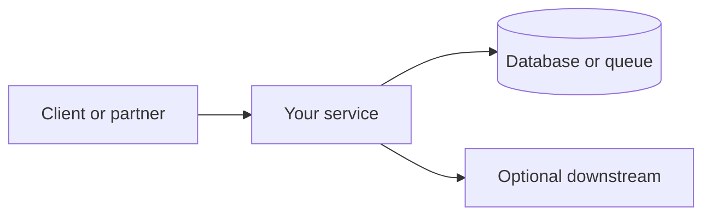

# Portfolio artifacts template (resume-ready)

Each lab repo should accumulate an **interview packet** under `docs/portfolio/` (or equivalent README sections). Commit artifacts when you call the milestone **done**—they are what senior engineers show in reviews and interviews.

**Template location:** this file lives in the playbook; copy structure into your lab repo.

---

## 1. Architecture diagram

**File:** `docs/portfolio/architecture.md` (or `architecture.png` + short caption)

One box-and-arrow diagram showing:

- Service boundaries (who calls whom)
- Sync vs async paths (HTTP vs queue)
- Data stores and external dependencies

**Mermaid starter** (replace labels for your lab):



**Tips:** Context level is enough for early labs; add component detail when you split services (Projects 8, 11, 21).

---

## 2. ADR (Architecture Decision Record)

**File:** `docs/portfolio/adr-001-short-title.md`

One page per significant fork. Glossary: [ADR](../concepts/software-engineering-glossary.md#adr-architecture-decision-record).

```markdown
# ADR-001: [Short title]

## Status
Accepted | Superseded by ADR-00N

## Context
What problem or constraint forced a decision?

## Decision
What we chose and what we rejected.

## Consequences
Positive, negative, and follow-ups (monitoring, debt, team skill).
```

Cross-project ADRs (e.g. Go vs Rust) may also live in playbook [PROGRESS.md](../../PROGRESS.md) with a link from the lab repo.

---

## 3. Performance numbers

**File:** `docs/portfolio/performance.md`

At least **one measured** baseline or before/after:

| Metric | Before | After | How measured |
|--------|--------|-------|--------------|
| p95 latency | … | … | curl loop / hey / wrk |
| Throughput | … | … | … |
| Peak RSS / memory | … | … | profiler / `docker stats` |
| Query plan | seq scan | index scan | `EXPLAIN ANALYZE` |

**Early labs:** “N/A — no hot path yet; will baseline at Project 8” is acceptable **with one sentence why**.

See [Memory and performance](../concepts/memory-and-performance.md) for measure → profile → fix → verify workflow.

---

## 4. Failure modes

**File:** `docs/portfolio/failure-modes.md`

Three bullets minimum—what breaks in production **without** this project’s mitigations:

```markdown
## Failure modes without this work

1. **Duplicate webhook delivery** → double billing unless idempotency key stored.
2. **Forged POST** → unauthorized state change unless HMAC verified on raw body.
3. **Poison payload loop** → partner retries forever unless DLQ + documented abandon.
```

Mirror optional **Failure mode** field in [PROGRESS.md](../../PROGRESS.md) milestone entries.

---

## 5. Observability evidence

**File:** `docs/portfolio/observability.png` (or `.md` with fenced log excerpt)

Screenshot or redacted log snippet showing:

- **request_id** (or trace id) on a real request
- Latency or status in structured form
- Optional: metric dashboard or grep count

**Do not commit:** API keys, tokens, full prompts with PII, production customer data.

Project 3 success criteria often satisfy this artifact for the host service; still copy one excerpt into `docs/portfolio/` for the portfolio folder.

---

## Checklist before milestone done

- [ ] `docs/portfolio/` exists in lab repo (or linked README sections)
- [ ] Architecture diagram committed
- [ ] At least one ADR (or explicit “single-path lab, ADR at integration step” note)
- [ ] Performance numbers or N/A with reason
- [ ] Failure modes documented
- [ ] Observability evidence attached
- [ ] Optional: `scripts/` with strict mode; `shellcheck` clean ([Bash map](../languages/bash.md))

**Capstone (Project 22):** Flagship README links to each service’s `docs/portfolio/` plus one **system-level** diagram and demo walkthrough.
