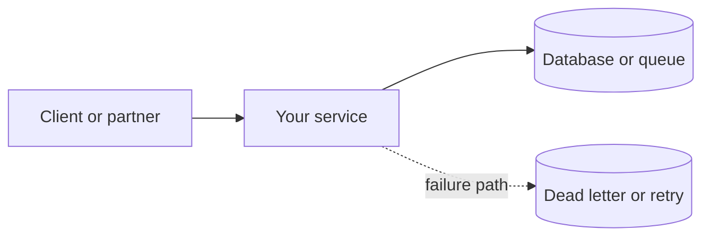

# Project spec visuals template

Use this when enriching [career-project-specs/](../../career-project-specs/) so each spec works as **standalone learning material** — diagrams for intent, reference outcomes for what "done" looks like, without requiring you to run the lab first.

**Pilot example:** [Project 1 spec](../../career-project-specs/01-integration-webhook-receiver.md) · [01-webhook](../examples/project-outcomes/01-webhook/) · [Project 2 spec](../../career-project-specs/02-rag-llm-service.md) · [02-rag-llm](../examples/project-outcomes/02-rag-llm/)  
**Lab portfolio (your proof):** [Portfolio artifacts](portfolio-artifacts.md) — commit in **your** lab repo after you ship.

---

## Spec vs lab artifacts

| Location | Who creates it | Purpose |
|----------|----------------|---------|
| **Playbook spec** — System diagram + Reference outcomes | Playbook maintainers | Read and learn before/during the lab |
| **`docs/examples/project-outcomes/NN-*/`** | Captured from lab repo (or representative fixtures) | Full log/HTTP/DB snapshots |
| **Lab `docs/portfolio/`** | You | Interview packet after milestone done |

Reference outcomes are **exemplars**. Portfolio artifacts are **your evidence**.

---

## Section A — `## System diagram`

**Place after:** `## Problem` or `## Architecture pillars` (before deep code concepts).

**Include:**

1. **Context diagram** (mermaid `flowchart`) — actors, your service, stores, async paths
2. **Pillar annotation table** — map components to [five pillars](../concepts/architecture-framework.md#the-five-pillars)
3. Optional **request-flow** diagram (mermaid `sequenceDiagram`) for HTTP or queue-heavy labs — can live here or in `docs/examples/project-outcomes/`

**Starter (replace labels):**



**Quality bar:** [sample-portfolio/architecture.md](../examples/sample-portfolio/architecture.md)

---

## Section B — `## Reference outcomes (read without running)`

**Place before:** `## Success criteria`.

**Intro paragraph (copy and adapt):**

> Learn what "done" looks like before you clone the lab. Snapshots below are **captured from the reference implementation** (or **representative fixtures** when the repo is TBD). Run [Exploration scenarios](#exploration-scenarios) yourself to verify.

**Inline in spec (keep scannable):**

- 1–2 structured **log** JSON lines (success + failure)
- One **success** HTTP response (status + body)
- One **error** HTTP response (401/400/500 as applicable)

**Link to full captures:**

```markdown
**Full captures:** [docs/examples/project-outcomes/NN-short-name/](../examples/project-outcomes/NN-short-name/)
```

### Subsections by project type

| Subsection | When to include | Example |
|------------|-----------------|---------|
| Structured log line | HTTP services, workers | `request_id`, `duration_ms`, domain fields |
| Success HTTP response | REST/webhook/API labs | `200` + JSON body |
| Error HTTP response | Security/validation labs | `401`, `400`, `422` |
| Concurrency response | Idempotency labs | `409` in-flight |
| Store / schema snapshot | DB-heavy labs | SQLite/Postgres row after replay |
| Dead letter snapshot | Integration labs | `dead_letters` row |
| Queue / metric output | Workers, observability | queue depth, Prometheus text |
| CLI / terminal output | Shell/CLI labs | `curl -i`, script stdout |
| Eval / trace output | LLM labs | JSONL eval row, trace span |

### Regenerating captures

When lab code changes:

1. Clone or pull the lab repo (see spec **Code repo**).
2. Run exploration scenarios from the spec.
3. Save stderr JSON lines, `curl -i` output, and DB queries into `docs/examples/project-outcomes/NN-*/`.
4. Update inline snapshots in the spec if shapes changed.
5. Note capture date in `project-outcomes/NN-*/README.md`.

Label **representative fixtures** clearly when no repo exists yet (`_TBD_` in spec).

---

## Cross-links

- **Exploration scenarios** — number scenarios; reference outcome files by scenario id (e.g. "See [http-responses.md § scenario 3](../examples/project-outcomes/01-webhook/http-responses.md#scenario-3--invalid-signature)").
- **Portfolio artifacts** — add one line: "After you build, commit your own versions under `docs/portfolio/` in the lab repo."

---

## Phased rollout (specs 2–25)

| Phase | Projects | Priority |
|-------|----------|----------|
| **Pilot** | 1 | Done — [01-webhook](../examples/project-outcomes/01-webhook/) |
| **Phase 2** | 2, 3, 4 | **2 done** — [02-rag-llm](../examples/project-outcomes/02-rag-llm/); P3 log schema + P4 SQL pending |
| **Phase 3** | 5–9 | Add system diagram where still missing (01, 02, 03, 04, 19 today) |
| **Phase 4** | 10–22 | Capstone 22 = composite platform diagram |
| **Phase 5** | 23–25 optional | Representative fixtures if repos thin |

Per spec: add Section A + B per this template; capture from live repo when available; use fixtures only when labeled.
