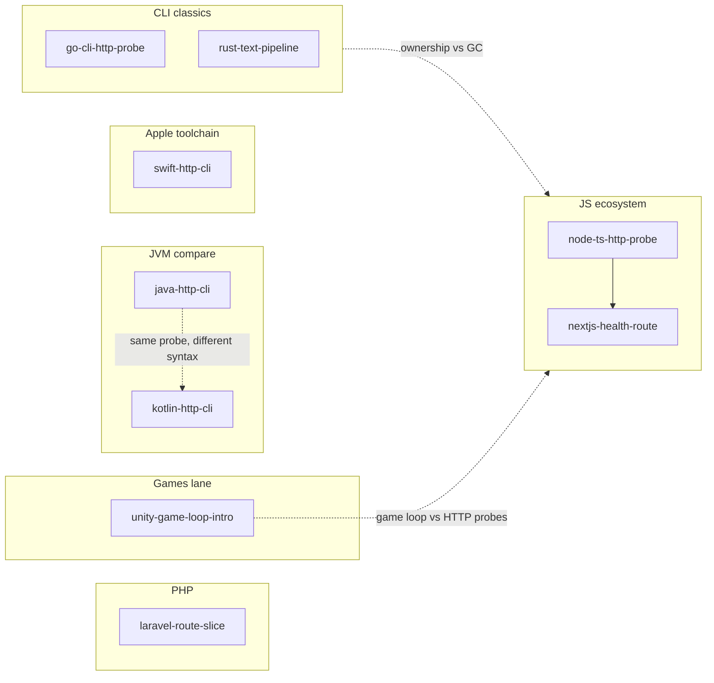

# Exploration projects

Commented **language / ecosystem sandboxes** for breadth (Go, Rust, Unity, Node + TypeScript, Next.js, Laravel, Java, Kotlin JVM, Swift). They stay **inside** this playbook repo. **Playbook career labs** (**webhook**, **RAG**, **SQL**) live in [`career-projects/`](../career-projects/README.md)—not here ([Quick links](../README.md#quick-links-to-practice-repos)). Optional **`~/Documents/dev/business-projects/`** holds unrelated product work (PacPal-style); see sibling [`business-projects/README.md`](../../business-projects/README.md).

Specs and ordering remain in [`career-project-specs/`](../career-project-specs/) and [FOCUS.md](../FOCUS.md). Log milestones in [PROGRESS.md](../PROGRESS.md).

## Beginner orientation: concepts before syntax

Across languages you will reuse the **same ideas** with different spelling:

| Concept | Plain English | In this repo |
|---------|---------------|--------------|
| **Module / package** | How source files group into a build unit | Go: `package main`, `go.mod` · Rust: `mod`, `Cargo.toml` · Node: `"type":"module"`, `tsconfig` · Next: `app/` segments · Laravel: Composer autoload · Java/Kotlin: packages · Swift: SPM target · Unity: assemblies later |
| **Toolchain** | Compiler, formatter, dependency fetcher | Go: `go` · Rust: `cargo` · Node: `npm`/`tsx` · Next: `next` · PHP: Composer · Java: Maven · Kotlin: Gradle · Swift: `swift build` · Unity: Editor |
| **Errors as values** | Return information instead of only crashing | Go: `(T, error)` · Rust: `Result<T, E>` · TS: `try/catch` + typed `catch` · Laravel: exceptions + HTTP responses · JVM: exceptions · Swift: `throws` / `Result` · C#: `try` / `throw` (Unity intro) |
| **Async vs sync** | Whether callers wait for I/O | Node probe: **`fetch` + abort deadlines** · Swift probe: **`async`/`await`** · Next route handler: **`async function GET`** · Go/Java probes: sync clients (simplest first) |

Stack vocabulary maps ( deeper reading ): [`docs/stacks/`](../docs/stacks/) — e.g. [node-typescript-backend.md](../docs/stacks/node-typescript-backend.md), [nextjs-react-typescript.md](../docs/stacks/nextjs-react-typescript.md), [php-laravel.md](../docs/stacks/php-laravel.md), [java-jvm.md](../docs/stacks/java-jvm.md), [kotlin-android.md](../docs/stacks/kotlin-android.md), [swift-ios.md](../docs/stacks/swift-ios.md).

## Suggested sandbox order

**Web / JS lane**

1. **[node-ts-http-probe](node-ts-http-probe/)** — `tsconfig`, **`fetch`**, typed CLI parsing (`parseArgs`).
2. **[nextjs-health-route](nextjs-health-route/)** — App Router layout + **`app/api/*/route.ts`** boundaries.

**JVM compare lane**

3. **[java-http-cli](java-http-cli/)** — Maven + **`java.net.http.HttpClient`** probe.
4. **[kotlin-http-cli](kotlin-http-cli/)** — Gradle Kotlin DSL + same probe shape (**nullable ergonomics** contrast).

**PHP lane**

5. **[laravel-route-slice](laravel-route-slice/)** — Composer scaffold outside git + **paste reference routes** (`routes/web.php` mental model).

**Apple lane**

6. **[swift-http-cli](swift-http-cli/)** — SwiftPM executable + **`URLSession`** **`async`/`await`**.

**Original breadth trio** (still valuable)

7. **[go-cli-http-probe](go-cli-http-probe/)** — Fast CLI feedback, **`(value, error)`**, `context` timeouts.
8. **[rust-text-pipeline](rust-text-pipeline/)** — Ownership, **`Result` / `?`**.
9. **[unity-game-loop-intro](unity-game-loop-intro/)** — **`Update`**, **`deltaTime`**, component lifecycle.

Finish **[Go]** before optionally porting the probe to **[Rust]**—avoid too many CLIs day one.

## Why these stacks here

| Choice | Role here | Sustainably useful because |
|--------|-----------|------------------------------|
| **Go** | First CLI + HTTP | Small language, stable tooling, huge cloud/CLI footprint. |
| **Rust** | Systems habits | Memory reasoning + explicit errors—ideas that transfer broadly. |
| **Node + TS** | Default web/backend spelling | Matches how most tutorials ship TS (runtime + types together). |
| **Next.js** | Framework boundaries | Routing + Route Handlers + server/client split without a giant template dump. |
| **Laravel** | PHP HTTP stack | Composer + middleware idioms distinct from Node. |
| **Java / Kotlin** | JVM literacy | Same platform—syntax + null-model contrast in one afternoon. |
| **Swift** | Apple toolchain | Optionals + structured concurrency at CLI scale before UI kits. |
| **C# + Unity** | Game loop + OOP | Common indie path; C# overlaps with .NET server work later. |

## How to use the commented code

- **[Language fundamentals comparison](../docs/handbook/language-fundamentals-comparison.md)** — one handbook reference: variables, operators, conditionals, loops, functions, classes, collections, modules, enums, errors, nulls, async (JS/PHP anchored vs Go, Rust, C#, Java, Kotlin, Swift).
- Start with **module / file header comments**, then inline **why** comments in each sandbox.

## Git and artifacts

Tracked here: Markdown + sandbox sources. **`target/`**, **`node_modules/`**, **`.next/`**, **`vendor/`**, Unity **`Library/`**, stray binaries remain ignorable patterns in [.gitignore](../.gitignore).

---

**Next:** Skim [Language fundamentals comparison](../docs/handbook/language-fundamentals-comparison.md), then pick your lane starting at **[node-ts-http-probe/README.md](node-ts-http-probe/README.md)** or **[go-cli-http-probe/README.md](go-cli-http-probe/README.md)**.
