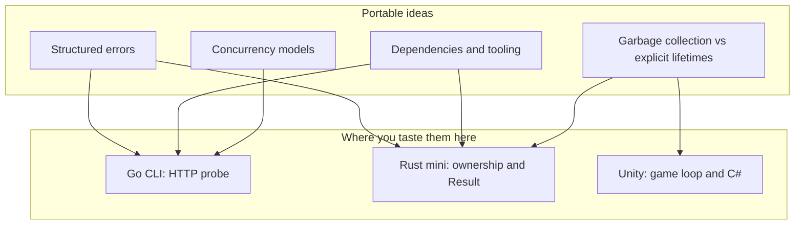

# Exploration projects

Commented **language / ecosystem sandboxes** for breadth (Go, Rust, Unity). They stay **inside** this playbook repo. **Playbook career labs** (**webhook**, **RAG**, **SQL**) live in [`career-projects/`](../career-projects/README.md)—not here ([Quick links](../README.md#quick-links-to-practice-repos)). Optional **`~/Documents/dev/business-projects/`** holds unrelated product work (PacPal-style); see sibling [`business-projects/README.md`](../../business-projects/README.md).

Specs and ordering remain in [`career-project-specs/`](../career-project-specs/) and [FOCUS.md](../FOCUS.md). Log milestones in [PROGRESS.md](../PROGRESS.md).

## Beginner orientation: concepts before syntax

Across languages you will reuse the **same ideas** with different spelling:

| Concept | Plain English | In this repo |
|---------|---------------|--------------|
| **Module / package** | How source files group into a build unit | Go: `package main`, `go.mod` · Rust: `mod`, `Cargo.toml` · Unity: `Assembly` (later); start with one script |
| **Toolchain** | Compiler, formatter, dependency fetcher | Go: `go` · Rust: `cargo` · Unity: Editor + external script editor |
| **Errors as values** | Return information instead of only crashing | Go: `(T, error)` · Rust: `Result<T, E>` · C#: `try` / `throw` (introduced gently in Unity script) |
| **Async vs sync** | Whether the CPU waits for I/O | Go probe uses **sync** HTTP (simplest); game uses **per-frame** sync code on the main thread |

## Suggested sandbox order

1. **[go-cli-http-probe](go-cli-http-probe/)** — One file, fast feedback. **CLI flags**, **HTTP**, **`(value, error)`** in Go.
2. **[rust-text-pipeline](rust-text-pipeline/)** — **Ownership**, **`&` borrowing**, **`Result` / `?`**.
3. **[unity-game-loop-intro](unity-game-loop-intro/)** — **Update**, **`deltaTime`**, component lifecycle (real Unity Editor on your machine).

## Why Go / Rust / Unity here (breadth picks)

| Choice | Role here | Sustainably useful because |
|--------|-----------|-----------------------------|
| **Go** | First CLI + HTTP | Small language, stable tooling, huge cloud/CLI footprint. |
| **Rust** | Systems habits | Memory reasoning + explicit errors—ideas that transfer broadly. |
| **C# + Unity** | Game loop + OOP | Common indie path; C# overlaps with .NET server work later. |

Finish the **[Go]** CLI before porting the same probe to **[Rust]** (optional stretch)—avoid two CLIs too early.

## How to use the commented code

- **[BEGINNER-SYNTAX-EXAMPLES.md](BEGINNER-SYNTAX-EXAMPLES.md)** — terse Go vs Rust vs C#.
- Start with **module / file header comments**, then inline **why** comments.

## Git and artifacts

Tracked here: Markdown + sandbox sources. **`target/`**, Unity **`Library/`**, stray binaries remain ignorable patterns in [.gitignore](../.gitignore).

---

**Next:** Skim [BEGINNER-SYNTAX-EXAMPLES.md](BEGINNER-SYNTAX-EXAMPLES.md), then [go-cli-http-probe/README.md](go-cli-http-probe/README.md).
