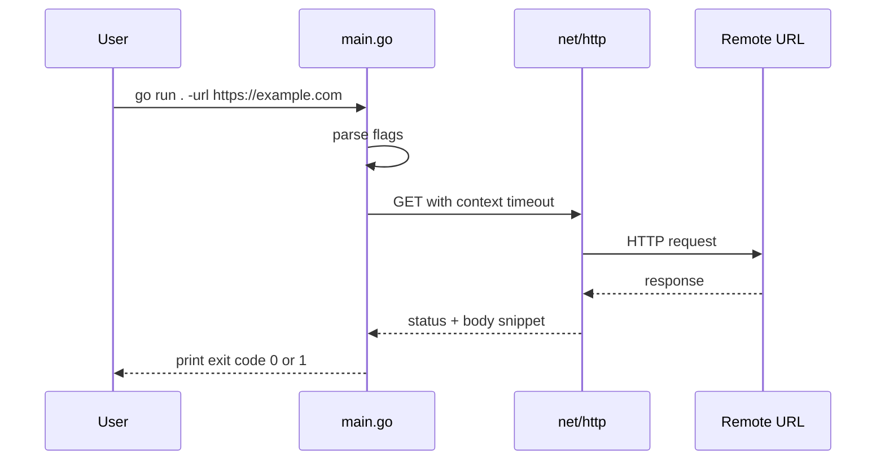

# Go: HTTP probe CLI (beginner)

## What you learn (transferable)

- **Command-line flags** (user input at the shell)
- **HTTP GET** with timeouts (integration-shaped thinking)
- **Error handling** as returned values, not exceptions
- **`go.mod`** as the dependency manifest (stdlib only here)

## Why Go for this slot

Go keeps **builds and syntax** small so you focus on **I/O boundaries** (network, flags, stdout)—the same boundaries you see in webhook receivers and microservices.

## Diagram: what runs when you type the command



## Prerequisites

- Install Go 1.21+ from [go.dev/dl](https://go.dev/dl/).
- Verify: `go version`

## Run

```bash
cd exploration-projects/go-cli-http-probe
go run . -url https://example.com
go run . -url https://example.com -timeout 5s
```

Deliberate failure (expect non-zero exit and an error line):

```bash
go run . -url https://127.0.0.1:9
```

## Build a binary (optional)

```bash
go build -o http-probe .
./http-probe -url https://example.com
```

## Files

| File | Purpose |
|------|---------|
| `main.go` | All logic, heavily commented |
| `go.mod` | Module path and Go version |

## Stretch ideas (after you understand the file)

- Add an `-H "Name: Value"` repeat flag (headers).
- Print **only** HTTP status when `-head` is set (use `http.Head`).
