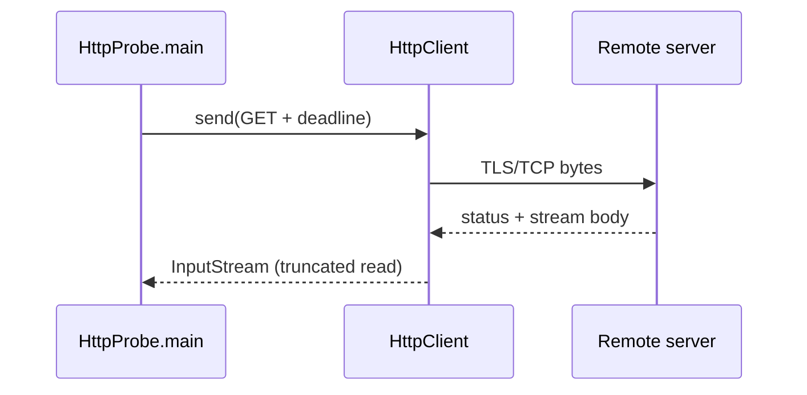

# Java: HTTP CLI probe (beginner)

## What you learn (transferable)

- **`public static void main`** entry — JVM ships without Node-style scripts by default.
- **Maven coordinates** (`pom.xml`) — repeatable builds vs IDE-only configs.
- **`java.net.http.HttpClient`** — baseline HTTP stack since Java 11 (timeouts + redirects concepts).

## Companion playbook vocabulary

[docs/stacks/java-jvm.md](../../docs/stacks/java-jvm.md)

## Diagram



## Prerequisites

- **JDK 17+** (`java -version`)
- **Maven 3.9+** (`mvn -version`)

## Run

```bash
cd exploration-projects/java-http-cli
mvn -q exec:java -- \
  --url https://example.com \
  --timeout 10s \
  --max-body 2048
```

Failure modes mirror siblings: stderr message + exit code **`1`** on transport failures or HTTP **`>= 400`**.

## Flags

| Flag | Default | Meaning |
|------|---------|---------|
| `--url` | `https://example.com` | Absolute URL |
| `--timeout` | `10s` | Deadline (`500ms`, `10s`, `2m`) |
| `--max-body` | `2048` | Bytes read into RAM |

## Stretch

- Replace hand-rolled argv parsing with **Picocli** (rich help text, validation).
- Compare **OkHttp** vs `HttpClient` ergonomics with the same CLI.
