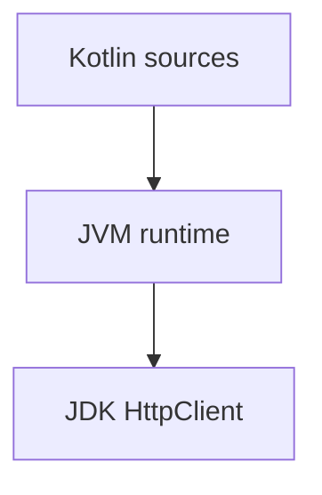

# Kotlin JVM: HTTP CLI probe (beginner)

## What you learn (transferable)

- **`fun main`** — Kotlin entry vs Java `public static void main`.
- **Gradle Kotlin DSL** (`build.gradle.kts`) — readable dependency graphs vs XML-only Maven (both valid careers learn).
- **Null-adjacent ergonomics** (`orElse`) — tiny contrast vs Java `Optional`.

## Companion playbook vocabulary

[docs/stacks/kotlin-android.md](../../docs/stacks/kotlin-android.md)

This sandbox is **CLI-shaped on the JVM** first — overlap with Android vocabulary without pulling the SDK.

## Diagram



## Prerequisites

- **JDK 17+** (`java -version`)
- **Gradle 8+** (`gradle -version`) — no wrapper jar is committed here on purpose.

## Run

```bash
cd exploration-projects/kotlin-http-cli
gradle run --args='--url https://example.com --timeout 10s --max-body 2048'
```

Quotes matter on shells — alternate:

```bash
gradle run --args="--url https://example.com --timeout 500ms --max-body 512"
```

## Flags

Same semantics as [`java-http-cli`](../java-http-cli/README.md).

## Stretch

- Swap **`gradle`** for **`./gradlew`** once you generate a wrapper locally (`gradle wrapper`).
- Port the probe to **`ktor-client`** — compare callback cancellation vs structured concurrency (`coroutineScope`).
