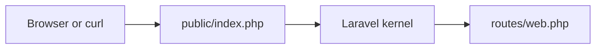

# Laravel: route slice (beginner)

## Why README-first?

Full Laravel trees pull **`vendor/`** (Composer) and many framework files—they belong **outside** git history here. You scaffold once locally, then paste **reference snippets** committed in [`reference/`](reference/).

## What you learn (transferable)

- **Composer** as PHP’s dependency / autoload hub (`composer.json`, `vendor/`).
- **Routes file** wiring (`routes/web.php`) — minimal HTTP surface before controllers.
- **Closure routes vs controllers** — start tiny, refactor upward later.

## Companion playbook vocabulary

[docs/stacks/php-laravel.md](../../docs/stacks/php-laravel.md)

## Diagram



## Prerequisites

- PHP **8.2+** (`php -v`)
- [Composer](https://getcomposer.org/) (`composer --version`)

## Scaffold (once per machine)

From **`~/somewhere-outside-this-repo`** or beside **`career-playbook`**:

```bash
composer create-project laravel/laravel laravel-exploration-sandbox
cd laravel-exploration-sandbox
php artisan serve
```

Visit `http://127.0.0.1:8000` — Laravel welcome page confirms wiring.

## Apply this sandbox slice

1. Open **`routes/web.php`** in your new project.
2. **Merge** (do not delete Laravel defaults until you understand them) the snippet from [`reference/routes-web-snippet.php`](reference/routes-web-snippet.php).
3. Restart **`php artisan serve`** if needed.
4. Curl:

```bash
curl -sS http://127.0.0.1:8000/exploration/hello | jq .
```

## Stretch

- Move the closure body into **`app/Http/Controllers/ExplorationController.php`** + `Route::get(..., [ExplorationController::class, 'hello']);`.
- Add **`routes/api.php`** twin returning JSON without session middleware defaults—observe behavioral differences documented in Laravel docs.
