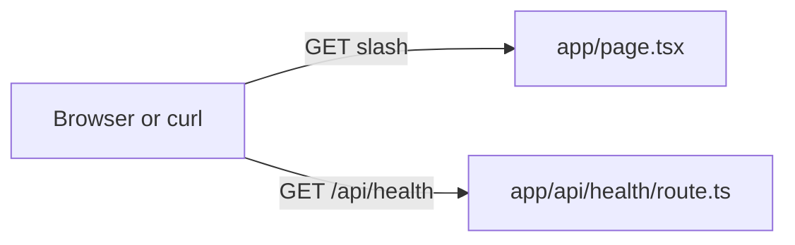

# Next.js: App Router + `/api/health` (beginner)

## What you learn (transferable)

- **`app/` directory routing** — folders map to URL paths.
- **Route Handlers** — `route.ts` replaces many `pages/api/*` patterns from older Next.
- **Server vs client components** — this sample keeps the home page server-side only (no `"use client"`).

## Companion playbook vocabulary

[docs/stacks/nextjs-react-typescript.md](../../docs/stacks/nextjs-react-typescript.md)

## Diagram



## Prerequisites

- **Node.js 20+** recommended (same toolchain as `node-ts-http-probe`).

## Setup

```bash
cd exploration-projects/nextjs-health-route
npm install
```

## Run (development)

```bash
npm run dev
```

Then visit `http://localhost:3000` and `http://localhost:3000/api/health`.

Quick JSON check:

```bash
curl -sS http://localhost:3000/api/health | jq .
```

## Production build (optional)

```bash
npm run build
npm start
```

## Files

| Path | Role |
|------|------|
| `app/layout.tsx` | Root layout + metadata |
| `app/page.tsx` | `/` UI |
| `app/api/health/route.ts` | JSON health endpoint |
| `next.config.mjs` | Next config entry |

## Stretch

- Add a **`POST`** handler alongside `GET` in the same `route.ts`.
- Introduce **`"use client"`** in a tiny child component with `useEffect` fetching `/api/health`—then reason about waterfalls vs server fetch.
