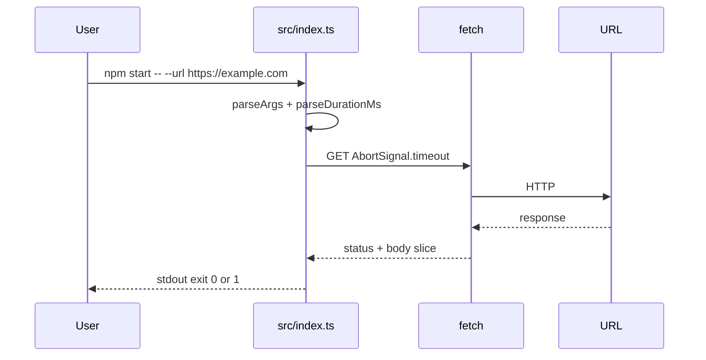

# Node + TypeScript: HTTP probe CLI (beginner)

## What you learn (transferable)

- **`package.json`** scripts and **`npm install`** / **`npx`**
- **`tsconfig.json`** — **`strict`** TypeScript catches bugs early (same mindset as shipping APIs)
- **CLI parsing** via Node **`parseArgs`** (`node:util`)
- **`fetch`** + **`AbortSignal.timeout`** — bounded waits without blocking threads (integration-shaped thinking)

## Companion playbook vocabulary

[docs/stacks/node-typescript-backend.md](../../docs/stacks/node-typescript-backend.md)

## Diagram



## Prerequisites

- **Node.js 20+** (includes stable **`fetch`** / **`AbortSignal.timeout`**).
- Verify: `node --version`

## Setup once

```bash
cd exploration-projects/node-ts-http-probe
npm install
```

## Run (tsx — fastest feedback)

```bash
npm start -- --url https://example.com
npm start -- --url https://example.com --timeout 5s --max-body 1024
```

Deliberate failure:

```bash
npm start -- --url https://127.0.0.1:9 --timeout 2s
```

## Compile + run (optional)

```bash
npm run build
npm run probe -- --url https://example.com
```

## Files

| File | Purpose |
|------|---------|
| `src/index.ts` | Logic + teaching comments |
| `package.json` | Scripts + dev deps (**tsx**, **typescript**) |
| `tsconfig.json` | Strict compiler flags |

## Stretch

- Accept **`--header 'Name: Value'`** repeated flags (needs richer parsing than `parseArgs` alone).
- Swap **`fetch`** for **`undici`** or **`axios`** only after you trust the native path—know why each exists.
