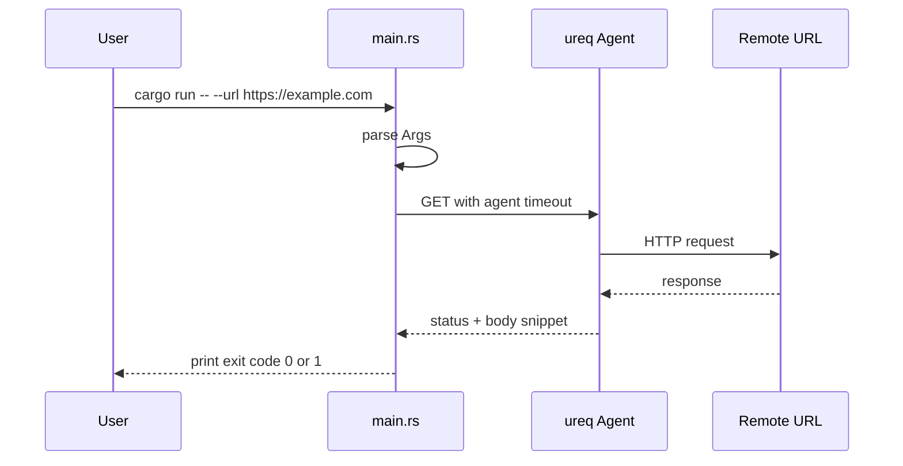

# Rust: HTTP probe CLI (beginner)

## What you learn (transferable)

- **Command-line flags** (`clap` derive — Rust’s structured arg parsing)
- **HTTP GET** with timeouts (integration-shaped thinking)
- **`Result` and `?`** — explicit errors, no exceptions
- **`Cargo.toml`** as the dependency manifest

## Why Rust for this slot

Rust is a **Tier‑2 growth lane** in the playbook—practice **after** [P9 Go](../../career-project-specs/09-go-retrieval-worker-lab.md) core, or use this sandbox for syntax **before** P9 without starting a second worker spine. This probe mirrors [go-cli-http-probe](../go-cli-http-probe/README.md) so you compare **ownership + Result** to **Go’s `(T, error)`**.

## Diagram: what runs when you type the command



## Prerequisites

- Install Rust via [rustup.rs](https://rustup.rs/) (stable toolchain).
- Verify: `rustc --version` and `cargo --version`

## Run

```bash
cd exploration-projects/rust-cli-http-probe
cargo run -- --url https://example.com
cargo run -- --url https://example.com --timeout-secs 5
```

Deliberate failure (expect non-zero exit and an error line):

```bash
cargo run -- --url https://127.0.0.1:9
```

## Build a release binary (optional)

```bash
cargo build --release
./target/release/rust-cli-http-probe --url https://example.com
```

## Files

| File | Purpose |
|------|---------|
| `src/main.rs` | All logic, heavily commented |
| `Cargo.toml` | Crate metadata and dependencies |

## Stretch ideas (after you understand the file)

- Add a `--head` flag using `HEAD` instead of `GET`.
- Compare the same probe in [go-cli-http-probe](../go-cli-http-probe/README.md) — note error handling and memory model differences.
- After P9 Go is green: optional [P9 Rust reimplementation stretch](../../career-project-specs/09-go-retrieval-worker-lab.md#stretch).

## Related

- [Rust ecosystem map](../../docs/stacks/rust.md)
- [Learning journey — Rust Tier‑2](../../docs/paths/learning-journey.md#rust-tier-2-after-p9-go)
