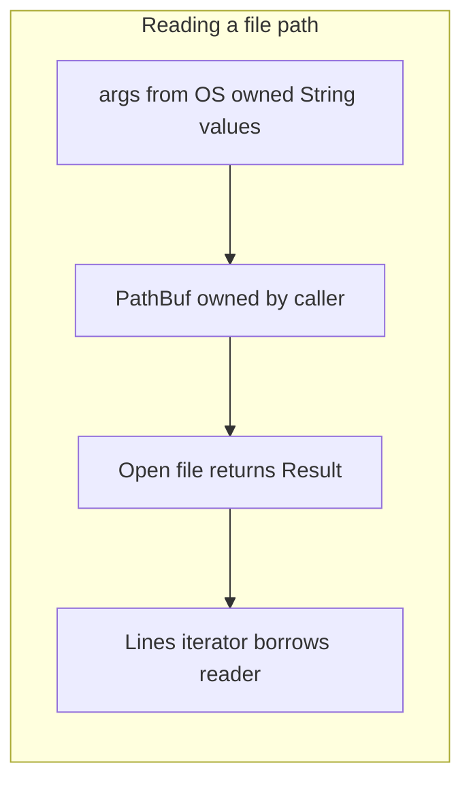

# Rust: text pipeline (beginner ownership lab)

## What you learn (transferable)

- **Ownership**: each value has one owner; when you pass a `String`, you often *move* it.
- **Borrowing**: `&str` and `&String` let you read without taking ownership.
- **`Result` and `?`**: errors are explicit types; `?` returns early on failure.
- **`match`**: exhaustively handle enum variants (here, `Ok`/`Err`).

## Why Rust in this lane (alongside Go)

Go already teaches a **straightforward CLI + HTTP** story. Rust is here because its **borrow checker** trains a transferable mental model:

- Where is data **mutated**, and **who else** can see that mutation?
- How do APIs signal **recoverable failures** (`Result`) versus **panic** (crash)?

Industry use is long-term credible: systems software, WASM, tooling, CLI (after you finish the Go CLI, port this tool for comparison).

## Diagram: ownership in this tiny program



Rust will reject code that lets you use a value after giving it away—when you struggle, that is the lesson.

## Prerequisites

- Install Rust via [rustup](https://rustup.rs/).
- Verify: `cargo --version`

## Run

```bash
cd exploration-projects/rust-text-pipeline
echo -e "hello\nworld" > sample.txt
cargo run -- sample.txt
```

Expect lines printed with a `| ` prefix (see `main.rs` comments).

## Files

| File | Purpose |
|------|---------|
| `src/main.rs` | Heavily commented program |
| `Cargo.toml` | Package name, edition, dependencies (none yet) |

## Stretch ideas

- Add a `--upper` flag using `clap` (add dependency in `Cargo.toml`).
- Return a non-zero exit code when the file is missing (use `std::process::exit`).
