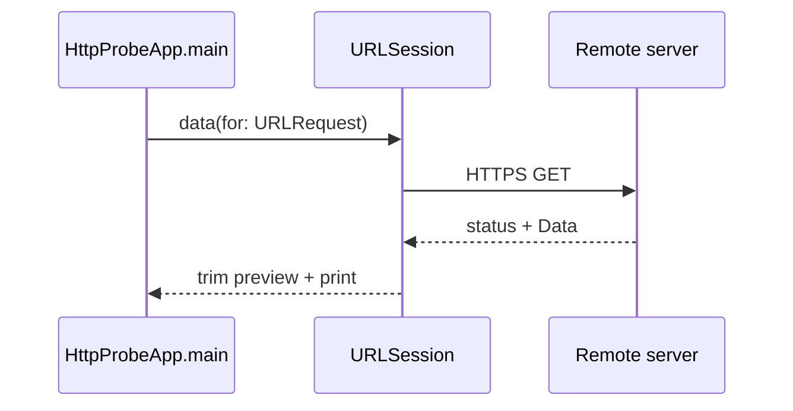

# Swift: HTTP CLI probe (beginner)

## What you learn (transferable)

- **Swift Package Manager** layout (`Package.swift`, `Sources/<target>/`).
- **`async`/`await` with `URLSession`** — structured concurrency without wrapping callbacks manually.
- **Optionals + explicit failure paths** (`guard let`) vs JVM exceptions.

## Companion playbook vocabulary

[docs/stacks/swift-ios.md](../../docs/stacks/swift-ios.md)

This sandbox ships as a **CLI executable** — Xcode UI optional later.

## Diagram



## Prerequisites

- **Swift 5.9+** (`swift --version`) on macOS **13+** (Swift concurrency entrypoint uses `@main` + `async`).

## Run

```bash
cd exploration-projects/swift-http-cli
swift run swift-http-cli -- \
  --url https://example.com \
  --timeout 10s \
  --max-body 2048
```

`swift run` forwards the `--` separator literally; this probe skips a leading `--` so the command matches common README patterns.

## Flags

Same semantics as [`java-http-cli`](../java-http-cli/README.md).

## Stretch

- Add **`URLComponents`** parsing for relative URLs — safer composition than string concat.
- Introduce **`async let`** parallel probes — compare latency curves vs sequential JVM siblings.
