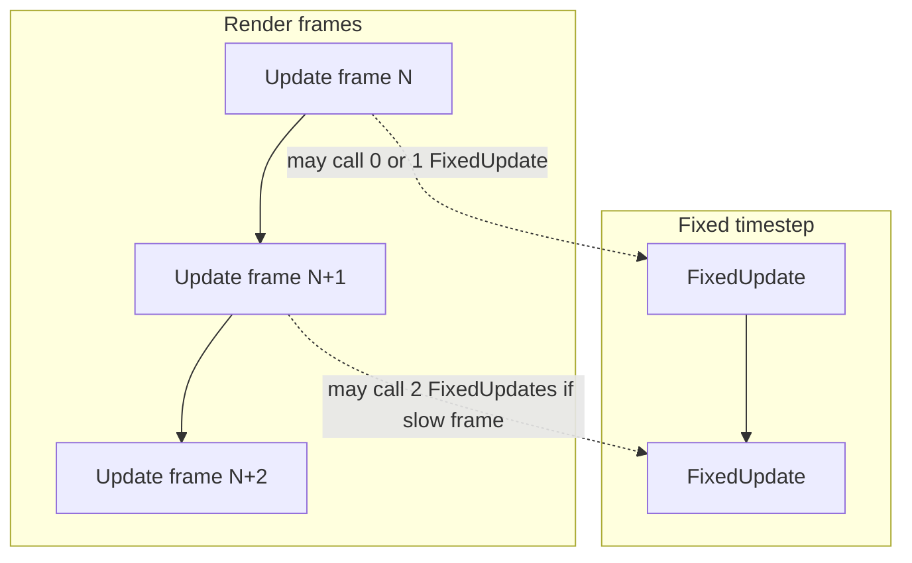

# Unity: game loop intro (C# beginner)

## What you learn (transferable)

- **Game loop**: `Update` runs every frame; `FixedUpdate` runs on a physics clock.
- **Delta time**: `Time.deltaTime` makes motion **frame-rate independent** (same speed on 30 FPS vs 144 FPS).
- **Components**: You attach scripts to **GameObjects**; Unity calls lifecycle methods for you.

## Why Unity (not Unreal or Godot for this playbook)

For **C# + editor + asset pipeline** with the largest tutorial surface, Unity is the sustainable default. Godot is excellent too; this repo picks **one** path to avoid parallel engines.

## Diagram: frame vs physics tick

Use **Update** for reading input and smooth motion. Use **FixedUpdate** for forces that must match the physics engine step.

## Setup (on your computer)

1. Install **Unity Hub** and an **LTS** editor (e.g. Unity 6 or 2022 LTS—match your class/tutorial if any).
2. **New project** → 3D (URP or Built-in is fine for this lab).
3. Create folder `Assets/ExplorationScripts/` in the Project window.
4. Copy `SampleGameLoop.cs` into that folder (drag from Finder/Explorer).
5. Create an empty **GameObject** (right-click Hierarchy → Create Empty), name it `Spinner`.
6. Drag `SampleGameLoop` component onto `Spinner` (Inspector → Add Component, or drop script).
7. Press **Play**. Select `Spinner` and watch **public** fields change in the Inspector.

## What you will *not* commit from Unity

The Editor generates `Library/`, `Temp/`, `Logs/`, `obj/`, often **gigabytes**. Keep the real project outside this playbook, or add those paths to `.gitignore` if you open a Unity project *inside* `exploration-projects/`.

## Files here

| File | Purpose |
|------|---------|
| `SampleGameLoop.cs` | Heavily commented MonoBehaviour |
| `README.md` | This guide |

## Stretch ideas

- Swap the rotation axis to `Vector3.up` and read `transform.forward` in `Debug.Log`.
- Add a `Rigidbody` sphere and move it in `FixedUpdate` with `AddForce` so you feel physics timing.
